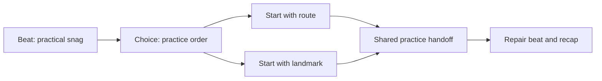
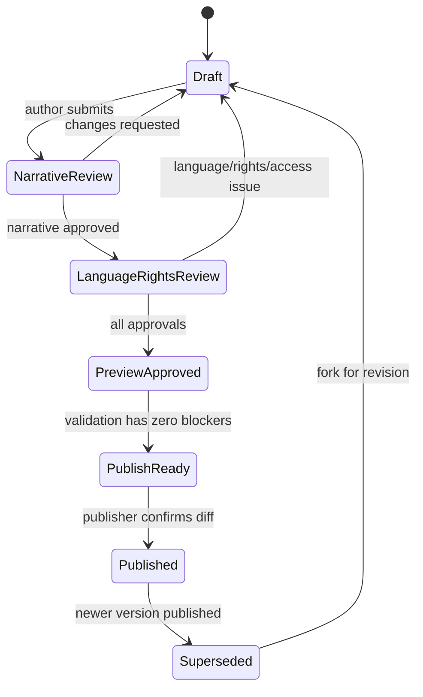

# Yomu Academy Author Panel

**Status:** product and content specification. This defines an authoring workspace; it does not change application code, the content graph, or deployment behaviour.

## 1. Purpose

The Author Panel is the single workspace for creating and publishing Academy story content that is:

- original, rights-cleared, and fictional;
- tied to a real language need and learning evidence;
- authored as N5, bridge, and N4 variants around one semantic intent;
- safe to skip, accessible without sound or motion, and non-gating;
- reviewable by narrative, Japanese-language, curriculum, rights, and accessibility reviewers before release.

It replaces scattered Markdown assumptions with inspectable authoring records. It must not make an author hand-edit runtime code, infer learner identity, or use story choices as assessment.

## 2. Product Principles

| Principle                                | Panel behaviour                                                                                                                                    |
| ---------------------------------------- | -------------------------------------------------------------------------------------------------------------------------------------------------- |
| Intent before line                       | A beat cannot be approved without a practical communicative intent and current scene problem.                                                      |
| Story is not assessment                  | The panel separates narrative completion from activity evidence. Choices never write mastery, placement, or entitlement.                           |
| Draft truth matters                      | A `planned:` activity is visibly draft-only; a current activity ID resolves to the live content graph. The panel never disguises one as the other. |
| Access is authored, not added later      | Captions, transcript, text route, skip recap, and reduced-motion meaning are fields in the primary form.                                           |
| Sources inform; they do not supply prose | A source link states scope, rights, or review provenance. It cannot be pasted as dialogue or a model answer.                                       |
| Revisions are cheap                      | Branch preview, diff, validation, and rollback are always available. Publishing is a deliberate, reviewable action.                                |

## 3. Users and Permissions

| Role                   | May do                                                                                      | May not do                                                                   |
| ---------------------- | ------------------------------------------------------------------------------------------- | ---------------------------------------------------------------------------- |
| Narrative author       | Draft episodes/scenes/beats, choices, recap, source notes, model answers, and asset briefs. | Publish alone, override source/right blocks, attach a real-person reference. |
| Curriculum editor      | Attach outcomes/activities, author explanations and rubrics, verify response types.         | Treat a scene as mastery evidence or create a false live ID.                 |
| Japanese reviewer      | Review naturalness, reading load, grammar tags, and N5/bridge/N4 equivalence.               | Change the shared semantic intent without returning the work to draft.       |
| Rights reviewer        | Clear origin/licence/attribution/permitted uses and reject unsafe references.               | Approve text copied from a scope-only curriculum source.                     |
| Accessibility reviewer | Check text-first, captions, controls, reading support, and reduced-motion parity.           | Waive a required equivalent outcome for audio or microphone-only content.    |
| Publisher              | Publish a reviewed, validated version to the selected catalogue channel.                    | Publish with a blocker or silently alter approved text.                      |

Every action records author, time, and revision summary locally in the content workspace. The panel stores no learner data and has no social/analytics function.

## 4. Information Architecture

### 4.1 Workspace layout

The default authoring screen is an operational editing surface, not a dashboard of decorative cards.

```text
┌────────────────────────────────────────────────────────────────────────────┐
│ Episode: Ch. 5 Open Rooms Rehearsal  [Draft] [Preview] [Validate] [Publish]│
├───────────────┬───────────────────────────────────────┬────────────────────┤
│ Episode tree  │ Scene editor                          │ Inspector           │
│ - Prologue    │ [Story] [Variants] [Lesson] [Assets]  │ Status / refs       │
│ - Ch. 1       │                                       │ blockers / sources  │
│   S1.1        │ Beat list / branch canvas             │ review requests     │
│   S1.2        │                                       │                     │
│ - Ch. 5       │                                       │                     │
│   S5.1        │                                       │                     │
└───────────────┴───────────────────────────────────────┴────────────────────┘
```

### 4.2 Persistent controls

| Control           | Type                | Behaviour                                                                                         |
| ----------------- | ------------------- | ------------------------------------------------------------------------------------------------- |
| Episode selector  | searchable tree     | Shows title, level range, publish state, unresolved validation count, and direct activity status. |
| Scene status      | compact status chip | `draft`, `needs-review`, `approved`, `blocked`, or `published`; never a progress score.           |
| Preview           | icon + text button  | Opens the current scene in the selected support/variant mode without publishing.                  |
| Validate          | icon + text button  | Runs local schema, reference, branch, variants, rights, and access checks; focuses first blocker. |
| Publish           | guarded command     | Enabled only when all required approvals and zero blockers exist; presents a release diff.        |
| Access simulation | segmented control   | `Default`, `Audio off`, `Reduced motion`, `Text route`, `Keyboard`, `Screen reader outline`.      |
| Variant selector  | tabs                | `N5`, `Bridge`, `N4`, and `Intent diff`; cannot hide missing variants.                            |

Icons may be used for compact actions such as preview, validate, undo, redo, and history, with tooltips and visible labels in the overflow menu. Destructive actions always use text confirmation and never discard another author’s draft.

### 4.3 Episode tree

The tree is ordered by story chronology and exposes content truth at a glance:

```text
Ch. 5 - Open Rooms Rehearsal                         approved with blocker
  S5.1 The Rehearsal Brief       activity-listen-weekend-plan       current
  S5.2 Hear the Plan             activity-listen-weekend-plan       current
  S5.3 A Condition Is Care       activity-nara-suggestion           current
  S5.6 One Voice, Same Plan      activity-solo-dialogue-adaptation  access blocker
  S5.10 Fifth Card               recap only                          approved
```

Each row has a level badge, linked activity state (`current`, `planned`, `missing`), source/rights state, and validation count. It does not show learner data, bond totals, or completion statistics.

## 5. Core Authoring Records

The panel owns structured records, then renders Markdown/export views from those records. Markdown remains a review/export format, not the only source of validation.

```ts
type StoryLevel = "n5" | "bridge" | "n4";
type ChoiceEffect = "cosmetic" | "practice-order";
type LinkStatus = "current" | "planned" | "missing";
type ReviewStatus =
  "draft" | "needs-review" | "approved" | "blocked" | "published";

interface EpisodeRecord {
  id: string;
  title: LocalizedText;
  premise: LocalizedText;
  chapterQuestion: LocalizedText;
  sceneIds: readonly string[];
  curriculumUnitRef: string;
  status: ReviewStatus;
}

interface SceneRecord {
  id: string;
  episodeId: string;
  title: LocalizedText;
  locationId: string;
  narrativeJob: LocalizedText;
  languageNeed: LocalizedText;
  evidence: LearningEvidenceLink;
  beatIds: readonly string[];
  choiceIds: readonly string[];
  recap: LocalizedText;
  estimatedMinutes: number;
  canSkip: true;
  directTaskRoute: true;
  status: ReviewStatus;
}

interface LearningEvidenceLink {
  activityId: string;
  status: LinkStatus;
  outcomeIds: readonly string[];
  responseKinds: readonly string[];
  plainLanguagePurpose: LocalizedText;
  runtimeNote?: LocalizedText;
}

interface BeatRecord {
  id: string;
  sceneId: string;
  intentId: string;
  practicalSituation: LocalizedText;
  speakerId: string;
  variants: readonly DialogueVariantRecord[];
  captionSource: "variant-text";
  transcriptId?: string;
  audioAssetId?: string;
  grammarTags: readonly string[];
  rights: AssetRights;
}

interface DialogueVariantRecord {
  level: StoryLevel;
  japanese: string;
  englishCaption: string;
  readingSupport: readonly TokenSupport[];
  grammarTags: readonly string[];
  reviewStatus: ReviewStatus;
}

interface StoryChoiceRecord {
  id: string;
  sceneId: string;
  label: LocalizedText;
  effect: ChoiceEffect;
  learningPurpose: LocalizedText;
  consequencePreview: LocalizedText;
  branchStartBeatId: string;
  rejoinBeatId: string;
  practiceOrderSeed?: readonly string[];
}
```

`LocalizedText` includes Japanese and English support text. `AssetRights` uses the existing Academy field names: `origin`, `status`, `rightsHolder`, `license`, `attribution`, `permittedUses`, and optional `sourceUrl`. The panel resolves current activity IDs against the current content graph and marks all `planned:` IDs visibly.

## 6. Scene Editor

### 6.1 Story tab

The Story tab is a vertical beat editor. Each beat visibly answers:

1. Who needs to say something?
2. What makes that sentence necessary now?
3. What does the listener need to be able to do next?
4. Which activity demonstrates that outcome?

A beat row contains speaker, expression (decorative unless text says otherwise), stage direction, intent ID, practical situation, Japanese line, English caption, and one-click access to the exact linked evidence. A beat missing any of those fields shows an inline blocker before a writer can add more dialogue.

The editor supports a small **scene cue** field for original visual context, such as “static rain on a window” or “card rack with blue half-door.” It rejects copied photos/maps/logos and asks for asset provenance before an art/audio brief can be sent onward.

### 6.2 Branching dialogue

The branch canvas is a constrained graph rather than a freeform narrative maze.



Branch authoring form:

| Field               | Required rule                                                                        |
| ------------------- | ------------------------------------------------------------------------------------ |
| Choice label        | Clear command, readable in Japanese/English support.                                 |
| Effect              | Only `cosmetic` or `practice-order`.                                                 |
| Learning purpose    | States what the choice helps the learner practise.                                   |
| Consequence preview | States exactly what changes: wording or order, not access.                           |
| Rejoin beat         | Required and visible in the graph.                                                   |
| Evidence parity     | Each branch must reach the same activity IDs, outcomes, review behaviour, and recap. |

The canvas shows a red closure marker if a branch lacks a rejoin. It shows a blocker if a choice attempts to write score, placement, reward, route entitlement, bond, or content visibility. Authors can replay any branch from its start and compare the final recap side by side.

## 7. Variant Editor

### 7.1 Shared intent lock

Every beat has a single editable **semantic intent** and practical task at the top. N5, Bridge, and N4 variants live in tabs below it. Editing the intent marks every variant for re-review; editing a variant never changes the intent silently.

| Variant | Required content                                                               | Editor affordance                                                      |
| ------- | ------------------------------------------------------------------------------ | ---------------------------------------------------------------------- |
| N5      | Familiar vocabulary, short clauses, introduced grammar only.                   | Reading-load meter, introduced-form lookup, optional furigana preview. |
| Bridge  | Same N5 act plus one tagged expansion that can be isolated/collapsed.          | Highlight the one expansion and preview it on/off.                     |
| N4      | Same act with a natural connection, condition, reason, repair, or polite form. | Grammar-tag diff and Japanese-review checklist.                        |

The **Intent diff** view aligns the variants by speech act, not by character count. It flags:

- a new factual claim in only one level;
- a changed story consequence;
- a missing task or different linked activity;
- grammar tags beyond the selected support level;
- an English caption that does not preserve the Japanese intent;
- accidental shifts in politeness, agency, or pressure.

### 7.2 Example

**Shared intent:** propose a rain alternative so a visitor has one next action.

| Level  | Approved shape                                       |
| ------ | ---------------------------------------------------- |
| N5     | `雨の ときは、カフェです。`                          |
| Bridge | `雨が 降ったら、カフェで 休みましょう。`             |
| N4     | `雨なら、ぬれないように近くのカフェに変えませんか。` |

The panel shows that all three still lead to the same plan, card, and activity. It does not permit an N4 line that makes the rain event optional or changes who is invited.

## 8. Lesson Editor

The Lesson tab connects narrative need to curriculum evidence. It has five fixed sections.

### 8.1 Practical reason

The first field is always learner-facing plain language:

> “Use `なら` to offer a rain alternative after someone says rain is possible.”

The editor does not begin with a grammar label. The label, form, and constraints follow the practical reason.

### 8.2 Activity link

The activity picker searches current `academyContentGraph` IDs and presents:

- title, instructions, outcomes, focus variants, response kinds, model/rubric availability, and asset availability;
- `current` or `planned` state;
- direct activity route preview;
- mismatches between the story’s claim and actual activity behaviour.

Choosing `planned:` opens a proposal drawer with required fields: intended unit, outcome statement, response kinds, model/rubric need, asset plan, and owner. The publish button stays unavailable for a scene whose required core activity is planned.

### 8.3 Explanation builder

The explanation builder has a fixed order:

1. practical question from the scene;
2. one original Japanese example with English caption;
3. form and use note;
4. one contrast or recovery example;
5. “after this, you can...” statement;
6. handoff to practice.

Fields for `first-attempt support`, `after-attempt support`, furigana, gloss, grammar note, and translation are separate. The panel warns if a model answer appears before the first attempt when the activity is configured to reveal it later.

### 8.4 Practice and feedback

The panel selects a valid response editor from the current response kinds: select-one, select-many, short-text, long-text, matching, ordering, recording, or self-assessment. It requires:

- accepted answers/distractor rationale where auto-graded;
- no “wrong social choice” feedback;
- a repair/retry message;
- a clear explanation of whether support appears before or after attempt;
- a text equivalent for every speaking/listening route.

### 8.5 Model answers and rubrics

The Model tab is available only for activities that need a model. It supports one or more clearly labelled examples, never a single hidden “correct life answer.”

| Field       | Requirement                                                                          |
| ----------- | ------------------------------------------------------------------------------------ |
| Model label | “One possible model” or comparable non-normative wording.                            |
| Visibility  | `always`, `after-first-attempt`, or `optional`; must agree with activity metadata.   |
| Source      | Must be original Yomu Academy text and rights-cleared.                               |
| Annotations | Explain reader-care choices, not merely grammar correctness.                         |
| Rubric      | 2-4 criteria, each with clear levels; no relationship, personality, or story result. |

The rubric editor supports self-review first. Any teacher-review workflow requires a separate product decision; it cannot silently create remote learner data.

## 9. Source Links and Rights

### 9.1 Source drawer

Every episode, scene, lesson explanation, model answer, audio asset, art brief, and transcript has a Source drawer. Each link has a role so the author cannot use “source” as a vague permission field.

| Link role                | Example                              | Allowed effect                                                             |
| ------------------------ | ------------------------------------ | -------------------------------------------------------------------------- |
| `world-canon`            | World Bible                          | Constrains setting, access, and story mechanics.                           |
| `curriculum-scope`       | Corpus inventory or course alignment | Guides level/sequence only.                                                |
| `activity-reference`     | Current content graph ID             | Resolves actual outcome/response/asset contract.                           |
| `rights-record`          | Asset licence/provenance             | Clears a specific shippable asset.                                         |
| `language-review`        | Review record                        | Records Japanese-language approval.                                        |
| `prohibited-inspiration` | Modern work/real-person source       | Flags material that must not inform character, plot, visuals, or dialogue. |

The panel renders a red block for a source that is being used as dialogue text without a rights-cleared original-author note. It also blocks a real-person profile, contact route, personally identifying placeholder, or unsourced “inspired by my class” field.

### 9.2 Asset readiness

An asset cannot move past draft unless it contains:

- `origin`, `status`, `rightsHolder`, `license`, `attribution`, `permittedUses`;
- optional `sourceUrl`/reference if relevant;
- original brief (for commissioned/generated work) stating no protected-character/style imitation;
- transcript/captions for audio;
- visual text alternative and reduced-motion state where relevant.

## 10. Preview Studio

Preview is a real content test surface, not a static text dump. Authors can switch state without changing content:

| Preview mode          | What it proves                                                                                 |
| --------------------- | ---------------------------------------------------------------------------------------------- |
| N5 / Bridge / N4      | Same story event and task across language levels.                                              |
| Furigana hidden/shown | Reading support does not remove text or reflow the sentence.                                   |
| Gloss hidden/shown    | Translation is independently controllable.                                                     |
| Audio off             | Captions/transcript carry every required fact; no audio fetch or playback control is required. |
| Reduced motion        | No timing, animation, pan, particle, or transition carries meaning.                            |
| Keyboard              | Focus order, advance, choice, skip, recap, and direct task controls are reachable.             |
| Screen-reader outline | Headings, speaker labels, current line, choice preview, recap, and task handoff read in order. |
| Direct activity       | The activity can be opened without reading the scene.                                          |
| Skip scene            | One-sentence recap and the identical direct activity route appear.                             |

Preview toolbar actions include back one beat, advance, open backlog, select any choice branch, reveal support, skip to recap, and open the linked activity. It never writes real learner progress; all preview state is isolated and disposable.

## 11. Validation

Validation runs continuously in the inspector and on demand in the Validate command. Results are grouped by **blocker**, **warning**, and **note**. A blocker cannot be overridden by the publisher.

### 11.1 Reference and curriculum rules

| Severity | Rule                                                                                                                                  |
| -------- | ------------------------------------------------------------------------------------------------------------------------------------- |
| Blocker  | Every scene has one authentic language need, practical situation, evidence link, skip recap, and direct task route.                   |
| Blocker  | A `current` activity ID resolves to exactly one current `AcademyActivity`; outcomes and response kinds match.                         |
| Blocker  | A scene labelled publishable links only current IDs; `planned:` IDs may not ship as playable requirements.                            |
| Blocker  | Story choice writes or influences mastery, placement, review schedule, activity availability, access, bond, currency, or entitlement. |
| Warning  | Scene evidence has no post-activity repair/reuse beat.                                                                                |
| Warning  | Explanation does not state a practical reason before a form label.                                                                    |

### 11.2 Branch and variant rules

| Severity | Rule                                                                                                     |
| -------- | -------------------------------------------------------------------------------------------------------- |
| Blocker  | A branch has no rejoin or changes the set of activities/outcomes.                                        |
| Blocker  | A choice lacks effect type, purpose, or consequence preview.                                             |
| Blocker  | N5/Bridge/N4 variants change factual event, speaker goal, choice outcome, task, recap, or activity link. |
| Blocker  | Grammar tag exceeds declared level or bridge contains more than one unisolated expansion.                |
| Warning  | N4 only adds length, not a natural reason/condition/repair/polite connection.                            |
| Warning  | A character voice breaks its guide or a scene repeats an earlier beat without a new language need.       |

### 11.3 Accessibility and privacy rules

| Severity | Rule                                                                                                                              |
| -------- | --------------------------------------------------------------------------------------------------------------------------------- |
| Blocker  | A required fact appears only in audio, animation, colour, or visual layout.                                                       |
| Blocker  | A speaking task requires a microphone/recording where text rehearsal and self-assessment are not complete equivalents.            |
| Blocker  | Skip/replay changes activity, review, route, reward, or access state.                                                             |
| Blocker  | Content requests or interpolates real name, contact, biography, identity, private history, image, voice sample, or social action. |
| Warning  | A line promises a modality the actual linked activity cannot deliver.                                                             |
| Warning  | A stage direction has no static reduced-motion equivalent or text alternative.                                                    |

The activity resolver evaluates the current graph for modality conflicts. A current activity with a required recording and no complete text/self-assessment equivalent appears as a content-specific blocker in the affected scene, rather than as a hardcoded special case in the tool.

### 11.4 Rights and originality rules

| Severity | Rule                                                                                                                                |
| -------- | ----------------------------------------------------------------------------------------------------------------------------------- |
| Blocker  | A shippable asset lacks cleared rights/provenance/captions as needed.                                                               |
| Blocker  | Story text, art brief, cast field, or source note identifies or bases content on a real person without a separate approved process. |
| Blocker  | Content copies or imitates a protected plot, character, work, visual style, lyric, brand-led gag, or modern adaptation.             |
| Warning  | Source is scope-only but has no explicit original-author declaration.                                                               |
| Warning  | A source link is stale or fails to resolve.                                                                                         |

### 11.5 Model/rubric rules

| Severity | Rule                                                                                 |
| -------- | ------------------------------------------------------------------------------------ |
| Blocker  | A long-text activity claims self-review but lacks its required model/rubric linkage. |
| Blocker  | A model answer is presented as the only valid story/personal response.               |
| Blocker  | Rubric changes story state, bond, reward, or access.                                 |
| Warning  | Model appears before first attempt despite an after-attempt activity setting.        |

### 11.6 Series continuity rules

The Episode editor also holds a small **Series threads** register. A thread is a structured promise, not an invitation to add hidden lore.

| Thread field           | Requirement                                                                                                                    |
| ---------------------- | ------------------------------------------------------------------------------------------------------------------------------ |
| Thread ID and question | State the reader-facing question, such as `folio.why-left-unfinished`.                                                         |
| Setup                  | Cite the exact scene/beat where the question or motif is introduced.                                                           |
| Escalation             | Cite the scene where it gains a new practical meaning.                                                                         |
| Payoff                 | Cite the resolving scene/beat and state what is now answered.                                                                  |
| Open/closed status     | `closed` requires a payoff; deliberately open threads require a named safety/product reason and cannot be the central mystery. |
| Character arc          | State want, pressure flaw, practical turning point, and payoff; no private biography field is permitted.                       |

| Severity                 | Rule                                                                                        |
| ------------------------ | ------------------------------------------------------------------------------------------- |
| Blocker for term publish | Central mystery, required recurring motif, or declared character arc lacks a payoff.        |
| Blocker for term publish | Payoff changes the premise or resolves through undisclosed real-person/private information. |
| Warning                  | Setup and payoff use different objects/wording without an explicit continuity link.         |
| Warning                  | A motif repeats without changing the language need or practical stakes.                     |

## 12. Review and Publishing Workflow



### 12.1 Required approvals

| State                         | Required condition                                                                                                                    |
| ----------------------------- | ------------------------------------------------------------------------------------------------------------------------------------- |
| Draft                         | Structured fields complete enough for local validation.                                                                               |
| Narrative review              | Story question, character behaviour, scene pacing, choices, and payoff meet the Story Bible.                                          |
| Language/rights/access review | Japanese variants, curriculum evidence, source/right records, captions, text route, reduced-motion route, and privacy checks approve. |
| Preview approved              | N5/bridge/N4, audio-off, reduced-motion, keyboard, skip, recap, and direct task previews were reviewed.                               |
| Publish ready                 | Zero blockers; all linked activities are current; all required assets cleared.                                                        |
| Published                     | Immutable release snapshot with release note, manifest, source approvals, and rollback target.                                        |

### 12.2 Publish command

When the publisher chooses **Publish**, the panel shows:

- version number and target catalogue/environment;
- episode/scene/beat diff since the last published snapshot;
- changed activity references and whether they are current or planned;
- changed asset/right records;
- validation report and named approvals;
- generated recap/preview/transcript inventory;
- explicit confirmation that publishing does not create learner-facing deadline, social, or data collection behaviour.

The command writes a versioned content package only after confirmation. It retains the previous published snapshot for rollback. A rollback restores the prior content package; it does not delete other authors’ drafts or learner local data.

## 13. Acceptance Scenarios

| Scenario                                                      | Expected panel behaviour                                                                             |
| ------------------------------------------------------------- | ---------------------------------------------------------------------------------------------------- |
| Author adds a pretty scene with no practice task.             | Blocker: missing authentic language need/evidence.                                                   |
| Author links Ch. 1 to `planned:activity-n5-card-name-repair`. | Visible `planned` badge; draft preview allowed; publish blocked.                                     |
| Author links Ch. 5 to `activity-nara-suggestion`.             | Current activity/outcome resolves; response preview loads.                                           |
| Author makes N4 dialogue reveal a different mystery clue.     | Blocker: variant changes factual event.                                                              |
| Author adds "record this line to continue."                   | Blocker: microphone required; text equivalent missing.                                               |
| Author creates a choice that changes a character’s affection. | Blocker: unsupported social/bond effect.                                                             |
| Author attaches a coursebook screenshot as a background.      | Blocker: un-cleared/copying asset.                                                                   |
| Author adds an original writing model.                        | Panel requires origin/right record, after-attempt visibility, rubric, and reviewer status.           |
| Publisher opens Audio off preview.                            | Full dialogue, transcript, activity purpose, and task route remain available without audio controls. |
| Learner skips scene in preview.                               | Panel shows the scene recap plus the same direct activity, no altered state.                         |

## 14. Out of Scope

The Author Panel does not:

- create real learner profiles, social rooms, messages, or cloud voice features;
- auto-generate unreviewed Japanese variants or source-derived dialogue;
- replace Japanese-language, rights, or accessibility review with a score;
- change the curriculum graph, build code, runtime player, or deployment configuration by itself;
- publish new content when a linked activity is only planned;
- collect analytics about story choices, relationships, mistakes, or time in scenes.

Its job is smaller and more valuable: make every sentence accountable to a reader, a learner, and the next person who has to maintain it.
