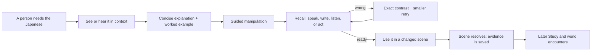

# Yomu Academy direction reset

**Status:** binding product contract before further volume work
**Date:** 2026-07-12
**Purpose:** align the existing runbook with the class experience the product must actually deliver.

The original Zero-to-N1 plan still stands. This document corrects how it reaches the learner.

The accepted route, lesson, grounded-content, living-paper, and usability rules are specified in [`LESSON-EXPERIENCE-CONTRACT.md`](LESSON-EXPERIENCE-CONTRACT.md). That contract was adversarially reviewed before Slice 1 resumed.

## Concept boards

These boards make the contract concrete. They are composition and interaction references, not production UI or canonical content: generated Japanese copy, exact source wording, faces other than approved references, and control details must be replaced by validated runtime data.

| Board | Where | What | Why | How |
| --- | --- | --- | --- | --- |
| [Complete first class](evidence/direction-reset/01-complete-first-class.png) | occupied `教室`, desk, then corridor | a six-beat view of the complete Lesson 0 | makes clear that the fourteen-expression handout is only one section | VN arrival → sound/script → source handout → sentence pattern → writing/recording → transfer |
| [VN and source flow](evidence/direction-reset/02-vn-source-flow.png) | teacher stage, physical worksheet, classmate exchange | one source-backed learning beat | replaces full-page cards with people, documents, and purposeful output | visible speaker → focused paper → audio/production → reactive dialogue |
| [World and map](evidence/direction-reset/03-world-map.png) | campus, neighbourhood, later travel | coherent geography with time/weather states | makes movement legible and lets the world expand without a destination grid | Japanese signs, open doors, ground routes, compact minimap, discovered folded map |
| [Content journey](evidence/direction-reset/04-content-journey.png) | class journal, lesson desk, `図書室` | the learner-facing shape of 73 weeks plus N3–N1 and the shared library | keeps 42 GB of material rich but calm | one current folio → authored lesson flow → later Study; shelves and shards stay behind the scene |
| [Three opening missions](evidence/direction-reset/05-opening-paths.png) | `LL教室`, `図書室`, `教室` entrance | different Sound, Text, and Speaking experiences | makes the first choice consequential | different canonical hosts, tasks, camera language, evidence, and mementos |
| [Journal and freedom](evidence/direction-reset/06-journal-freedom.png) | the learner's hands inside the live classroom | lesson choice, chronology, map, memories, Study, and end day | provides freedom without a dashboard or broken immersion | tactile tabs and found objects plus the quiet `…` safety route |
| [Learning interaction](evidence/direction-reset/07-learning-interaction.png) | one continuous classroom beat | annotation, real input, production, repair, reaction, and completion | keeps feedback inside the class instead of changing to a status page | per-line support → committed output → exact contrast → retry → changed expression and scene |

The boards agree on one rule: content is encountered through a person, place, or physical object. The archive and system state remain behind that experience.

## The correction

Stage 1 proved access, persistence, routing, source provenance, annotation injection, and offline restore. It did not yet prove a good first Japanese class.

The opening source is a two-page handout with fourteen classroom expressions. The current route turns only item 9 into a giveaway multiple choice and then jumps to an unrelated single-kanji task. It reads as a technical demo wrapped in large cards. That route is not the product target and must not be used as the template for the remaining corpus.

The product succeeds in this order:

1. **Japanese learning:** a coherent lesson with real input, explanation, recall, production, repair, transfer, and review.
2. **A living class:** people speak as visible characters in a visual-novel scene; language changes what happens.
3. **Effortless freedom:** the next action is obvious, while changing lesson, revisiting work, testing out, or ending the day remains easy.
4. **A memorable world:** place, time, weather, sound, motion, and relationships make returning feel worthwhile.

Story, maps, achievements, bonds, and collection systems celebrate evidence from learning. They never hide a thin lesson.

## The class test

Before a screen ships, answer these questions from the learner's seat:

- What Japanese am I learning or using now?
- What did I see or hear before I was tested?
- Does the response require recall or production, or does the screen reveal the answer?
- If I am wrong, does the repair teach the exact distinction?
- What changes in the room, story, or relationship because I used the language?
- Can I stop, revisit, or choose another available lesson without losing state?

If those answers are weak, visual polish does not rescue the screen.

## The first real class

The opening handout is one source activity inside a proper first class. Fourteen expressions are useful classroom survival language; they are not enough vocabulary, grammar, listening, reading, speaking, or writing to carry a complete lesson.

### Full Lesson 0 scope

Lesson 0 is a resumable 60–90 minute foundation class with a clear close after each section.

| Section | Japanese | Evidence |
| --- | --- | --- |
| Arrival and greetings | `こんばんは`, `はじめまして`, `よろしくお願いします`, names and classroom politeness | follow the live opening; greet Rie and a classmate naturally |
| Sound map | Japanese vowels, mora timing, long vowels, the role of hiragana, katakana, and kanji | hear and distinguish a small contrast set; map sounds to the first useful kana |
| Classroom survival handout | all fourteen source expressions below | understand the teacher's instructions, ask for repair, and use the handout without English leakage |
| First sentence frame | `N は N です`, `N じゃありません`, `N ですか`, `N の N`, `N も` | understand classmates' introductions; construct and say a true introduction |
| First useful vocabulary | people, learner/teacher, language, place/origin or role where the learner chooses to share it, plus the handout nouns | recall in context and add useful items to the shared Study collection |
| Authentic input | a short multi-speaker class introduction with paired audio and transcript reveal | identify speakers and facts from sound first, then confirm in text |
| Reading and writing | a simple name card and class note; first kana production appropriate to the chosen route | read a real purpose-built artefact; write with IME or Doodle as appropriate |
| Transfer | introduce yourself, repair something missed, then help a classmate enter the room or follow Rie's instruction | use the language after the teaching surface has gone |
| Close | Rie's short recap and one optional extension | choose more class work, another available lesson, exploration, Study, or end day |

The first class is not forced into one sitting. The journal marks section boundaries, keeps the classroom state, and lets the learner return to the exact beat.

### The classroom survival handout

The handout is grouped by use rather than reduced to one phrase.

| Cluster | Source expressions | Class action |
| --- | --- | --- |
| The room begins and ends | `はじめましょう`, `おわりましょう`, `やすみましょう` | Rie changes the room state; the learner follows the instruction and later chooses the right instruction for a real situation. |
| Look, say, listen, write | `みてください`, `（みなさんで）いってください`, `きいてください`, `かいてください` | Rie's sprite, board, class audio, and worksheet respond. The learner performs the action, then produces an instruction from a cue. |
| Check and repair | `わかりますか`, `はい、わかります`, `いいえ、わかりません`, `もう一度お願いします` | A fast instruction creates a genuine need to ask for repetition; the answer is not translated or displayed before commitment. |
| Feedback | `とてもいいです`, `そうです／あっています`, `ちがいます` | Rie's expression and the class response change. The learner distinguishes praise, confirmation, and correction in context. |
| Things on the desk | `しゅくだい`, `れい` | The learner identifies the example and homework on the literal handout, then follows the correct next step. |

The activity uses the exact source pages as teacher-verifiable evidence and a semantic reconstruction as the playable surface. All fourteen expressions receive source-question or instructional records, audio state, annotation state, accepted evidence, and later review homes.

### The opening choice changes the class

Sound, Text, and Speaking share the minimum survival outcomes required to function in class, but they do not merely reorder identical screens.

| Choice | First mission | Early cast/place | Practice balance | Distinct result |
| --- | --- | --- | --- | --- |
| Sound | help prepare a short class recording and catch who said what | `LL教室`; a listening-focused classmate | more real audio, sound discrimination, shadowing, and delayed transcript | an audio memory and listening-first daily plan |
| Text | work out the first handwritten note and label the classroom handout | `図書室` or board; an evidence/reading-focused classmate | more staged reading, kana recognition, reconstruction, and dictionary use | the first page clue and reading-first daily plan |
| Speaking | greet the people arriving and recover when something is missed | classroom/entrance; a socially supportive classmate | more rehearsal, recording, turn-taking, and repair language | a different first bond scene and speaking-first daily plan |

The route changes the first character connection, location, scene, optional material, daily recommendations, and evidence profile. Everything remains discoverable later without a message explaining that freedom.

### Cast ownership and rotation

Every named person comes from the canonical cast registry. Concept art may use an unnamed silhouette while likeness is pending; it may never invent a named classmate. The discarded `さくらさん` generated label is an example of what must not reach runtime.

Character name labels use the exact recorded first name—Xingyu, Mika, Sophie, Ruparna, Aakash, Sam, and so on. Do not auto-transliterate a person's name into guessed katakana. A kana alias may appear in dialogue only when it has been explicitly confirmed.

Each Week declares one lead, one or two supporting classmates, and only the background ensemble the scene needs. Rie teaches when teaching is required; she does not replace the cast's learning roles. No classmate leads more than two consecutive Weeks, and every real classmate receives meaningful learning ownership as well as bond scenes.

| Course need | Primary rotating hosts |
| --- | --- |
| sound, music, pronunciation, speaking confidence | Xingyu, Mika; Rie supplies teacher feedback |
| reading, evidence, subtitles, inference | Sophie, Ruparna, Jodi, Francis |
| greetings, social transfer, invitations, quiet inclusion | Aakash, Sam, Jenny, Peter |
| kana, kanji, games, mnemonics | Tom, Shin; Miller and Tawapon appear sparingly as textbook legends |
| food, menus, hosting, register | Robert, Shin, Sam |
| routines, instructions, movement | Christian, Sam, Rose |
| planning, technology, projects | Angel, Henry, Alex |
| art, media, opinion, expression | Stasi, Francis, Xingyu, Ruparna |
| ambiguity, changed plans, conflict, support | Sophie, Jenny, Alex, Aakash, Peter |

Suggested early ownership demonstrates the rotation: Lesson 0 Sound uses Xingyu/Mika; Text uses Sophie/Ruparna; Speaking uses Aakash/Sam. The following introduction Week rotates to Henry/Jenny/Tom; food and directions Weeks rotate to Robert/Shin/Rose; routines rotate to Christian/Jodi/Mika. Later N3–N1 arcs widen and recombine the ensemble rather than repeating the same four faces.

Nanako and Mira are canonical extended members only once their evidence and dossiers are complete. Their names, likenesses, interests, and lesson roles are never inferred from another person or invented to fill a scene.

### A ten-minute proof slice

The next implementation slice is deliberately small enough to judge honestly, but it belongs to the complete lesson above.

1. The classroom is full bleed. Rie is on stage and says `みてください` while indicating the handout.
2. The physical handout slides onto the desk. The relevant source region is focused; no technical source note is shown.
3. Rie uses `きいてください`, `いってください`, and `かいてください`. The learner responds by listening, speaking or recording, and writing—not by selecting translated answers.
4. Rie moves too quickly. The learner recalls or constructs `もう一度お願いします` with English hidden until commitment.
5. Rie's expression changes for correct, near, and repair outcomes. A wrong form produces one contrast, a smaller retry, and then returns to the same scene.
6. A classmate needs the same phrase later in the room. The learner transfers it without the source line in view.
7. The paper receives Rie's flower mark; the room advances. Review scheduling is silent unless the learner opens Study.

This slice must prove the final dialogue, annotation, source-paper, audio, production, reaction, repair, and return patterns. It must not invent a temporary UI.

## Lesson anatomy

Every class week is authored as a complete bundle. Source order remains traceable, but the learner experiences a paced class rather than a file viewer.

### Activity choice follows the skill

- Vocabulary: hear, recognise in context, recall, then use; batch the lesson set through the shared Study module.
- Grammar: worked contrast, construction, changed-context production, then open output.
- Listening: real source MP3 first, question after listening, transcript only after commitment, timecoded replay and shadowing afterward.
- Reading: evidence selection, rephrasing, inference, and summary; translation is not the pre-answer display.
- Kana and kanji: lesson set together, recognition-to-writing and writing-to-reading through canonical Yomu Doodle and KanjiVG.
- Writing: IME/freeform or Doodle as the task requires, with an earned reference tray and rubric. Never a fake keyboard alternative masquerading as handwriting.
- Speaking: target audio, rehearsal, recording/listen-back, intelligibility prompt, and a meaningful scene response. Browser TTS is not source audio.
- Multiple choice: reserved for genuine close contrasts, source-faithful items, or an accessibility alternative. Three options with their English meanings beside them is not assessment.

Sound, Text, and Speaking are consequential preferences, not three labels over the same activity. They change the default input, practice ratio, recommended daily work, and first transfer mission. They do not lock content or require explanatory copy.

## The 42 GB content system

The learner never sees “42 GB”, archive filenames, extraction status, provenance chatter, or a wall of lesson files. They see the right material at the right moment.

### Authoring layers

| Layer | What it owns | What reaches the learner |
| --- | --- | --- |
| Immutable source library | payload hash, occurrence, page/time locus, instructions, questions, images, answer relations | an exact crop or verified reconstruction when the source itself matters |
| Curriculum graph | concepts, prerequisites, Class/Genki/Minna/JLPT/performance projections | a clear lesson sequence and honest readiness state |
| Week bundle | the complete source set, explanations, media, activities, production mission, cast and locations | one coherent class with a beginning, middle, close, and optional extensions |
| Personal route | known state, placement evidence, errors, interests, Sound/Text/Speaking mix | the order and support best suited to this learner |
| Learner event log | attempts, repairs, reviews, production, scenes and relationships | continuity across Academy and Study without save-status narration |

### Source priority

1. Moodle chronology and every faithful source question anchor the seventy-three class weeks.
2. The shared Japanese library supplies cleared audio, images, readings, video, examples, textbook projections, and gap-filling practice.
3. High-quality audited Soya material supplies validated mechanics and shippable content where provenance permits, including full placement and recurring mocks.
4. Original Yomu material bridges missing Minna concepts and completes Foundation through N1 with four-skill work.
5. Learner-mined Yomu material powers personal transfer and long-term Immersion Hall work.

Payloads are deduplicated; occurrences remain visible in their original weeks. Public runtime data is sharded by current chapter, activity, and media need. A lesson pack is downloaded when chosen; large archives, unused PDFs, and soundtrack libraries are never swept into the application shell.

### The learner's course object

The course is a journal/syllabus found on Rie's desk. It opens to one next class and shows a slim chronology at the page edge. From it the learner can:

- continue the current class;
- revisit any played scene or completed source activity;
- choose another unlocked lesson or route view;
- take a local test-out;
- inspect optional work for the current day;
- end the day.

These controls are always reachable from the top-left `…` menu as a safety route. The physical journal is the immersive route; the menu is the reliable shortcut. Neither becomes a dashboard of progress cards.

## A world with scale

The map expands through connected places. It is not one giant hub and not a grid of cards.

### Scale 1: room and corridor

| Place | Learning home | World reason |
| --- | --- | --- |
| `教室` | current class, explanation, source activities, ensemble scenes | the main route and emotional centre |
| `図書室` | shared Study, reading, dictionary, saved lines, personal corpus | quiet independent work and class research |
| `LL教室` | source listening, video, pitch, shadowing, recording | equipment and acoustics make the activity believable |
| `作文室` | Doodle, kana/kanji sets, composition, rubrics | paper, tablets, brushes, and writing references live here |
| `カフェ` | low-pressure transfer, bonds, physical radio | people use Japanese after class |
| `中庭` | speaking walks, seasonal scenes, pronunciation games | movement and weather change the rhythm |
| `講堂` | orientation, full mocks, festivals, performances, graduation | events deserve a different spatial and audio scale |
| `玄関／ホール` | arrival, invitation, noticeboard, discovered folded map | entry and orientation remain diegetic |
| `受付` | account linking and class administration when the story calls for it | optional infrastructure has a believable home |

The compact minimap at top right shows only the current floor or immediate campus. It recedes during dialogue and assessment, expands on focus, uses Japanese place names, and never obscures Japanese text.

### Scale 2: campus and neighbourhood

The doors lead to a coherent Bloomsbury route: campus gate, station, park, pub, ramen shop, konbini, cinema/museum, gym, restaurant, and selected homes. A learner first walks there in a scene. After discovery, the journal map and `…` menu can shortcut the trip.

Each place has a learning reason:

- station/train: five-minute review, announcements, return recaps;
- ramen/restaurant: menus, counters, requests, register, group plans;
- pub/cafe: conversation, bonds, disagreements, media discussion;
- konbini: prices, quantities, requests, practical reading;
- park/courtyard: description, weather, movement, low-pressure speaking;
- cinema/museum: subtitles, inference, interpretation, cultural comparison;
- gym/tennis: routines, instructions, health and scheduling;
- home/room: personal writing, messages, remote listening, absence return.

### Scale 3: travel regions

Japan becomes a later regional route with airport, train, neighbourhood, school, museum, temple, office, restaurant, and story-specific destinations. It is reached through authored travel, not exposed as icons on the first campus map. Seasonal and alumni routes reuse the same world graph with new states.

### Movement grammar

1. Hover, focus, or touch reveals the route on the actual ground, corridor, or folded map.
2. The chosen door, path, light, or nearby character becomes the visual anchor.
3. Camera movement, parallax layers, footsteps, ambience, and a short transition show the journey.
4. The destination establishes time, weather, occupants, and one primary action before controls arrive.
5. Backtracking is immediate and preserves the exact activity or scene return state.

Reduced-motion mode replaces travel animation with a brief spatial dissolve while preserving origin and destination. Motion explains causality; environmental loops provide life without making every control twitch.

## Visual and interaction grammar

- The world is full bleed. A speaking person has an approved sprite on stage.
- Dialogue occupies the lower scene as a responsive angular paper speech shape with a speaker tab and tail; it is not a centred full-page card.
- Literal documents—worksheet, journal, letter, map, ticket, menu, manuscript page—may become tactile foreground objects because their material form matters.
- Explanations are written on the board, placed beside the relevant source area, or spoken by the teacher. They do not become a generic stack of panels.
- One image has one visual home in a beat. Do not repeat it as background, inset, and thumbnail on the same screen.
- Environmental colour follows place, season, weather, and time. Cozy rainy nights remain a signature, not the only state. Daylight, overcast afternoons, warm evenings, clear nights, festivals, and interiors add colour.
- Velvet Hour is one rare, unmistakable, authored state with its own palette, audio, rules, and narrative function. Dark blue is not the default Academy theme.
- Yomu theme accent drives focus, ink marks, routes, stamps, and selected states. It does not recolour the whole world.
- Every screen feels alive through subtle environmental loops and responsive state transitions. Constant decorative motion is avoided; focus remains on Japanese.
- Hover, focus, press, selection, busy, correct, repair, unlock, page turn, door open, and route travel each have a consistent response and sound.
- Journal entries use the approved character sprite as the person. Event CGs are replay thumbnails or story moments, not substitute portraits.

### Japanese support

- Japanese dialogue and every assessed choice use the full Yomu annotation bridge.
- Furigana and pitch are revealed on demand per line or choice according to the learner's support state; they are not incomplete or permanently forced.
- Compounds such as `もう一度` show the compound entry and its useful subwords in the popover.
- English interface mode never places the assessed translation beside an answer before commitment.
- Dialogue translations, transcripts, and model answers appear after commitment or through a clearly earned support action.
- Visible place names remain Japanese. Accessible English names are available to assistive technology and the minimap legend when requested.

## Copy contract

Copy is concise, literal, and spoken by a person when a person is present.

Remove:

- large marketing slogans and eyebrow labels;
- headings and subtitles that repeat the same instruction;
- “saved to your reviews”, “online”, “offline on this device”, “recommended”, and attribution/status narration in the learning flow;
- “source note” controls on learner screens;
- technical explanations of systems the result already demonstrates;
- unnatural setup lines such as “Aakash found the light, but not the cafe”.

Prefer:

- Rie: `もう一度、聞きますか。`
- Aakash on stage: `カフェ、こっちで合ってる？`
- Activity instruction: `聞いて、書いてください。`
- Navigation: `授業を変える`, `今日を終える`, `地図`, `日誌`.

When the scene, sprite, animation, or result makes something clear, do not say it again.

## Navigation contract

There is no persistent large navbar or floating Yomu puck.

- World navigation uses doors, paths, signs, objects, the compact minimap, and character invitations.
- The top-left `…` menu is the universal safety route: resume class, change lesson, map, journal, achievements, class board, Study, settings, sound, language, account, and end day.
- Contextual actions stay near the object or speaker they affect.
- The learner is never trapped in a mandatory chain after an activity boundary.
- “End day” saves state, resolves the current beat if needed, and offers a warm next return—not a guilt warning.

## Progress and relationships

- Progress is evidence: concepts used, kanji written, listening understood, writing produced, mistakes repaired, and material retained.
- Daily progress may appear as a small timetable edge, flower marks on completed work, a kanji garden, known-kanji colour, or the 15-minute Study countdown. It is not a wall of meters.
- One hundred achievements and medal tiers remain available through the journal/`…` menu, but celebration never interrupts graded input.
- Bonds use ten authored chapters with memories, choices, friction, support, vocabulary, and changed later scenes. Three stars are only a compact preview, not the relationship model.
- Class boards and peer progress require an account and use the learner's chosen public name plus discriminator. They remain optional and privacy-minimal.

## Immediate deletion and replacement list

| Current pattern | Replacement |
| --- | --- |
| full-page cream lesson cards | full-bleed VN scene plus literal source object |
| translated options before answer | Japanese response with on-demand reading support; meaning after commitment |
| single unrelated `一` choice | the actual lesson's full kana/kanji set through Doodle/Study when the curriculum calls for it |
| keyboard pseudo-handwriting | canonical Doodle or real IME/freeform writing |
| browser speech as lesson audio | paired source MP3; reviewed high-quality authored voice only for a true gap |
| journal summary card | replay through the canonical scene runtime |
| Aakash event CG as profile | approved Aakash sprite; CG remains an event image |
| neutral Rie for every outcome | approved reaction expressions bound to feedback state |
| floating map cards and spider lines | coherent geography, Japanese signs, highlighted paths, doors, and minimap |
| recommendation/status copy | visual route and implicit adaptive ordering |
| three-star relationship ceiling | ten-chapter bond progression |
| duplicated Yomu surfaces | shared Study, Doodle, annotation, dictionary, mining, and review modules |

## Required concept and production art

| Asset | Runtime home | Why it exists |
| --- | --- | --- |
| warm occupied classroom, day/dusk/rain/night | `教室` lessons | the class must feel populated and variable, not eerie |
| classroom phrase handout reconstruction | first lesson desk/board | faithful interaction with all fourteen expressions |
| Rie correct/encouraging/repair/listening expressions | lesson feedback | the teacher visibly reacts to the learner |
| approved Aakash neutral/speaking/uncertain/pleased | directions transfer and journal | a person speaking needs a sprite |
| coherent campus plates and floor minimap | world travel | geography and movement replace floating cards |
| corridor/door/parallax layers | between campus rooms | short travel explains place change |
| folded/open campus map | entrance and journal | the shortcut is first discovered as a world object |
| closed/open class journal with tabs | classroom desk and replay | lesson freedom and memories feel deliberate |
| source worksheet, menu, ticket, message, genkō paper props | activity-specific scenes | the material object becomes the interaction surface |
| group classroom/cafe/courtyard/event images across times and weather | weekly scenes | colour, ensemble life, and seasonal variation |
| Velvet Hour environment and transition family | one later special route | preserve darkness for a meaningful contrast |

Art is produced only after a runtime home is named. New character expressions derive from an approved neutral; missing likeness evidence remains a blocker rather than an invitation to invent a face.

## Acceptance before volume resumes

The direction reset closes only when the rebuilt proof slice passes in the real app at phone, tablet, and desktop sizes:

- the scene reads as a visual novel, not a card stack;
- Rie is visible and reacts to the attempt;
- the source paper is literal, legible, and not duplicated;
- English mode does not disclose the answer;
- Japanese annotations cover the complete line, including compounds, and remain stable after toggling;
- the learner listens to real paired audio or an explicitly reviewed authored recording, never browser TTS;
- speaking/writing/listening inputs match the claimed skill;
- wrong → precise repair → retry → return works without leaving the scene;
- change lesson, revisit, and end day are reachable through `…` without losing state;
- movement to the next place has coherent geography, a compact minimap, and a reduced-motion equivalent;
- the screen contains no learner-facing source/status/attribution chatter;
- a Japanese teacher could identify what was taught, practised, produced, and retained.

After this proof passes, the same grammar is applied to the complete Lesson 0 above, then to the seventy-three source weeks, the shared Japanese library, Soya integrations, original N3–N1 course, full story, art, audio, access/sync, and release gates in the original runbook.
