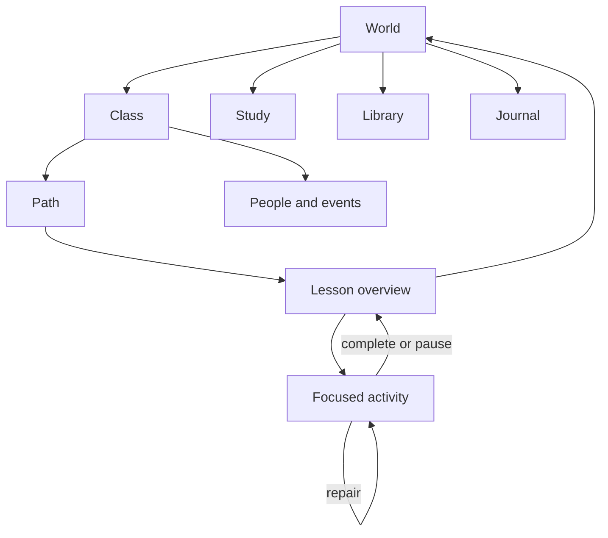

# Academy lesson experience contract

**Status:** binding for the direction-reset slices and every later Week
**Reviewed:** Fable 5, low effort, sessions `665dfc90-1169-4bc7-ad70-1e2b61172438`

The same curriculum must work as a living story and as a direct course. The learner chooses the presentation; content, evidence, progress, and Study remain identical.

## One route tree

- Story view enters through places, people, and objects.
- Course view opens on Class and renders dialogue as an annotated script.
- Both views mount the same activities and append the same learner events.
- `…` is the stable safety route. Back uses persisted route history; campus is not hard-coded as every screen's parent.
- Class and end-day are reachable in at most two interactions with no state loss.

## Class and lesson shape

### Class

The path is a two-level syllabus spine:

- level headings are always visible with progress and Week count;
- only the current level is expanded by default;
- the page opens at the current Week with Resume as the primary action;
- selecting an authored Week opens its overview directly;
- unauthored Weeks remain honestly unavailable and never route to a placeholder;
- People and Events show the selected level rather than dumping the whole registry.

### Lesson overview

One paper spread answers, without opening separate panels:

- what the learner will understand or produce;
- the ordered sections and their state;
- the source objects and media used;
- the people and place involved;
- current progress and the next resumable section.

The overview chooses an activity. It does not test the learner or repeat the activity's content.

### Focused activity

One activity owns the screen. Its stable anatomy is:

1. section name and position;
2. Japanese input or task;
3. learner-controlled reading support;
4. genuine response input;
5. one commit action;
6. precise in-place feedback and repair;
7. back to overview and next after completion.

Draft/committed/save state is truthful. Answers, translations, transcripts, and models are absent from the DOM until their declared reveal condition is met.

## Grounded lesson gate

Art, story, rewards, cast, and layout cannot satisfy this gate. A lesson is playable only when its validator proves:

1. **Input:** immutable source records or versioned authored input with register/naturalness review.
2. **Curriculum:** concepts, outcomes, and prerequisites resolve in the curriculum graph.
3. **Teaching:** relevant explanation and worked examples precede assessed practice and cover the assessed concepts.
4. **Media:** required image, audio, video, transcript, captions, and source loci are delivered and reviewed.
5. **Practice:** guided, independent, and changed-context transfer production are all present or the lesson is blocked.
6. **Assessment:** deterministic answer sets or a real rubric resolve to authored definitions; IDs are not invented by convention.
7. **Concealment:** assessed answers and equivalent English are unavailable before commitment.
8. **Repair:** tagged errors lead to an exact contrast, nearby example, smaller or same-task retry, and return.
9. **Evidence:** attempts and review seeds resolve to the canonical Yomu expression/reading key space.
10. **Access:** keyboard, touch, screen-reader, motion, caption, and input alternatives preserve the same learning construct. Typing cannot count as handwriting and selecting cannot count as speaking.
11. **Fidelity:** every source instruction, worked example, question, answer relation, occurrence, and required media locus survives through the source-package validator.
12. **Honesty:** a missing proof produces a named blocker; presentation quality never changes status.

The build must validate every advertised lesson against this interface. Coverage reports keep source occurrences, unique payloads, source questions, playable activities, and concepts as separate denominators.

### Write authority

- Every complete lesson has one registry entry with its kind, filename, lesson ID, content revision, and expected SHA-256. Support shards name their owning lesson and cannot pose as complete lessons.
- The runtime fetches the shipped lesson bytes, verifies their digest before parsing, re-runs the registered audit, and checks lesson ID and revision. A caller names a lesson; it cannot pass a contract or playable verdict.
- An attempt or review write requires a playable lesson and activity, exact concept/source scope, and an item in the lesson's audited canonical Yomu review allow-list.
- Review identity is normalized by one shared function across validation, learner evidence, and scheduling. Duplicate forms collapse; one canonical card associated with different concepts is invalid.
- A ready concealment proof references a registered surface audit. Its actual DOM/reveal facts must match the claim; an ID, boolean, or author assertion alone cannot pass.
- Class-Week delivery is derived after these checks. A route, authored shell, cast plan, screenshot, or manual ledger edit cannot promote a Week.

## Living-paper types

The world and conversations remain full bleed. Paper appears when the learner is handling a real learning object.

| Type | Home | Distinct behaviour |
| --- | --- | --- |
| Lesson handout | numbered source and teaching sequence | item focus and post-attempt answer rows |
| Dialogue letter | messages and script-mode dialogue | line advance and speaker attribution |
| Reading/book page | passages and stories | live Yomu annotation and evidence marking |
| Listening sheet | source audio | transport, replay evidence, transcript after commitment |
| Writing/genkō page | IME, composition, kana and kanji | real text or Doodle input; earned reference tray |
| Worksheet/PDF | exact source document | pan/zoom, semantic loci, focused answer probes |
| Mock booklet | placement and recurring mocks | timer, section rules, support only in review mode |
| Review slip | shared Study | canonical queue and rating controls only |
| Journal | people, memories, class history | continuous book spreads and inline replay |
| Video/subtitle surface | cleared video | existing Yomu player, subtitles, dictionary, paused probes |

Ten types are the ceiling. A new exercise must fit one or justify replacing a type.

Across every assessed type, these remain predictable:

- `…` at top left and a stable menu order;
- title and position;
- the same reading-support location;
- one primary commit/advance control;
- in-place repair rather than a modal;
- back to overview;
- identical event emission, save language, keyboard semantics, and reduced-motion behaviour.

## Navigation and transition rules

- `go` pushes a checkpoint frame; `back` pops it; replacement and reset are explicit.
- History survives refresh and offline resume.
- Re-rendering the same route does not grow history.
- Enrollment normalization cannot expose an expired access state through Back.
- Routes are classified centrally. Any legacy ungrounded activity is removed from both current state and saved history before rendering, even when the invite session is otherwise valid.
- Leaving a draft needs at most one concise saved-state message, never a confirmation maze.
- Course-view switching changes the host, not the activity or evidence.
- A failed answer stays in the activity for repair. Pausing returns to the overview with `needs review`; passing returns with the section marked.

## Library use

The 42 GB corpus is a private source store, not a UI claim.

- Automatic work: classify, hash, deduplicate, probe, pair likely tracks, and produce opaque metadata.
- Human review: source questions, answer relations, transcript/speaker pairing, level/skill tags, rights, and learner-facing shelf placement.
- Delivery: reviewed items resolve through signed media into the existing Yomu video, PDF/OCR, audio, image-region, or Study surface.
- Anki packages remain metadata-only until note mappings are reviewed; imported items deduplicate into the shared collection.
- Learners never see filenames, hashes, archive counts, provenance chatter, or private source paths.

## Usability gate

Each slice must pass these observable checks:

- current position, attempt state, and save state are visible and true;
- the interface matches a familiar syllabus → lesson → exercise → feedback loop;
- Back, change lesson, pause, and end day preserve work;
- global controls do not move or change meaning between paper types;
- support cannot reveal the answer accidentally;
- the current task is the visual priority; dead controls and duplicate routes are absent;
- errors explain the distinction and allow an immediate recovery;
- one short class-help page and first-use support hints are sufficient; no tutorial overlay is required.

## Slice order

1. Persisted navigation and Story/Course presentation hosts.
2. Class → Lesson 0 overview → all focused Lesson 0 activities → repair/return.
3. One curated Library shelf with real video/subtitles and one source PDF.

Content volume and per-Week art resume only after these three templates pass at phone, tablet, and desktop sizes.
