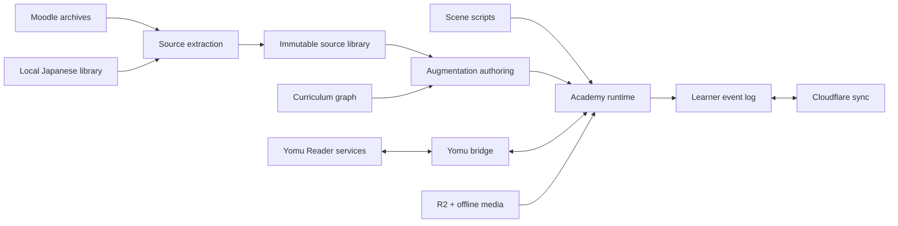

# Architecture and Domain Model

## Core domains

| Domain | Owns | Does not own |
| --- | --- | --- |
| **Source Library** | immutable source records, occurrences, loci, media, answer keys | pedagogy, story, learner state |
| **Curriculum Graph** | concepts, prerequisites, outcomes, order projections | source bytes, rendering |
| **Learning Activity** | prompt model, response kind, grading, hints, explanation, SRS signals | page layout, persistence backend |
| **Learner Record** | attempts, mastery evidence, due events, preferences, unlocks | content definitions |
| **Narrative** | scene scripts, choices, flags, bonds, dialogue variants | grading policy |
| **World** | calendar, locations, available actions, transitions | content authoring |
| **Media** | image/audio/video/transcript assets and playback contracts | lesson sequencing |
| **Access** | invite session, profile linking, entitlements | learning logic |

## Ubiquitous language

- **Source document:** one deduplicated payload such as a PDF.
- **Occurrence:** one placement of a source document in a course section/week.
- **Source question:** the smallest faithful assessable prompt, with source locus.
- **Augmentation:** explanation, hint, grading logic, solo adaptation, extra practice, or story wrapper added by Academy.
- **Concept:** a stable skill/knowledge node independent of textbook order.
- **Week:** a class-chronology container that references sources and concepts.
- **Unit:** a learner-facing sequence projected by a curriculum view.
- **Attempt event:** immutable evidence that a learner responded.
- **Mastery projection:** derived state from attempt/review events.
- **Scene beat:** one narrative action or exchange with a learning or character purpose.
- **Bond beat:** a replayable relationship scene unlocked by evidence and story state.
- **Asset home:** the exact runtime scene, activity, journal entry, or location that consumes an asset.

## Deep module boundaries

### `source-library`

Interface:

```ts
interface SourceLibrary {
  getDocument(id: SourceDocumentId): Promise<SourceDocument>;
  getQuestion(id: SourceQuestionId): Promise<SourceQuestion>;
  questionsForOccurrence(id: OccurrenceId): AsyncIterable<SourceQuestion>;
  mediaForQuestion(id: SourceQuestionId): Promise<SourceMedia[]>;
}
```

The source layer is immutable. Corrections create new extraction revisions while preserving old hashes and loci.

### `activity-runtime`

```ts
interface ActivityPlugin<Response> {
  kind: string;
  render(model: ActivityModel, host: ActivityHost): ActivityController<Response>;
  grade(model: ActivityModel, response: Response): GradeResult;
  toReviewEvents(model: ActivityModel, result: GradeResult): ReviewEvent[];
  validate(model: ActivityModel): ValidationIssue[];
}
```

Every response kind carries keyboard, touch, screen-reader, reduced-motion, and deterministic-grading contracts.

### `scene-runtime`

Scene scripts are data. The interpreter owns execution, cancellation, save/resume, backlog, auto, read-skip, stage blocking, and activity handoff. Renderers own presentation. Narrative authors never manipulate DOM.

Use Ink/inkjs as an authoring reference or optional compiler seam, not as a second state engine. A compiled scene must resolve to the Academy `SceneNode` union so tests and progress remain uniform.

### `learner-record`

Append-only events are canonical:

```ts
type LearnerEvent =
  | AttemptRecorded
  | ReviewRated
  | GrammarKnownChanged
  | SceneCompleted
  | BondChanged
  | AssetUnlocked
  | ProfileChanged;
```

Local IndexedDB stores the event log and projections. Cloudflare sync exchanges idempotent events. UI reads projections rather than mutating ad hoc localStorage keys.

### `yomu-bridge`

The bridge is an anti-corruption layer over Reader APIs:

- `AnnotationService`
- `DictionaryService`
- `GrammarKnowledgeService`
- `ReviewQueueService`
- `KanjiWritingService`
- `AudioPronunciationService`
- `ImmersionExampleService`
- `MiningService`

Academy code depends on these interfaces. Adapters import Reader modules. A browser fallback adapter handles plain-fetch contexts such as `/academy/` where userscript bridges may not exist.

### `media-runtime`

One `AudioDirector` owns music, ambience, voice/listening audio, and SFX buses. One `MediaResolver` turns asset IDs into local, R2-signed, or offline-cache URLs. Screens never instantiate audio elements directly.

## Data flow



## Architecture decisions

1. **Canonical content is data, not TypeScript literals.** It must be searchable, validated, diffable, and streamable.
2. **Story choices alter presentation and relationships, not access to learning.** A learner may jump to any lesson.
3. **One learner event log.** Progress, SRS, bonds, and sync derive from evidence rather than duplicated flags.
4. **One audio director.** This eliminates the drone, track overlap, and inconsistent restore behavior seen in prototypes.
5. **One annotation bridge.** Furigana, pitch, dictionary popovers, and KanjiVG share network/fallback behavior.
6. **Plugins deepen the core.** New content adds manifests and plugins; it does not enlarge an Academy god-object.

## File-size and ownership guardrails

- Core orchestrators target 300 lines or fewer.
- One module owns each state transition.
- Plugins do not import other plugins; shared needs become core interfaces.
- CSS is layered by tokens, shell, scene, activity, and plugin. Japanese annotation selectors use direct-child and role classes, never broad descendant `span` rules.
- Every public JSON schema has a version and validator.
