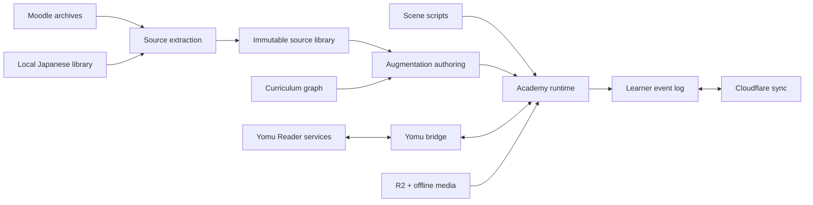

/goal

# Yomu Academy Zero-to-N1 True One-Shot Implementation Plan

This is the complete implementation brief. Begin implementation immediately on the existing main branch. Address every requirement and release gate in this document end to end. Maintain progress and memory artifacts in the repository so the work survives task transitions.


---

<!-- Embedded source 1/17: ONESHOT-EXECUTOR-PROMPT.md -->

# One-Shot Executor Brief

You are the lead engineer, game director, curriculum architect, and final integrator for Yomu Academy. Build the product, start to finish, directly on the repository's `main` branch. Work sequentially through verified stages, use the existing source and art ledgers, and leave executable evidence after every stage.

## Product

Yomu Academy is a Foundation-to-N1 Japanese learning world set around a warm, rain-lit London evening class. It combines a real visual novel, a place-based school-life loop, every question from three years of Moodle material, original advanced curriculum, Yomu Reader's proven learning tools, and a memorable ensemble led by Rie-sensei.

The game is narrative and image driven. Language is how the player helps people, repairs misunderstandings, makes plans, explores places, handles conflict, and grows closer to classmates. The emotional story includes comedy, surprise, tension, friendship, ordinary adult life, pop-culture conversation, and an eventual Japan arc. The learning system remains rigorous: explanation, authentic input, guided practice, production, feedback, repair, SRS, and transfer.

## Read first

Read every file in:

`/Users/heru/Documents/Projects/yomu/docs/academy-oneshot-discovery-20260712/`

Start with `README.md`, `MASTER-PLAN.md`, `PROTOTYPE-SYNTHESIS.md`, `VERTICAL-SLICE.md`, and `PRODUCTION-RUNBOOK.md`. The other files are binding discovery artifacts for architecture, source content, Yomu integration, narrative, cast, art, audio, and reference code.

## Main branch and evidence

1. Work directly in `/Users/heru/Documents/Projects/yomu/apps/yomu-reader` on its existing `main` branch and preserve unrelated local changes.
2. Fetch `origin/main` and integrate current upstream work without discarding the working tree.
3. Treat the two donor trees and dormant Codex worktrees as read-only evidence; implement the unified result only on `main`.
4. Copy this discovery pack into `docs/academy/discovery/` on `main`.
5. Create and maintain `STATUS.md`, `BACKLOG.md`, `DECISIONS.md`, `SESSION-LOG.md`, `MEMORY.md`, the resource ledger, and asset-usage ledger described in the runbook.
6. Commit each green stage to `main`. Every status update names changed files, tests, browser evidence, remaining defects, and the next action.

## Build order

Execute `PRODUCTION-RUNBOOK.md` in order. Begin with the enrollment vertical slice. It must prove code entry, Rie's introduction and fiction note, four protagonist choices, the three start paths (Lesson 0, chosen JLPT band, or optional JLPT mock), evidence-based placement, a plot-preserving midstream arrival bridge, location-first campus, the lesson forks, one complete source activity, KanjiVG/Doodle, a Yomu review event, character unlock, bond journal, audio state, and offline resume.

Then complete the source pipeline and all 73 class weeks. Every Moodle question, instruction, worked example, image dependency, answer relation, and listening pair becomes a faithful playable activity. After that, build the original N3-N1 course, full story, complete art, audio, Cloudflare access/sync, and release hardening.

## Product synthesis

Take Donor A's strong entrance, full-bleed study composition, visual identity, direct OpenAI art, and source corpus. Take Donor B's modular engine direction, map/day loop, progression, journal, bond stars, content breadth, onboarding model, SRS, Doodle, audio controller, and tests. Port reviewed modules and ideas in small commits. Rebuild the cramped CSS, weak sprites, placeholder prose, duplicated surfaces, and stale Reader integrations.

## Visual direction

All new art uses the locked warm pixel-painted anime realism in `ART-AND-AUDIO-LEDGER.md`. The campus ensemble, rainy directions, classroom tutoring, and Rie art are the calibration set. `quality-2` through `quality-5` are the protagonist choices. Every classmate is regenerated consistently with OpenAI image generation after their neutral likeness passes review. Generated scenes may include natural pop-culture context across games, anime, manga, music, films, books, cooking, fashion, cars, sport, and travel.

## Learning and Yomu

Use one learner event log and Yomu's canonical study repositories. Mount dictionary, furigana, pitch, grammar, mining, immersion examples, sentence reveal, audio, KanjiVG, Doodle, OCR/PDF, subtitles, and review through the `yomu-bridge` interfaces. Fix shared Reader defects at their source and rebase the latest main as needed. Study locations present these workflows inside the Academy world; they do not send the learner to a visually unrelated app.

Every exercise produces useful evidence. Wrong answers lead to a precise explanation, smaller repair, nearby example, retry, and future review. Writing has an earned reference tray and rubric. Listening pairs audio, questions, transcript state, timecodes, shadowing, and replay. Kanji is practised both recognition-to-writing and writing-to-reading. Use the audited Soya corpus for optional placement and recurring JLPT mock events; validate provenance and calibration before shipping. Placement recommends by skill while preserving Lesson 0 and manual level choice. Curriculum acceleration preserves the plot through playable entry bridges and chronological journal memories.

## Story and cast

Use the six-season Foundation-to-N1 spine and ensemble matrix. Give every classmate meaningful learning appearances, three bond steps, unlock animation, expressions, journal profile, bond stars, and replayable Japanese scenes. Use fictional but emotionally strong variants for high-risk real-world events. The two unidentified contacts stay outside the cast. Pho is not canon. After the finite graduation ending, sustain years of play through level-layered New Game Plus, an alumni calendar, rotating JLPT seasons, SRS-driven encounters, Immersion Hall, replayed source activities, fresh game instances, and curated finite storylets. The world continues without undoing graduation or trapping the cast in endless central drama.

Rie's opening briefly states that the AI-created plot is fictional and does not describe real events or make claims about real people, then asks the player's name and reason for learning Japanese. Dialogue is concise, specific, funny, and human. Support reduces as the learner improves.

## Audio and world life

Build `AudioDirector` before visual polish. Use the exact private Persona soundtrack mapping and Shinday SFX shortlist in the cue sheet. Places have distinct themes, ambience, transitions, and silence states. The cafe/lab radio is a real world object. Music unlocks on gesture, crossfades, ducks for lesson audio, resumes intentionally, and never becomes an electro drone.

## Infrastructure

Use Wrangler and existing Cloudflare credentials to create/verify D1, R2, Worker routes, migrations, archive upload, signed media, invite sessions, and sync. Seed `<PRIVATE_CLASS_INVITE>` through the admin endpoint. Keep Stripe implementation ready and activate it after class-code launch stability.

## Completion

The work is complete only when every release gate in the runbook passes. Show the final Academy in Playwright at desktop, tablet, and phone sizes after Japanese annotations have injected. Demonstrate the full enrollment journey, daily loop, one whole class week, review return loop, bond replay, handwriting, listening, writing, offline resume, and Cloudflare smoke. Leave `main` coherent, exact deployment/rollback instructions, and living documents that another session can resume without reconstructing history.


---

<!-- Embedded source 2/17: README.md -->

# Yomu Academy Studio Discovery Pack

**Prepared:** 2026-07-12  
**Purpose:** turn the merged Zero-to-N1 plan into an implementation-ready studio brief.  
**Canonical entry point:** [MASTER-PLAN.md](MASTER-PLAN.md)

This pack resolves the discovery work that earlier plans deferred. It records the verified donor topology, usable code, source-coverage baseline, approved art provenance, audio inventory, Yomu integration seams, narrative spine, content-image pipeline, architecture, and production gates.

## Read order

1. [MASTER-PLAN.md](MASTER-PLAN.md) - product definition, priorities, stages, and definition of done.
   The ready-to-run single-agent instruction is [ONESHOT-EXECUTOR-PROMPT.md](ONESHOT-EXECUTOR-PROMPT.md).
2. [DISCOVERY-BASELINE.md](DISCOVERY-BASELINE.md) - what actually exists, including dormant Codex worktrees.
3. [PROTOTYPE-SYNTHESIS.md](PROTOTYPE-SYNTHESIS.md) - module-level keeper/reject matrix for both prototypes.
4. [ARCHITECTURE.md](ARCHITECTURE.md) - deep-module boundaries and data flow.
5. [YOMU-INTEGRATION-MATRIX.md](YOMU-INTEGRATION-MATRIX.md) - every proven Yomu capability and its Academy home.
6. [CONTENT-AND-WORKSHEET-MEDIA.md](CONTENT-AND-WORKSHEET-MEDIA.md) - lossless Moodle digitisation and PDF-image strategy.
7. [NARRATIVE-AND-CAST.md](NARRATIVE-AND-CAST.md) - story structure, ensemble arcs, comedy, and learning alignment.
8. [ART-AND-AUDIO-LEDGER.md](ART-AND-AUDIO-LEDGER.md) - keeper assets, rejected batches, missing production, OST and SFX plan.
9. [CHARACTER-ASSET-DOSSIER.md](CHARACTER-ASSET-DOSSIER.md) - likeness locks, interests, references, and art acceptance.
10. [IMAGEGEN-RECOVERY.md](IMAGEGEN-RECOVERY.md) - recovery and approval for direct OpenAI image stores.
11. [REFERENCE-CODE-HARVEST.md](REFERENCE-CODE-HARVEST.md) - exact pinned mechanisms to adapt from local references.
12. [VERTICAL-SLICE.md](VERTICAL-SLICE.md) - the opening 20-minute beat sheet and acceptance script.
13. [AUTHORING-SPEC.md](AUTHORING-SPEC.md) - week, scene, dialogue, and source-fidelity contracts.
14. [AUDIO-CUE-SHEET.md](AUDIO-CUE-SHEET.md) - exact prototype music/SFX slots and mixing test.
15. [PRODUCTION-RUNBOOK.md](PRODUCTION-RUNBOOK.md) - the one-shot execution sequence, living files, and release gates.

## Locked owner decisions

- The launch path is `<PRIVATE_CLASS_INVITE>` plus admin-created invite codes. Stripe remains an activation-ready adapter rather than a launch dependency.
- The executor owns Cloudflare setup and seeding through Wrangler and the admin API. Owner intervention is reserved for secrets that are unavailable locally and physical-device acceptance.
- Real classmates remain the emotional foundation. Wholesome details and class chemistry may appear directly. High-risk real events become fictional but equally consequential story events.
- Rose remains a named classmate from direct recollection. The two unidentified chat numbers are not assigned identities. One may be Rose and one may be another Chinese classmate, but neither is merged into a dossier without evidence.
- The course runs from absolute zero through N1. Story progress never substitutes for demonstrated learning.
- Every Moodle question, instruction, answer-key item, audio pairing, and image-dependent task receives a stable source record and a playable Academy representation.
- Runtime art uses OpenAI-generated or explicitly approved existing assets. Pollinations/Flux/Python-generated character batches are excluded.

## Source plan

The source plan is:

`/Users/heru/.codex/attachments/8d945eba-7120-4070-a985-0e68bf2dc705/pasted-text.txt`

Its useful decisions are incorporated here. The plan states concrete outcomes and trusts the executor's judgment wherever implementation choices remain open.


---

<!-- Embedded source 3/17: MASTER-PLAN.md -->

# Yomu Academy: Implementation-Ready Master Plan

## Dream state

Yomu Academy is a complete Japanese-learning world from first kana to N1. A learner enters a rainy, warm-lit London evening class, meets Rie-sensei and a memorable ensemble, and learns through real dialogue, living worksheets, listening, handwriting, reading, writing, speaking, games, and review. The story has the emotional range of a good visual novel: jokes that recur, awkward evenings, difficult departures, friendships that deepen, small betrayals, unexpected kindness, travel, and earned joy. The course has the rigor of a strong language programme: every claim is evidenced, every source is traceable, every mistake returns at the right time, and every skill is practised in production as well as recognition.

The visual layer is full-bleed warm pixel-painted anime realism: evening blue, practical amber light, expressive adults, believable places, and one coherent cast. The learning layer is quiet, legible, and direct. The two do not compete. A learner always knows where they are, what they can do next, and why it matters in the scene.

## Product pillars

### 1. The worksheet becomes a world

The original prompt remains intact. Its images, audio, order, examples, and answer-key relationship remain traceable. Academy adds interaction, hint ladders, explanations, grading, solo adaptations, model answers, SRS extraction, and a story reason to complete it.

### 2. Narrative creates the need for language

The plot does not pause for a lesson card. A task begins because someone needs directions, a message repaired, a menu understood, a plan negotiated, a memory explained, or a difficult conversation handled. Learning content is the action of the scene.

### 3. One learning record everywhere

Academy and Yomu Reader share vocabulary review, grammar-known state, pitch data, mined sentences, handwriting outcomes, and due work. The learner can read on the web, study in Academy, and return without maintaining parallel progress systems.

### 4. A complete route, many orders

Canonical concepts and source activities exist once. Views project them into class chronology, Genki, Minna no Nihongo, JLPT, JF/CEFR performance, and a custom route. At enrollment the learner chooses one of three equally clear paths: begin at Lesson 0, choose a provisional JLPT band, or take an optional JLPT-style mock that recommends a starting point from evidence. Local skill/unit test-out remains available afterward because learners often have uneven reading, listening, grammar, speaking, and writing profiles.

### Placement and JLPT event contract

- The optional initial mock uses audited structures, scripts, and listening media from `/Users/heru/Documents/Projects/yomu/references/soya-research/`, including official-source candidates under `source-candidates/jlpt-official/`. Verify provenance and reuse rights item by item before shipping.
- The learner may select N5, N4, N3, N2, or N1 as the mock target, or take a short adaptive ladder that refines the recommendation by skill.
- Results report language knowledge, reading, and listening separately. Speaking and writing confidence comes from short Academy production tasks rather than being inferred from receptive JLPT scores.
- The result recommends a curriculum entry point and seeds known-state/SRS evidence. The learner remains free to begin earlier, start at Lesson 0, or change routes later.
- Full mock tests recur as calendar events: orientation diagnostic, term checkpoint, festival/exam-week rehearsal, and pre-exam simulation. Timed, untimed-study, and review modes share one validated assessment model.
- Starting midway never loses the plot. A level-specific playable bridge introduces Rie, the campus, the chosen identity, the present season, relationships, and current emotional stakes. The journal opens replayable chronological recaps for earlier canonical scenes.
- Story experience and curriculum mastery are separate state dimensions. Placement can advance lessons and seed reviews without pretending unseen scenes were emotionally experienced.

### 5. Kind challenge

Daily practice is visible and satisfying without punishment. Wrong answers produce useful repair. The return loop is short enough for a commute and deep enough for a long evening. Bonds, stamps, scenes, and unlocks celebrate real mastery rather than replacing it.

## Experience architecture

### First session

1. The academy doors open over the approved blue-hour campus scene.
2. Rie greets the learner in simple Japanese with immediate furigana, pitch, audio, and tap-to-inspect support.
3. The learner enters a name and a private reason for learning Japanese.
4. The learner chooses one of the four approved `quality-2` through `quality-5` protagonist portraits.
5. Rie is the first character unlock. The journal opens with one replayable scene and one empty bond row.
6. The campus map appears. Classroom is the clear main route; Library, Language Lab, Writing Studio, Cafe, and other locations show concise purposes.
7. Lesson 0 asks only: `Choose what Rie-sensei should show first.` Sound, Text, and Speaking are real forks with independent completion state.

### Daily loop

1. **Arrival:** a short location or character beat, never a dashboard.
2. **Check-in:** due work and one story objective are visible together.
3. **Choose:** continue the class route, visit a study location, meet a character, or take a five-minute train-home session.
4. **Learn:** explanation, worked example, guided attempt, independent attempt, transfer.
5. **Repair:** errors enter a focused queue with a hint and a contrasting example.
6. **Close:** a scene resolves, progress is saved, SRS events are scheduled, and one next action is offered.

### Weekly loop

- One full class week, preserving every source activity.
- One cumulative checkpoint that interleaves older concepts.
- One relationship or world beat that uses the week's Japanese.
- One bespoke game instance built from a reusable mechanic, exact lesson content, a host character, and an original art skin.
- One production mission: speaking, handwriting, or extended writing.

### Long loop

- Foundation/N5: belonging, useful repair language, identity, time, town, food, routine.
- N4: plans become real; conditions, favours, explanation, experience, connected narration.
- N3: the class handles ambiguity, changing plans, register, evidence, agency, and everyday native input.
- N2: people disagree; the learner compares sources, qualifies claims, and supports a position.
- N1: the ensemble confronts a complex shared problem involving conflicting accounts, implied meaning, and difficult choices. The learner reads, listens, synthesises, presents, and adapts under questions.
- Post-N1: New Game Plus raises the language layer and removes supports while keeping the world replayable.

### Infinite learning life after the finite story

The six-season story reaches a definite graduation and emotional ending. The Academy then becomes a persistent alumni world designed for years of Japanese growth:

- New Game Plus replays canonical scenes at a chosen higher language layer, with reduced support, alternate response demands, different character perspectives, and mastery-aware dialogue rather than merely resetting progress.
- The daily loop continues indefinitely from real SRS due work, mined Yomu material, weak-skill repair, immersion recommendations, writing prompts, shadowing, and rotating character encounters.
- JLPT seasons recur for N5 through N1 with fresh validated forms, mock-exam calendar events, score history, targeted repair arcs, and post-exam reflection.
- Earlier weeks remix through interleaving and transfer missions. The content changes through learner evidence, source media, register, production mode, host character, and story framing, not palette swaps.
- Alumni episodes, group-chat updates, birthdays, seasonal campus states, radio shows, trips, and friendship epilogues provide bounded new storylets without undoing the ending or manufacturing endless central conflict.
- Immersion Hall supplies an effectively unbounded stream of learner-chosen articles, subtitles, video transcripts, books, games, and mined sentences through Yomu's shared known-state and coverage model.
- A generative authoring pipeline may draft new practice variants and slice-of-life prompts from validated concepts, but deterministic grading, provenance, character voice, safety, and human-readable QA contracts remain mandatory.
- Returning after days or years produces a warm recap, due-work triage, current-world beat, and one clear next action. There are no guilt streaks and no narrative punishment for absence.

## What is already decided

- The existing `main` branch is the sole implementation line; donor trees remain read-only evidence and salvage sources.
- Donor B supplies the modular shell, scene interpreter, campus loop, world model, journal, bonds, and week rail after code review.
- Donor A supplies source data, story/cast research, Moodle ledgers, worksheet packs, mappings, scripts, and approved art after provenance review.
- Dormant Codex worktrees contain useful isolated implementations for map navigation, SRS integration, PWA, Doodle, onboarding, cast journal, responsive CSS, audio, story, Cloudflare, and source audit. They are reviewed as patches, not merged wholesale.
- The Academy shell imports Yomu capabilities through adapters. It does not fork Reader internals.
- Public runtime content is sharded and lazy-loaded. Private source archives remain outside the public bundle.
- Cloudflare Worker + D1 + R2 are the deployment platform. Wrangler is the operational interface.

## Quality bar

The opening minute must already contain the final product's truth: strong art, warm human dialogue, responsive audio, working annotations, an immediate choice, and a visible path. A beautiful static shell without learning is a failure. A complete LMS inside generic panels is also a failure.

Every screen must pass four questions:

1. What is the learner doing here?
2. What is the one primary action?
3. What changes in learning, story, or relationship state?
4. Does the full-bleed visual context help without reducing legibility?

## Workstreams

### A. Foundation and architecture

- Begin directly on the repository's existing `main` branch, preserving unrelated local work while integrating current `origin/main`.
- Import the reviewed Donor B shell in small commits.
- Establish typed registries for activities, scenes, games, curriculum views, audio, media, and SRS providers.
- Keep persistence, content loading, grading, audio, and reader integration behind deep interfaces.
- Add conformance tests before adding volume.

### B. Source fidelity and content

- Rebuild the corpus ledger from all 96 Moodle archives and the local Japanese library.
- Deduplicate by payload hash while preserving every course occurrence.
- Digitise every question and source image; pair all listening media.
- Make all 73 existing class-week records authored and reachable, then extend the original Yomu course through N1.
- Map every concept to class, Genki, Minna, JLPT, and performance outcomes.

### C. Learning loop

- Embed Yomu SRS, grammar-known state, pitch, furigana, audio, Doodle, sentence mining, and immersion examples.
- Implement skill-local test-out, repair queue, daily drills, and return-to-scene state.
- Keep model answers behind the first honest attempt.
- Make every graded response produce an outcome event used by progress and SRS.

### D. Narrative and cast

- Rewrite the full script from Foundation to N1 using the ensemble arc in `NARRATIVE-AND-CAST.md`.
- Give every classmate a meaningful plot function, a learning speciality, three bond scenes, and recurring comedy.
- Use fictional causes for high-risk hardship while preserving real emotional weight.
- Author dialogue variants by learner band and support replay with raised language difficulty.

### E. Art and animation

- Start from approved OpenAI keeper art listed in `ART-AND-AUDIO-LEDGER.md`.
- Generate missing sprites, expressions, poses, backgrounds, props, event CGs, and worksheet reconstructions with OpenAI image generation only.
- Tie every asset to a runtime home before production.
- Build transitions around place, time, weather, and earned ceremonies.

### F. Audio

- Build the audio system before screen polish: user-gesture unlock, crossfade, scene/room themes, ducking, SFX bus, pause/resume, offline fallbacks.
- Map the supplied Persona 5 Royal soundtrack for private prototype use by location and event.
- Use Shinday SFX as local prototype references; ship only assets approved for the release context.
- Pair all class listening audio with tasks, transcript state, and replay controls.

### G. Cloudflare and access

- Deploy archive media to R2 with signed access through the Worker.
- Use D1 for invite codes, profiles, progress events, and optional sync.
- Seed `<PRIVATE_CLASS_INVITE>` through the token-gated admin endpoint.
- Keep Stripe behind an adapter and activate after the class-code release is stable.

## Release definition

Enrollment-ready means:

- `<PRIVATE_CLASS_INVITE>` opens a secure anonymous session without an account.
- Onboarding, map, Lesson 0, one complete class week, daily review, character unlock, journal replay, Doodle, listening, writing, and offline resume work end to end.
- All Moodle sources have ledger entries and every source question is playable. Blocking reasons are production tracking states, never release completion.
- The class chronology is fully visible, with honest authored/playable states.
- Foundation through N1 curriculum nodes, dependencies, outcomes, and content-production status exist.
- Approved art is bound; rejected Python/Flux art is absent from runtime manifests.
- Music, ambience, SFX, speech audio, and silence states behave intentionally.
- Desktop, phone, tablet, keyboard, touch, reduced-motion, captions, and screen-reader paths pass.
- Typecheck, tests, source/media validators, browser E2E, and deployment smoke are green.

The staged implementation and exact gates are in [PRODUCTION-RUNBOOK.md](PRODUCTION-RUNBOOK.md).


---

<!-- Embedded source 4/17: DISCOVERY-BASELINE.md -->

# Verified Discovery Baseline

## Repository topology

As of 2026-07-12:

- Canonical Reader repo: `/Users/heru/Documents/Projects/yomu/apps/yomu-reader`
- Current `origin/main`: `5df8328a0221a2b73544b1bf4a482e8b25563e25`; it contains no Academy paths.
- The local `main` checkout contains active Reader pitch/hover work and is the Academy implementation target. Preserve those unrelated changes while integrating current upstream work.
- Donor A: `/Users/heru/Documents/Projects/yomu/release-worktrees/yomu-academy-initial-20260711`, branch `yomu-academy-initial`, 128 Academy content files plus a large dirty/generated state.
- Donor B: `/Users/heru/Documents/Projects/yomu/release-worktrees/yomu-academy-rebuild-20260711`, branch `academy-rebuild-20260711`, commit `666b339b6`, 57 `src/academy` files and 1,318 public Academy files. It is dirty with unfinished `app.ts`, CSS, week-rail, content-index, and sprite-output work; review those files as patches.
- Shared post-rebuild base: commit `1528bfb6c` in the Codex worktrees. It includes the rebuilt Academy shell and should be compared against current `origin/main`, not treated as current production.

## Dormant Codex workstreams worth salvaging

Each path is an isolated patch source. Review diff, tests, and runtime behavior before porting.

| Worktree | State | Useful payload |
| --- | --- | --- |
| `~/.codex/worktrees/0cdc/yomu-reader` | dirty | dynamic map areas, navigation, map tests |
| `~/.codex/worktrees/2f33/yomu-reader` | untracked | responsive CSS contract and test |
| `~/.codex/worktrees/3df8/yomu-reader` | untracked | accessibility/E2E QA scaffolding |
| `~/.codex/worktrees/4794/yomu-reader` | untracked report | Cloudflare access implementation prompt/result |
| `~/.codex/worktrees/47ad/yomu-reader` | untracked | integrated Academy SRS module |
| `~/.codex/worktrees/6e4a/yomu-reader` | untracked | evidence-backed zero-to-N1 expansion |
| `~/.codex/worktrees/9eef/yomu-reader` | untracked | worksheet-pack v2 scripts |
| `~/.codex/worktrees/c067/yomu-reader` | dirty | PWA implementation and tests |
| `~/.codex/worktrees/c091/yomu-reader` | dirty/untracked | two-way KanjiVG/Doodle practice card |
| `~/.codex/worktrees/c6ab/yomu-reader` | dirty | cast registry and journal tests |
| `~/.codex/worktrees/d543/yomu-reader` | untracked | onboarding and protagonist profile |
| `~/.codex/worktrees/dd1c/yomu-reader` | dirty/untracked | audio controller and tests |
| `~/.codex/worktrees/e008/yomu-reader` | committed `1a580caf2` | source coverage audit and 13k-line media backlog |
| `~/.codex/worktrees/ec63/yomu-reader` | dirty/untracked | first-term story catalogue and metadata |

The abandoned branch names all initially pointed at the same `1528bfb6c` base; their value is mostly uncommitted worktree content. A branch merge will miss it.

## Content baseline

Verified donor records establish:

- 3 Moodle courses, 10 sections, 148 modules.
- 96 downloaded folder archives.
- 916 archive-member occurrences, 688 unique payloads, and about 1.47 GB uncompressed.
- 716 PDF occurrences, 527 unique PDF payloads.
- 185 MP3 occurrences, 146 unique audio payloads.
- 73 indexed class-week records; 38 currently authored in the strongest curriculum audit.
- 44 digitised document packs and 879 items in the earlier pass.
- Genki local study resources: 24 lessons, 959 HTML exercises, 150 audio files.
- The wider Japanese folder contains 501 PDFs, 3,736 MP3s, 601 PNGs, 565 JPGs, 72 Anki packages, 49 MP4s, and additional dictionary/tool corpora.

These are distinct denominators:

1. **Source occurrence:** where a file appeared in a course/week.
2. **Unique payload:** a deduplicated PDF/audio/document.
3. **Source question:** a numbered or semantically distinct prompt inside a payload.
4. **Playable activity:** an Academy rendering of a source question or augmentation.
5. **Concept coverage:** the knowledge/skill taught or assessed.

Coverage reports must not substitute one denominator for another.

## Known content gaps

- 35 indexed class weeks still lack authored week payloads.
- Minna 24 and 26 are absent from the harvested spine and need original bridge units.
- Most unique Moodle PDFs have not reached lossless source-question records.
- Image-dependent questions are not yet reliably tracked as media requirements.
- Audio occurrence, transcript status, question pairing, and rights status are not unified in one record.
- N3-N1 has a credible outcomes map but no release-ready input bank, placement bank, or moderated production rubrics.
- Soya is useful for interaction shapes, scope, and gap detection; its generated question wording and media are not the canonical content source.

## Source audits already worth keeping

- `~/.codex/worktrees/e008/yomu-reader/docs/academy/content-audit/`
- `~/.codex/worktrees/e008/yomu-reader/public/academy/content/audit/`
- `~/.codex/worktrees/6e4a/yomu-reader/docs/academy/curriculum/ZERO-TO-N1-EXPANSION.md`
- Donor A `public/academy/content/source-ledger/`, `worksheet-packs/`, `weeks/`, `mappings/`
- Donor A `docs/academy/research/`, `PROGRESSION-SRS.md`, `IMMERSION-MODEL.md`, `USER-RESEARCH.md`

## Pinned reference engines

Already cloned under `references/academy-engine/`:

- ink `35c63e52f1d36060930dc7ed3cfba38ea224b528`
- inkjs `1b17540a619021b551ecc4bc5bf873758e6b509b`
- Monogatari `86659baf065178071f0956092f754e1d76be0072`
- howler.js `1d3053576a860e9854645493ad6c4a72c6cc6e45`
- Workbox `62b9d8ba8eb3c1a2ab8aac9d84c90cda7865d6a3`
- ts-fsrs `cdec8d2f8340f8e62ced596c1da02e20e70073f0`

Exact adaptation points are in `REFERENCE-CODE-HARVEST.md`.

## Transcript sources

- Newer Claude parent session: `/Users/heru/.claude/projects/-Users-heru-Documents-Projects-yomu/ba544dcb-e7b2-420b-96b4-2b3d26dfe6b9.jsonl`
- Codex session archive: `/Users/heru/.codex/sessions/2026/07/11/` and `/Users/heru/.codex/sessions/2026/07/12/`
- Founding Codex thread: `019f3220-a107-7262-95f1-b8f7573a667f`
- Generated-image store: `/Users/heru/.codex/generated_images/`

The transcript-mining output should be a compact decision ledger containing request, rationale, accepted implementation, superseding feedback, and evidence path. Raw transcript volume should not enter the implementation prompt.


---

<!-- Embedded source 5/17: PROTOTYPE-SYNTHESIS.md -->

# Prototype Synthesis

## Product judgment

Neither prototype is the product. The new build combines the earlier Codex prototype's visual confidence and learning-screen composition with the Claude rebuild's world loop, progression ideas, content volume, and modular architecture.

## Donor A: initial Codex Academy

Root: `/Users/heru/Documents/Projects/yomu/release-worktrees/yomu-academy-initial-20260711`

### Keep or adapt

- Blue-hour entrance, doors, Rie-led welcome, and clearer first-session pacing.
- Full-bleed scene composition and the stronger study-page hierarchy.
- Direct OpenAI campus, rainy directions, classroom, Rie, background, cinematic, and lesson-art families named in the art ledger.
- Moodle source ledgers, archives, worksheet packs, mappings, extraction research, and content scripts.
- Visual Bible, UX screen audit, story/cast research, immersion model, progression notes, and user research.
- Compact sound/text/speaking fork wording and visible lesson rail concepts after rebuilding the CSS.

### Reject or rebuild

- Nine-lesson compression of three years.
- Giant `app.ts`, ad hoc view state, and orphaned modules.
- Sterile notice/page/route prose and explanatory disclaimers.
- Broad descendant `span` CSS that caused duplicate radios and fragmented Japanese.
- Clipped rails, oversized panels, gaps, weak mobile composition, and duplicated Kanji/SRS surfaces.
- External/Python/cheap character art and opaque sprite rectangles.
- Drone fallback and incomplete audio state.

## Donor B: Claude rebuild

Root: `/Users/heru/Documents/Projects/yomu/release-worktrees/yomu-academy-rebuild-20260711`

Current reviewed commit: `666b339b6`.

### Keep or adapt

- Modular scene, world, map/area, activity, journal, bond, onboarding, and player-profile direction.
- Location-first day loop and explicit area availability.
- Character unlocks, bond stars, scene replay, and class journal.
- Browse-and-jump lesson access with Lesson 0 as the common starting point.
- SRS due-queue, kanji two-way activity, audio controller, responsive contract, and abortable scene lifecycle concepts.
- Wider week index, Soya listening extraction, curriculum validators, and zero-to-N1 planning artifacts.
- Commits worth reviewing individually: `826572bb1`, `b6bc25881`, `18148240e`, `054a057a8`, `ce9f058de`, `4247b9de1`, `48acebeb7`, `666b339b6`.

### Reject or rebuild

- Flat or crowded map and lesson layouts that feel like an LMS.
- Low-quality/generated v2 sprite fleet and textbook-character batches without a coherent visual gate.
- Placeholder or dead surfaces whose tests prove schema shape rather than felt learning quality.
- Rebuild-specific CSS copied without post-annotation and multi-viewport review.
- Uncommitted `app.ts`, `academy.css`, and week-rail work until manually diffed and browser-tested.
- Any source count presented as coverage when source-question survival was not proven.

## Resulting screen ownership

| Surface | Primary donor | Required transformation |
| --- | --- | --- |
| entrance/onboarding | Donor A | use four approved protagonist choices; bind Donor B profile model |
| campus/day loop | Donor B | repaint and recompose as a real navigable place using Donor A art |
| VN scene | Donor A composition + Donor B engine | typed stage lifecycle, actual speaker sprites, concise dialogue |
| lesson/study | Donor A hierarchy | Donor B activity plugins; Yomu bridge; no duplicated surfaces |
| character journal | Donor B | warm full-bleed profiles, bond stars, replay, vocabulary memories |
| curriculum views | Donor B data | compact searchable rail and Class/Genki/Minna/JLPT projections |
| SRS rooms | Donor B integration | mount canonical Yomu workflow inside location-specific shells |
| source/editor tools | Donor A data/scripts | new immutable source/augmentation architecture |

## Later decisions from the Claude session

- Pho is not canon.
- Rose is canon; two phone-number-only contacts remain unidentified.
- Lessons use generic titles rather than dates, weekdays, or online/in-person labels.
- Japanese support reduces as mastery rises.
- Main navigation prefers concise Japanese labels with accessible English support.
- The settings panel is not a destination; only meaningful preferences appear in context.
- Bonds use stars and are replayable under the class journal.
- Completed class work receives Rie's flower mark.
- Maps behave like places, not a grid of cards; transitions communicate movement, weather, and time.
- Kana/kanji production uses the shared Doodle canvas; kanji cards work recognition-to-writing and writing-to-reading.
- Every minigame emits real learning evidence used by progression and review.
- `quality-2` through `quality-5` are protagonist choices; `quality-1.jpg` is excluded.
- Future art is one coherent warm pixel-painted anime world.


---

<!-- Embedded source 6/17: ARCHITECTURE.md -->

# Architecture and Domain Model

## Core domains

| Domain | Owns | Does not own |
| --- | --- | --- |
| **Source Library** | immutable source records, occurrences, loci, media, answer keys | pedagogy, story, learner state |
| **Curriculum Graph** | concepts, prerequisites, outcomes, order projections | source bytes, rendering |
| **Learning Activity** | prompt model, response kind, grading, hints, explanation, SRS signals | page layout, persistence backend |
| **Learner Record** | attempts, mastery evidence, due events, preferences, unlocks | content definitions |
| **Narrative** | scene scripts, choices, flags, bonds, dialogue variants | grading policy |
| **World** | calendar, locations, available actions, transitions | content authoring |
| **Media** | image/audio/video/transcript assets and playback contracts | lesson sequencing |
| **Access** | invite session, profile linking, entitlements | learning logic |

## Ubiquitous language

- **Source document:** one deduplicated payload such as a PDF.
- **Occurrence:** one placement of a source document in a course section/week.
- **Source question:** the smallest faithful assessable prompt, with source locus.
- **Augmentation:** explanation, hint, grading logic, solo adaptation, extra practice, or story wrapper added by Academy.
- **Concept:** a stable skill/knowledge node independent of textbook order.
- **Week:** a class-chronology container that references sources and concepts.
- **Unit:** a learner-facing sequence projected by a curriculum view.
- **Attempt event:** immutable evidence that a learner responded.
- **Mastery projection:** derived state from attempt/review events.
- **Scene beat:** one narrative action or exchange with a learning or character purpose.
- **Bond beat:** a replayable relationship scene unlocked by evidence and story state.
- **Asset home:** the exact runtime scene, activity, journal entry, or location that consumes an asset.

## Deep module boundaries

### `source-library`

Interface:

```ts
interface SourceLibrary {
  getDocument(id: SourceDocumentId): Promise<SourceDocument>;
  getQuestion(id: SourceQuestionId): Promise<SourceQuestion>;
  questionsForOccurrence(id: OccurrenceId): AsyncIterable<SourceQuestion>;
  mediaForQuestion(id: SourceQuestionId): Promise<SourceMedia[]>;
}
```

The source layer is immutable. Corrections create new extraction revisions while preserving old hashes and loci.

### `activity-runtime`

```ts
interface ActivityPlugin<Response> {
  kind: string;
  render(model: ActivityModel, host: ActivityHost): ActivityController<Response>;
  grade(model: ActivityModel, response: Response): GradeResult;
  toReviewEvents(model: ActivityModel, result: GradeResult): ReviewEvent[];
  validate(model: ActivityModel): ValidationIssue[];
}
```

Every response kind carries keyboard, touch, screen-reader, reduced-motion, and deterministic-grading contracts.

### `scene-runtime`

Scene scripts are data. The interpreter owns execution, cancellation, save/resume, backlog, auto, read-skip, stage blocking, and activity handoff. Renderers own presentation. Narrative authors never manipulate DOM.

Use Ink/inkjs as an authoring reference or optional compiler seam, not as a second state engine. A compiled scene must resolve to the Academy `SceneNode` union so tests and progress remain uniform.

### `learner-record`

Append-only events are canonical:

```ts
type LearnerEvent =
  | AttemptRecorded
  | ReviewRated
  | GrammarKnownChanged
  | SceneCompleted
  | BondChanged
  | AssetUnlocked
  | ProfileChanged;
```

Local IndexedDB stores the event log and projections. Cloudflare sync exchanges idempotent events. UI reads projections rather than mutating ad hoc localStorage keys.

### `yomu-bridge`

The bridge is an anti-corruption layer over Reader APIs:

- `AnnotationService`
- `DictionaryService`
- `GrammarKnowledgeService`
- `ReviewQueueService`
- `KanjiWritingService`
- `AudioPronunciationService`
- `ImmersionExampleService`
- `MiningService`

Academy code depends on these interfaces. Adapters import Reader modules. A browser fallback adapter handles plain-fetch contexts such as `/academy/` where userscript bridges may not exist.

### `media-runtime`

One `AudioDirector` owns music, ambience, voice/listening audio, and SFX buses. One `MediaResolver` turns asset IDs into local, R2-signed, or offline-cache URLs. Screens never instantiate audio elements directly.

## Data flow



## Architecture decisions

1. **Canonical content is data, not TypeScript literals.** It must be searchable, validated, diffable, and streamable.
2. **Story choices alter presentation and relationships, not access to learning.** A learner may jump to any lesson.
3. **One learner event log.** Progress, SRS, bonds, and sync derive from evidence rather than duplicated flags.
4. **One audio director.** This eliminates the drone, track overlap, and inconsistent restore behavior seen in prototypes.
5. **One annotation bridge.** Furigana, pitch, dictionary popovers, and KanjiVG share network/fallback behavior.
6. **Plugins deepen the core.** New content adds manifests and plugins; it does not enlarge an Academy god-object.

## File-size and ownership guardrails

- Core orchestrators target 300 lines or fewer.
- One module owns each state transition.
- Plugins do not import other plugins; shared needs become core interfaces.
- CSS is layered by tokens, shell, scene, activity, and plugin. Japanese annotation selectors use direct-child and role classes, never broad descendant `span` rules.
- Every public JSON schema has a version and validator.


---

<!-- Embedded source 7/17: YOMU-INTEGRATION-MATRIX.md -->

# Yomu Integration Matrix

Academy is a new world built on existing Yomu learning machinery. The bridge should expose capabilities, not embed another copy of the Reader UI.

## Integration inventory

| Yomu capability | Verified code area | Academy use | Required adapter |
| --- | --- | --- | --- |
| Japanese segmentation and annotations | `src/reader/dom`, `lookup`, `styles` | furigana and pitch visible by default in dialogue, prompts, choices, feedback | `AnnotationService.annotate(root)` with lifecycle cleanup |
| Dictionary popover | `src/reader/popup`, `cards`, `dictionaries` | tap any Japanese word without leaving the scene | `DictionaryService.attach(root, context)` |
| Pitch accent | `src/reader/lookup/pitch-*`, `popup/pitch`, `newtab/listen-render.ts` | inline pitch, pitch contrast drills, speaking target | `PitchService.lookup(term, reading)`; phrase/compound fallback |
| Grammar detection/copy | `src/reader/study/grammar-data.ts`, bilingual rule copy | explanation seeds, known-state, sentence-linked hints | `GrammarKnowledgeService` |
| Local SRS | `src/reader/srs`, `newtab`, `study` | due queue, daily drills, repair scheduling | `ReviewQueueService` using Reader repository |
| Provider SRS | JPDB/Jiten/Bunpro/Anki modules | optional linked-provider grading and known state | provider registry behind the same review interface |
| Sentence mining | cards/mining actions, custom decks | save scene lines, worksheet phrases, mistakes, and model sentences | `MiningService.enqueue(sourceContext)` |
| Immersion examples | `src/reader/immersion` | show real sentence/video examples after explanation or error | `ImmersionExampleService.search(concept)` |
| Sentence reveal | subtitle/video controls | eye-icon progressive reveal in reading and listening | reusable `RevealSequence` component |
| Term audio chain | `src/reader/audio`, deployed audio worker | vocabulary, choices, SRS cards, shadowing | `PronunciationService.play(term, reading)` |
| Listen and pitch drills | `src/reader/newtab/listen-*` | Language Lab minimal pairs and self-record/listen-back | activity plugin using existing view models |
| KanjiVG | `src/reader/kanji/vg.ts` | ghost strokes, components, stroke sequence | browser-safe `KanjiWritingService.lookup()` |
| Doodle/stroke assessment | `src/reader/kanji/doodle.ts`, `stroke-assessment.ts` | kana/kanji production cards and worksheet handwriting | one canvas controller embedded in activity runtime |
| OCR/PDF reading | `src/reader/ocr`, PDF Reader | open source worksheet/page context with Reader tools | deep-link/resolver, not a second OCR engine |
| Video/subtitle reader | `src/reader/subtitles`, video userscript | native-media lesson scenes and exam reveal flows | media lesson adapter with return state |
| Interface localisation | Reader translation functions | Japanese-first controls with accessible English support | inject the real translator into Academy root |
| Settings/theme | `src/reader/settings`, `theme` | inherit meaningful Reader preferences and Yomu tokens | narrow preference adapter; no duplicate settings panel |

## Integrations missing from earlier plans

### 1. Error-to-example bridge

When an answer is wrong, use its concept ID and error tag to retrieve:

1. the shortest contrasting explanation,
2. one source-local worked example,
3. one Yomu immersion example,
4. a repair item scheduled for later.

This turns dictionary and immersion search into feedback machinery rather than optional side panels.

### 2. Scene-line mining

Every dialogue line carries scene, speaker, concept, audio, and translation metadata. The learner can save a whole line or one parsed term to the same Yomu deck. Replaying the card can deep-link to the original scene.

### 3. Writing reference tray

Extended writing opens a compact tray containing only concepts the learner has met: target vocabulary, grammar patterns, model sentence fragments, counters, and their mined lines. Selecting an item inserts nothing automatically; it opens meaning, register, examples, and audio so the learner still produces the writing.

### 4. Known-state adaptive dialogue

The scene loader checks grammar/vocabulary known state before choosing support:

- unknown: furigana, restrained gloss, slower audio;
- learning: furigana and tap support;
- known: normal Japanese display;
- mastered/NG+: reduced support and more natural variant.

The story words remain authored; support changes around them.

### 5. Reading-to-Academy return loop

Content encountered anywhere in Yomu can nominate a concept for Academy practice. A `Practise in Academy` action opens the relevant room and activity while preserving the original page as return context.

### 6. Personal corpus

Mined words, failed worksheet language, saved story lines, watched subtitle lines, and manually added terms become one searchable personal corpus. Academy can build a five-minute drill from it without inventing new state.

### 7. Annotation stability contract

Reader injection mutates Japanese DOM after render. Components reserve ruby height, keep radio/control decoration outside annotation roots, and use explicit text spans. Browser tests wait for annotations, then assert no clipping, duplicated controls, or layout shift.

### 8. Network fallback as a shared fix

Pitch, localisation, and KanjiVG failures under `/academy/` share a dead-bridge class. Reader network functions probe the bridge and fall back to same-page fetch when no live userscript bridge exists. Academy does not patch each feature separately.

## Integrated study locations

| Location | Learning role | Yomu services |
| --- | --- | --- |
| Classroom | main week route and explanation | annotations, grammar, dictionary, source activities |
| Library | reading, vocab, due reviews, saved lines | SRS, mining, immersion examples |
| Language Lab | listening, shadowing, pitch, transcripts | audio chain, listen drills, recording |
| Writing Studio | kana/kanji and extended writing | Doodle, writing tray, grammar examples |
| Cafe/Pub/Ramen | bond scenes and transfer missions | dialogue mining, speaking, contextual review |
| Station/Train home | five-minute review and audio-only mode | due queue, pronunciation, listening |

No location links to a visually unrelated `/study` page. The Reader's queue and repositories are mounted behind Academy's location shell, and return state remains in the world.


---

<!-- Embedded source 8/17: CONTENT-AND-WORKSHEET-MEDIA.md -->

# Content and Worksheet Media Strategy

## Fidelity model

Each source question has two adjacent records:

```ts
interface SourceQuestion {
  id: string;
  documentId: string;
  occurrences: OccurrenceId[];
  locus: { page: number; printedNumber?: string; bbox?: Rect };
  instructions: RichText;
  prompt: RichText;
  responseKind: string;
  media: SourceMediaRef[];
  answerKey?: AnswerKeyRef;
  extractionRevision: string;
}

interface QuestionAugmentation {
  sourceQuestionId: string;
  explanation: ExplanationBlock[];
  hints: Hint[];
  acceptedAnswers: AcceptedAnswer[];
  feedback: ErrorFeedback[];
  soloAdaptation?: ActivityModel;
  extraPractice: ActivityModel[];
  srsItems: ReviewSeed[];
  storyBinding?: StoryBinding;
}
```

Source and augmentation never share a mutable text field. A teacher correction can update extraction without overwriting Academy pedagogy.

## PDF image pipeline

### Stage 1: page and object census

For every unique PDF:

1. Render all pages at 200-300 DPI with `pdftoppm`.
2. Extract native raster objects when available.
3. Record page dimensions, image objects, vector-heavy regions, and OCR/text boxes.
4. Detect image-dependent prompts using layout adjacency, captions, arrows, labels, tables, blank answer regions, and instruction vocabulary such as `絵`, `図`, `地図`, `写真`, `見て`.
5. Create a contact sheet for the document with question boxes and candidate media regions overlaid.

### Stage 2: semantic region assignment

Each media region receives:

- stable `mediaId` based on document hash, page, and bounding box;
- relation to one or more source questions;
- role: prompt image, map, menu, table, diagram, answer key, worked example, decoration;
- whether text inside the image is semantically required;
- alt description and long description status;
- crop padding and reading order;
- exact-source, reconstructed, or regenerated status.

### Stage 3: choose the delivery form

**Exact crop** is preferred when the visual is part of the original question and remains legible. Preserve source provenance and page locus.

**Structured reconstruction** is preferred for tables, schedules, menus, forms, charts, maps, and layouts whose meaning can be represented accurately in semantic HTML/CSS. Keep a source thumbnail available to compare.

**OpenAI regeneration** is used when the original is too low-resolution, visually confusing, or unsuitable for the new interaction. The brief carries only the semantic facts needed by the question. A reviewer verifies that no answer cue changed.

**Hybrid** uses a reconstructed interactive layer over the exact source crop, such as clickable route nodes over a map or selectable objects over a room illustration.

### Stage 4: task preservation tests

An image-dependent question passes when:

- every fact required to answer is present;
- no new visual cue reveals the answer;
- spatial relationships and labels are preserved;
- zoom and mobile crop do not hide required content;
- keyboard and screen-reader alternatives express equivalent information;
- the source crop can be opened by the teacher/editor for comparison;
- answer keys still align after reconstruction.

## Worksheet patterns and reusable activity families

| Source pattern | Academy activity | Augmentation |
| --- | --- | --- |
| vocabulary list | listen/recognise/produce cards | pitch, audio, example, personal corpus |
| picture-word match | image matching | source crop or verified regenerated object set |
| fill-in-the-blank | typed/cloze response | morphology-aware variants and contrast feedback |
| substitution table | sentence builder | grammar explanation and free-transfer sentence |
| dialogue completion | VN roleplay | classmate takes partner role; voice replay |
| map/directions | interactive route | landmark state, spoken directions, wrong-turn repair |
| timetable/calendar | structured planner | time counters, conflict negotiation |
| listening questions | audio player plus responses | transcript unlock, timecoded replay, shadowing |
| kanji sheet | recognition and production pair | mnemonic, components, KanjiVG, Doodle grading |
| free writing | editor plus reference tray | structural checks, rubric, model after attempt |
| group discussion | simulated ensemble turn-taking | solo branching roleplay and speaking/text equivalence |
| reading comprehension | sentence/paragraph reveal | annotations, evidence highlighting, summary transfer |

## Automatic grading policy

- Closed responses use deterministic accepted-answer sets and normalisation.
- Japanese short text supports orthographic variants, kana/kanji alternatives, punctuation, and explicitly approved register variants.
- Sentence construction grades required meaning and target form separately.
- Listening grades the response, not transcription speed.
- Handwriting grades stroke order, direction, count, relative geometry, and recognisability with transparent sub-scores.
- Extended writing uses structural checks and a rubric. It does not claim one exact answer.
- Speaking provides target audio, waveform/pitch comparison where data exists, self-assessment, and teacher-style prompts. It does not pretend a browser score is a full pronunciation judgment.

## Coverage gates

For each source document:

- question count matches the audited source count;
- every instruction and worked example is represented;
- every question has a playable state or named manual-review reason;
- image-dependent questions have delivered media;
- audio questions have a media binding and transcript status;
- answer-key relations are explicit;
- source occurrence links preserve every year/term/week placement;
- duplicate payloads are not double-authored but remain visible in each chronology.

A blocker is valid while a document is being processed. The release gate is stricter: every Moodle source question must have a faithful playable representation, including required media. The source editor may retain manual-review notes after release, but they cannot stand in for the activity.

## Advanced course content

The class corpus anchors Foundation through N4. N3-N1 is original Yomu curriculum built from:

- official JLPT receptive outcomes;
- JF/CEFR performance outcomes kept separate from JLPT claims;
- Yomu's 307-rule grammar corpus;
- frequency, task need, and native-media occurrence;
- cleared or authored readings/listenings;
- moderated speaking/writing projects;
- cumulative review of all earlier concepts.

Each advanced unit includes authentic input, explicit analysis, guided manipulation, independent comprehension, production, and a story mission. It is not a list of advanced grammar labels.

## JLPT mock-test source and event strategy

The audited Soya corpus at `/Users/heru/Documents/Projects/yomu/references/soya-research/` is the implementation reference for diagnostic and mock-exam machinery. Useful evidence includes level-specific banks, interaction research, listening maps, audio audits, and official-source candidates. `source-candidates/jlpt-official/` contains N3/N4/N5 scripts and selected listening media; `listening-question-audio-map.json` and the download/audit reports help reconstruct question-to-media relationships.

Every assessment item receives provenance, reuse verdict, JLPT level and section, skill, answer and distractor rationale, source/media locus, timing profile, calibration evidence, and exposure policy. Reference data is audited rather than trusted wholesale. When an item cannot ship, preserve the validated mechanic and author an original equivalent.

One assessment schema supports optional enrollment placement, local skill test-out, calendar mock-test events, and full pre-JLPT simulations. Placement recommends a route and seeds known-state evidence; it never removes Lesson 0 or manual level choice. Mock events preserve section balance and timing, while review mode adds explanations, transcript reveal after commitment, mistake clustering, and targeted repair lessons.

For long-term play, forms are versioned and rotated without repeating exposed answers. Learner history tracks section trends, pacing, and recurring misconception families. Completed forms remain available as study replays, while new forms and source-grounded variants keep recurring JLPT seasons useful through N1.


---

<!-- Embedded source 9/17: NARRATIVE-AND-CAST.md -->

# Narrative and Cast Bible

## Opening ritual

The first scene borrows the clarity of a classic adventure-game professor introduction: a trusted guide welcomes the player, explains what kind of world this is, asks who they are, and sends them through the doors.

Rie's opening note is brief and spoken in her own warm voice:

> Before we begin: this is an AI-created fictional story. Its plot and dialogue are invented and do not describe real events or make claims about real people. Now then - what should I call you, and why are you learning Japanese?

The next lines move immediately into simple Japanese. The disclaimer remains replayable in About/Credits but does not recur.

## Narrative promise

The world begins with small evening-class stakes and grows with the learner. At N5, understanding a time and place matters. At N4, a class plan can fail if people cannot explain conditions. At N3, someone must distinguish what they saw, heard, and inferred. At N2, the group disagrees about evidence and consequences. At N1, the learner must hold ambiguity, implied meaning, competing accounts, and personal loyalty at once.

The tone mixes grounded adult friendship, sincere emotion, recurring comedy, quiet mystery, and occasional heightened visual-novel set pieces. Some threads resolve; others remain humanly unfinished.

## Six-season spine

### Season 0: The open doors - Foundation

The learner arrives early in the rain. Rie is juggling tea, worksheets, and a room that is much too hot. One chair is left open. Names, classroom language, kana, and repair phrases are how the group forms.

Inciting mystery: a handwritten page appears among the worksheets. It describes places around the campus in beginner Japanese, but nobody claims it.

### Season 1: After class - N5

The class starts meeting outside lessons. Directions, food, times, prices, invitations, routines, and likes become practical. The page seems to update after meaningful class events. The group chat becomes a diegetic reading surface.

Comedy: Rie appears at an implausible number of jobs; Henry has the wrong laptop charger every week; Robert can turn any grammar point into a restaurant plan; Miller arrives from the textbook, states his employer and destination, and disappears before follow-up questions.

### Season 2: Plans and promises - N4

A fictional opportunity may take Alex to Japan. The class decides to build something useful together before the term changes. Conditions, favours, explanation, experience, intentions, advice, and connected narration carry the planning. Tom challenges the learner to a kanji battle. Shin's enthusiasm for Totoro and the Nintendo Museum becomes a route into description and memories.

The mysterious page is revealed to be incomplete rather than prophetic. Different classmates have been adding to it for different reasons.

### Season 3: Different speeds - N3

The group no longer progresses evenly. A fictional crisis threatens Jenny's ability to remain in the project; the cause is invented, the emotion is real. The learner navigates register, agency, evidence, inference, and changed plans. A misunderstanding in the group chat creates the first serious rupture.

Resolution is not a speech about friendship. It happens through specific acts: someone covers a task, someone admits what they assumed, someone shows up late but prepared, and someone still needs time.

### Season 4: Whose story? - N2

The class prepares a public Japanese evening for newcomers. They must compare articles, audio, memories, and claims about Japan and London. Disagreement develops over whether the page should become a polished guide or remain a record of imperfect voices. The learner learns stance, concession, qualification, source comparison, and formal style.

Pop culture is ordinary conversation: Persona music, Final Fantasy stories, a Switch 2, Zelda, Pokémon, Miku, Frieren, Ghibli, city pop, Japanese films, manga, novels, cooking channels, comedy, fashion, sports, and online language communities. These references reveal character and generate language tasks; they are not trivia dumps.

### Season 5: The journey - N1

The group travels, separates, or reconnects through Japan-related opportunities. Conflicting messages and partial accounts force the learner to infer intent and preserve uncertainty. The final academic task is a critical inquiry using difficult written and spoken sources. The final emotional task is choosing what to write on the page for the next person.

The page's origin remains partly unresolved. The learner's contribution is clear.

## Midstream entry and the finite ending

Curriculum placement and story experience are separate. A learner beginning at N4, N3, N2, or N1 receives a bespoke playable arrival episode rather than a summary wall: Rie welcomes them as a transfer or returning evening student, establishes the present season, introduces the classmates needed for the next arc, and opens the journal's earlier memories. Those scenes remain `unseen` until played. Main reveals are summarized only as far as the current scene requires, and bond ranks are still earned through choices and interaction.

Season 5 and the epilogue conclude the central mystery, the class project, and the learner's original journey. Postgame does not erase that ending. The Academy moves into an alumni calendar: small friendship epilogues, recurring cultural seasons, class reunions, group-chat threads, radio dramas, travel postcards, new fictional students, and mastery-aware alternate-perspective replays. These are finite storylets generated and curated around ongoing learning needs; the central cast is allowed to grow and rest rather than being trapped in perpetual crisis.

New Game Plus lets the learner replay the full canon at a higher Japanese layer. Familiar scenes demand more independent comprehension and production, expose optional lines and viewpoints, and react to what the learner now knows. The emotional sequence remains authored and finite, while SRS, Immersion Hall, mock-test seasons, source activities, games, and alumni storylets make play effectively unbounded.

## Ensemble arc matrix

| Character | Surface energy | Deeper arc | Learning speciality | Comedy / recurring bit | Major beat |
| --- | --- | --- | --- | --- | --- |
| Rie | warm, capable, very busy | learns to accept help and let students own the class | repair, register, teacher feedback | appears at every workplace; tea, natto, cup noodles | hands the page to the learner rather than finishing it |
| Henry | inventive, distracted | turns shortcuts into responsibility | tools, mining, independent study | laptops, AI, missing homework | builds something useful, then must explain it without hiding behind tech |
| Aakash | stylish, sociable | learns when enthusiasm should make room for someone else | city talk, fashion, music, directions | classic cars, city pop, Hello Kitty detail | leads a rainy route scene, then listens during a conflict |
| Alex | understated, experienced | fictional departure makes the class confront change | travel, experience, formal plans | says enormous news like a timetable update | departure/return arc; emotional centre without using real employment facts |
| Tom | playful, competitive | confidence becomes generous mentorship | kanji, games, casual speech | Pokémon, Nintendo, Chestnut, dramatic battle poses | kanji-battle rivalry becomes a supportive rematch |
| Sam | steady, social | becomes the person who notices who has not spoken | food, invitations, routine | Saturday tennis always collides with plans | quietly reorganises a gathering so nobody is left out |
| Francis | observant, enthusiastic | moves from fan knowledge to expressing personal judgment | manga, media, opinions | tea, Frieren, Miku, mysterious pub shifts | hosts a media discussion that becomes unexpectedly serious |
| Shin | quick with kanji, cheerful | learns to explain rather than simply know | kanji, ramen, museums | Totoro and Nintendo Museum references | helps with a hard character, later asks for help with nuance |
| Jodi | experienced, reflective | revisits Japan without pretending memory is the present | memories, comparison, narration | produces a surprisingly specific old story | old photos complicate the group's assumptions |
| Christian | energetic, practical | balances self-improvement with patience | routines, health, instructions | gym, desk fan, recorder | solves the hot-classroom problem in an absurdly elaborate way |
| Jenny | creative, composed | fictional rupture tests whether the class can support without taking over | craft, description, work language | knitting appears in unlikely repairs | considers leaving; returns on terms she chooses |
| Robert | convivial organiser | learns that hosting is also listening | restaurants, invitations, keigo | every route ends at food or the pub | a planned perfect evening fails and becomes better |
| Mika | shy, multilingual | stops measuring every language against fluency | language comparison, pronunciation | knows an unexpected language fact, then retreats | leads a low-pressure speaking scene |
| Sophie | sharp, prepared | learns to tolerate ambiguity without losing rigor | grammar, evidence, reading | correct notes in multiple colours | makes a confident wrong inference and handles it honestly |
| Xingyu | bright, musical | happiness gains depth without becoming a mask | songs, sound, casual chat | Miku references and spontaneous humming | performs or shares something vulnerable |
| Angel | organised, generous | must choose between fixing everything and trusting people | planning, technology, writing | spreadsheets appear before decisions | the master plan breaks; the group improvises |
| Stasi | expressive, independent | finds a direct Japanese voice rather than a perfect one | art, style, personal expression | scarves, indie recommendations | creates a visual page the learner must interpret and discuss |
| Ruparna | thoughtful, cinematic | learns to state interpretation while preserving uncertainty | films, subtitles, inference | describes ordinary moments like scenes | subtitle club uncovers a crucial ambiguity |
| Rose | grounded, experienced | farm work and past life in Japan connect practical and reflective language | nature, work, lived memory | can solve oddly practical problems | notices the page's paper and ink do not match the story everyone assumed |
| Peter | initially peripheral | becomes a reminder that quiet presence is still participation | review, questions, observation | appears in the exact seat nobody checked | asks the simple question that changes the final argument |
| Miller | textbook legend | comic continuity across levels | model sentence structure | announces Kobe and vanishes | occasionally says something unexpectedly apt |
| Tawapon | textbook legend | bridges learner and textbook worlds | student life, routine | treats bizarre events as normal textbook examples | helps demonstrate register and learner identity |

## Bond design

Each classmate has three required bond steps:

1. **Recognition:** learn what matters to them through a short Japanese interaction.
2. **Friction:** use language during a misunderstanding, disagreement, or vulnerability.
3. **Support:** a later scene reflects the learner's earlier choice and requires more independent Japanese.

Unlock animation shows the character name, portrait, one memorable line, and the first bond star. The journal stores profile, interests, unlocked expressions, scene replay, vocabulary associated with them, and relationship history.

## Pop-culture use rules

- References arise from a character's real interest or the learning objective.
- A reference must create a task: describe a favourite, compare entries, explain a mechanic, recommend media, interpret a lyric line, plan a release-night meetup, or debate a story choice.
- Use real titles and products in dialogue where natural. Academy art, UI, audio, and game assets remain original rather than imitating protected characters or screens.
- Rotate beyond games: anime, manga, films, novels, music, idols, city pop, cooking, fashion, cars, sport, travel, folklore, television, podcasts, and internet culture.
- Higher levels move from preference to criticism, adaptation, translation choices, industry, and cultural context.

## Dialogue contract

- Short turns; specific observations; subtext before explanation.
- English support shrinks with learner ability.
- Characters do not speak in product copy or therapy slogans.
- Humour comes from timing, personality, and callback, not humiliation.
- Emotional scenes retain ordinary physical detail: cold tea, a missed train, a half-finished message, a chair left open.
- Every scene beat advances learning, relationship, mystery, or world state; strong beats may advance more than one.


---

<!-- Embedded source 10/17: ART-AND-AUDIO-LEDGER.md -->

# Art and Audio Ledger

## Provenance rule

Only two generated-art families are eligible before visual review:

1. direct OpenAI image-generation outputs;
2. existing images with explicit provenance showing OpenAI built-in image generation.

Pollinations Flux, Python generator batches, parametric SVG avatars, and unknown automated character sheets are excluded from runtime manifests.

## Approved anchors and strong keeper candidates

## Locked visual language

All new Academy art uses warm pixel-painted anime realism: expressive adult faces, believable anatomy and fabric, confident drawn edges, restrained cel shading, small hand-placed pixel texture, deep blue evening light, and warm practical lamps. The pixel treatment is textural rather than low-resolution or blocky. It must remain readable on a phone and rich on a wide display.

The campus ensemble, rainy directions scene, classroom tutoring scene, and approved Rie art are the calibration set. Character sprites, event CGs, maps, props, worksheet reconstructions, and protagonist portraits share one proportion guide, facial construction system, palette, edge treatment, light direction, and texture scale. A new image is rejected when it looks polished in isolation but belongs to a different game.

### Visual anchors

- Campus ensemble / desired world style: `/Users/heru/.codex/generated_images/019f3220-a107-7262-95f1-b8f7573a667f/exec-c8b9e0f2-65b8-4821-8ade-1eb74ad31241.png`
- Rainy directions scene with Rie and Aakash: `/Users/heru/.codex/generated_images/019f3220-a107-7262-95f1-b8f7573a667f/exec-ecc50561-7602-42aa-bd70-7699ea67805d.png`
- Classroom tutoring scene: `/Users/heru/.codex/generated_images/019f3220-a107-7262-95f1-b8f7573a667f/exec-47673506-16a5-4045-9dfa-13c590ddf674.png`
- Rie classroom portrait scene: `/Users/heru/.codex/generated_images/019f3220-a107-7262-95f1-b8f7573a667f/exec-76d267a1-01fb-4224-a61a-3514006abc38.png`
- Campus mockup source referenced in the founding thread: `/var/folders/pw/w51pz2xd16z4x521kb7m7x3r0000gq/T/codex-clipboard-0d98e662-f05c-433d-b529-39e02225ede7.png`

### Protagonist picker

The four starting portraits are approved player-character choices:

- `.../refs/quality-2.webp` - dark-haired man with camera;
- `.../refs/quality-3.webp` - dark-haired woman with planner;
- `.../refs/quality-4.webp` - short-haired androgynous woman with cards.
- `.../refs/quality-5.webp` - short-haired woman with pencil and notebook.

Full root: `/Users/heru/Documents/Projects/yomu/release-worktrees/yomu-academy-initial-20260711/public/academy/art/characters/claude-production/refs/`

They are player options, not classmate references. Preserve their identity and wardrobe language. Produce picker thumbnails, transparent dialogue busts, and a small neutral/speaking/surprised/determined expression set in the locked warm pixel-painted style. `quality-2` through `quality-5` need clean alpha extraction or OpenAI regeneration from the approved images rather than chroma-key fringes. `quality-1.jpg` is not an approved player asset.

### Rie sprite anchor

- `/Users/heru/Documents/Projects/yomu/release-worktrees/yomu-academy-initial-20260711/public/academy/art/codex-production-v1/sprites/people/rie/rie__neutral__halfbody__v001.png`
- Provenance: direct OpenAI built-in generation; transparent half-body; visually reviewed.
- Use: default Rie runtime sprite and style/lighting/proportion anchor for regenerated cast.

### Environment collection

- Root: `/Users/heru/Documents/Projects/yomu/release-worktrees/yomu-academy-initial-20260711/public/academy/art/codex-production-v1/backgrounds/`
- Provenance manifest: `backgrounds/manifest.json`
- Scope: 26 OpenAI-generated location-state plates with wide/mobile deliveries and safe-zone metadata.
- Strong keepers include Bloomsbury rain, campus entrance, classroom lamplit, library rain, cafe night, pub, ramen, station, konbini, gym, tennis, student room, restaurant, Japan classroom, Tokyo street, temple approach, shinkansen, office, and airport.
- Review task: remove any plate that reads as generic stock, has weak geography, or conflicts with the final map. Do not reject the family because one plate is weak.

### Cinematic event collection

- Root: `/Users/heru/Documents/Projects/yomu/release-worktrees/yomu-academy-initial-20260711/public/academy/art/codex-production-v1/cinematic-events/`
- Provenance manifest: `cinematic-events/manifest.json`
- Eight OpenAI-generated CGs: spare chair, first class, rainy directions, library study, ramen, pub support, kanji practice, first Japan arrival.
- Status: composition and mood keepers; character likeness must be checked against final dossiers before runtime use.

### Lesson art

- Root: `/Users/heru/Documents/Projects/yomu/release-worktrees/yomu-academy-initial-20260711/public/academy/art/codex-production-v1/lesson-assets/`
- Provenance manifest: `lesson-assets/manifest.json`
- 26 direct OpenAI assets with explicit lesson homes.
- Use only after source-question fidelity review; lesson illustration may not alter a worksheet's answer cues.

## Excluded families

- `public/academy/art/claude-production-v3/**` - Pollinations Flux plus Python post-processing.
- `public/academy/art/codex-production-v2/sprites/**` - Python-driven generator using the v3 pipeline; includes known weak Aakash/Tom likenesses.
- `public/academy/art/characters/claude-production/sprites/**` - generic, inconsistent, and duplicate expressions.
- `public/academy/art/characters/portraits/aakash.png` - polished but hat/beard-heavy and not a default Aakash likeness; retain only as historical reference.
- `/Users/heru/.codex/generated_images/019f3220-a107-7262-95f1-b8f7573a667f/exec-886a2fdf-6452-497c-8072-1af65575bae4.png` - attractive door composition but photoreal rendering breaks the approved painterly world style.
- SVG/parametric learner-facing avatars.

## Missing art production

### Character matrix

For each real classmate, Rie, protagonist options, Miller, and Tawapon:

- neutral, happy, laughing, thinking, surprised, concerned, determined, embarrassed, speaking, listening;
- half-body transparent sprite;
- full-body neutral and action pose;
- profile bust for journal and dialogue backlog;
- seated variant for classroom/cafe/pub;
- rain layer or umbrella pose where relevant.

Generate one neutral sample per character first. Human likeness approval precedes expression expansion. Aakash defaults to hat-free normal hair. Tom is blond, clean-shaven, and recognisable from the supplied photos.

### Consistency gate

Before expression production, place every accepted neutral sprite on the same classroom plate at identical scale. The art director checks eye line, head-to-body ratio, shoulder scale, outline weight, pixel texture, skin rendering, key light, shadow colour, and crop. Only a coherent cast contact sheet unlocks batch generation. Expression variants use the accepted neutral as the image reference; they do not restart from text prompts alone.

### Event and location matrix

- Each major story beat gets a cinematic CG only when the event cannot be expressed well with sprites over a location plate.
- Every location needs wide/mobile, day/evening/rain, plus named event states.
- Maps are authored as navigable spaces rather than flat menus: consistent geography, paths, lighting, hover/focus affordances, and clear return route.
- Worksheet imagery receives its own media pipeline; it is not forced into the cinematic style.

### Pop-culture art

Generated scenes may contain recognisable pop-culture context when it makes the world believable: a classmate discussing Persona, comparing Final Fantasy stories, showing a Switch 2, talking about Zelda or Pokémon, sharing a Miku playlist, reading Frieren or manga, or recommending films and music. The scene should show the social action and learner language, not reproduce a game's UI or turn branded objects into the composition's only point. Original Yomu interpretations, posters, handheld props, shelves, outfits, and conversation staging keep the visual world cohesive.

## Audio sources

### Persona 5 Royal prototype soundtrack

Path: `/Users/heru/Downloads/Persona 5 The Royal Soundtrack/`

Available FLACs include `Royal Days`, `Kichijoji 199X`, `No More What Ifs`, `Ideal and the Real`, `Take Over`, `Prison Labor`, `So Happy World`, `Out of Kindness`, `I believe`, and related event tracks.

Private prototype mapping:

| Space/event | Track candidate | Intent |
| --- | --- | --- |
| Campus map / ordinary evening | `Royal Days` | confident daily loop |
| Cafe / social study | `Kichijoji 199X` | relaxed place identity |
| Quiet bond scene | `No More What Ifs -instrumental version-` | intimate conversation |
| Reflective story beat | `Ideal and the Real` | ambiguity and memory |
| Kanji battle / challenge | `Prison Labor` or `Take Over` | playful intensity |
| Happy world unlock | `So Happy World` | earned delight |
| Support scene | `Out of Kindness` | warmth without sentimentality |
| Major resolve | `I believe` | late-story momentum |

The audio director consumes theme slots, not filenames. A release build can swap the slot map for cleared music without changing scenes.

### Shinday SFX

Path: `/Users/heru/Documents/Projects/shinday/assets/SFX/`

There are about 100 WAV assets: menu movement/select, pop-up close, result cues, module changes, unavailable, footsteps, camera, clap, environmental cues, and voice clips. Use the interaction design and local prototype sounds as references. The release manifest records provenance and rights status per file.

Recommended semantic map:

- `menu.move`, `menu.confirm`, `menu.cancel`, `action.unavailable`
- `scene.advance`, `page.turn`, `door.open`, `footstep.indoor`, `footstep.wet`
- `feedback.correct`, `feedback.repair`, `feedback.hanamaru`
- `bond.unlock`, `bond.rank`, `chapter.complete`
- `doodle.stroke`, `doodle.check`
- `radio.tune`, `camera.capture`

## Audio architecture

`AudioDirector` owns four buses:

1. music;
2. ambience;
3. lesson/voice audio;
4. SFX.

It handles first-gesture unlock, crossfade, ducking, loop points, pause/resume, visibility changes, offline availability, and user volume. Location transitions request a `ThemeSlot`; they never start tracks directly. Lesson audio ducks music rather than stopping it. Silence is a valid authored state.

The electro drone is removed. No fallback synthesiser plays continuously. If music is unavailable, the room uses ambience or silence.

## Diegetic radio

The Shinday/Miku radio idea becomes a physical radio in the Cafe or Language Lab. It is manually started, remembers volume, pauses the room theme, shows reliable play state, and can host cleared streams, local playlists, or unlocked radio-drama episodes. It is a discoverable world object rather than persistent navigation chrome.


---

<!-- Embedded source 11/17: CHARACTER-ASSET-DOSSIER.md -->

# Character and Reference Dossier

This is the casting source of truth for writing and art production. It contains first names and creative traits only. It excludes phone numbers, contact screenshots, employers, addresses, and unverified identities.

## Reference sets

The preserved class-photo references are in:

`/Users/heru/Documents/Projects/yomu/release-worktrees/yomu-academy-initial-20260711/public/academy/art/characters/claude-production/refs/`

Use these files as the contact sheet for real-class likeness:

- `class-group-01.webp` through `class-group-06.webp`
- `konbini-aakash-tom.png`
- `style-aakash.png`, `style-alex.png`, `style-rie.webp`
- `quality-2.webp` through `quality-5.webp` are the four approved protagonist choices
- `quality-1.jpg` is excluded; `quality-6.jpg` remains a rendering reference only
- `anime-ref-campus-ensemble.webp`, `anime-ref-rie.webp`, `style-campus.webp` for world consistency

The rejected v2 sprite source map remains useful as a written identity index:

`/Users/heru/Documents/Projects/yomu/release-worktrees/yomu-academy-initial-20260711/public/academy/art/codex-production-v2/sprites/source-map.json`

Its generated sprite files are not approved.

## Real-class ensemble

| Character | Visual lock | Interests and voice | Story and learning home | Reference confidence |
| --- | --- | --- | --- | --- |
| Rie | Japanese woman, soft dark bun, warm tired-bright eyes, cream cardigan/navy blouse | tea, natto, cup noodles; practical warmth; many-job running joke | guide, register, repair language, feedback | strong: dedicated Rie refs and approved OpenAI sprite |
| Henry | messy short brown hair, slightly sleepless, casual indigo layers | AI, too many laptops, avoiding homework by building tools | learner proxy, independent study, explaining technology | strong in group photos |
| Aakash | South Asian man, neat black hair, hat-free default; keep beard only if the selected photo supports it | classic cars, city pop, Hello Kitty, anime fashion | directions, city talk, listening during conflict | strong: `konbini-aakash-tom.png`, `style-aakash.png`, several group photos |
| Alex | White man, short brown hair, ordinary understated clothes | Fuji, accumulated travel experience | experience, sequencing, fictional Japan opportunity | strong: `style-alex.png` plus group photos |
| Tom | White man, clearly blond, fuller friendly face, clean-shaven | Nintendo, Pokemon, Chestnut | katakana, counters, kanji battle | strong: `konbini-aakash-tom.png` and group photos; reject dark-haired/bearded outputs |
| Sam | relaxed athletic White man, short chestnut hair | okonomiyaki, Saturday tennis | invitations, routines, noticing quiet classmates | medium; verify exact group-photo match before generation |
| Francis | gentle White man, soft sand-brown hair, no glasses | tea, Frieren, manga, Miku | opinion, feeling, media discussion | medium; no-glasses lock is confirmed |
| Shin | East Asian man, short black hair, round glasses | ramen, Totoro, Nintendo Museum, kanji | radicals, menus, nuance | strong in meal/group photos |
| Jodi | older White woman, silver-streaked bob | lived in Japan, memory and change | past narration, comparison | medium; age must remain visible and kind |
| Christian | Black man with tied-back ponytail, athletic presence | gym, volunteering, desk fan, recorder | routines, instructions, physical comedy | medium; identity lock confirmed |
| Jenny | woman with long hair and a warm, composed presence | knitting, notices the room | offers, description, fictional high-stakes departure/return | medium; do not import real job details |
| Robert | White man, side-parted brown hair, square glasses | restaurants, fine dining, pub plans | ordering, invitations, hosting/listening | medium |
| Mika | blond White/European man, thin glasses, shy expression | many languages | clarification, pronunciation, speaking confidence | medium; male and blond are fixed |
| Sophie | Chinese/Hong Kong woman, long dark hair, no glasses | rigorous, prepared, very smart | grammar, evidence, productive uncertainty | medium; avoid earlier face drift |
| Xingyu | East Asian woman, short hair/undercut, round glasses, joyful energy | Miku and singing | rhythm, listening, vulnerable performance | strong personality lock; verify exact likeness |
| Angel | East/Southeast Asian woman, long straight dark hair | organised, generous, technology/planning | writing, project coordination, learning to trust others | medium |
| Stasi | woman with red/auburn wavy hair and round glasses | art, style, independent recommendations | expressive Japanese and visual interpretation | strong visual lock |
| Ruparna | South Asian woman, long dark hair, thoughtful presence | film, subtitles, interpretation | inference and ambiguity | medium |
| Rose | woman with brown hair | farm work and previously living in Japan | nature, practical language, memory; paper/ink clue | identity not tied to an unknown number; generate only after reference match |
| Peter | quieter peripheral classmate | observation | review and the decisive simple question | low; needs reference confirmation before likeness art |

## Unresolved people

Two phone-number-only contacts may correspond to Rose and another Chinese classmate. They remain outside the named cast and art queue until a photo and name match is established. No placeholder identity is invented.

## Textbook legends

Miller, Tawapon, Mary, Takeshi, and selected Genki/Minna characters are original Yomu interpretations informed by the local books. Their journal label is `A legend from the textbook`. They may recur as comic continuity, tutors, rivals, or examples, but their art is newly generated rather than copied from textbook illustrations.

## Protagonist choices

The opening offers four visual identities from `quality-2` through `quality-5`. The player chooses a portrait, enters a name and reason for learning Japanese, and may change the portrait later from their journal. The story does not infer gender, personality, or romance preference from the image. All four receive the same warm pixel-painted rendering pass and a compact expression set so the protagonist can appear in journal moments and selected event scenes.

## Art acceptance per character

1. Assemble all matching reference crops from the six group photos and any dedicated image.
2. Generate one neutral half-body sprite with OpenAI image generation.
3. Compare face shape, hair, age, body proportions, and ordinary wardrobe against references.
4. Reject identity drift before producing expressions.
5. Produce expressions from the accepted neutral reference: happy, laughing, thinking, surprised, concerned, determined, embarrassed, speaking, listening.
6. Add only story-backed costumes and poses. Aakash is not always in a hat; Tom is never given dark hair or a beard.
7. Record prompt, source images, output path, review decision, and planned scenes in the art manifest.
8. Review the full cast and all four protagonists together on one neutral stage before approving production. Individual quality does not excuse cross-character style drift.


---

<!-- Embedded source 12/17: IMAGEGEN-RECOVERY.md -->

# OpenAI Image Recovery

## Stores

- Direct Codex image outputs: `/Users/heru/.codex/generated_images/`
- Founding Academy thread: `/Users/heru/.codex/generated_images/019f3220-a107-7262-95f1-b8f7573a667f/`
- Donor OpenAI production: `/Users/heru/Documents/Projects/yomu/release-worktrees/yomu-academy-initial-20260711/public/academy/art/codex-production-v1/`
- Preserved references: `/Users/heru/Documents/Projects/yomu/release-worktrees/yomu-academy-initial-20260711/public/academy/art/characters/claude-production/refs/`

The generated-image store currently contains 346 raster outputs across 236 task directories. A file's presence proves generation, not quality or provenance suitability.

## Approved now

The five founding-thread outputs and the three `codex-production-v1` manifest families are individually named in `ART-AND-AUDIO-LEDGER.md`. The painterly campus ensemble, rainy directions, classroom tutoring, and Rie portrait are visual anchors. The photoreal door is rejected.

`quality-2.webp`, `quality-3.webp`, `quality-4.webp`, and `quality-5.webp` are approved as the four protagonist identities. Their runtime variants must be normalized to the warm pixel-painted cast style before shipping. `quality-1.jpg` is excluded. Exact-hash scanning found no duplicate of `quality-5.webp`; the recovery index still checks perceptual similarity across all tasks.

## Recovery pass

Build `art-recovery-index.json` from task directory, output path, dimensions, hash, perceptual hash, alpha coverage, transcript/task ID, prompt excerpt, and any copied runtime destination. Then generate contact sheets grouped by task and visually review them against the anchors.

Classify each image as:

- `approved-runtime`: quality, provenance, likeness, and a scene home are all known;
- `approved-reference`: useful for composition or style but not shipped;
- `review`: promising but missing identity or prompt evidence;
- `reject`: weak, duplicate, wrong style, Python/external generation, fake alpha, or no product home.

Never approve an entire directory by name. Never delete the originals during recovery. The production app consumes only a new explicit manifest of approved paths.

## Missing production after recovery

- consistent OpenAI sprite sets for every classmate;
- protagonist portrait choices;
- Mary, Takeshi, Miller, Tawapon, and selected textbook guests;
- location variants needed by the final map geography;
- event CGs for major emotional turns from N3 through N1;
- lesson diagrams and mnemonic scenes linked to exact concepts;
- worksheet image reconstructions tracked by source region.


---

<!-- Embedded source 13/17: REFERENCE-CODE-HARVEST.md -->

# Reference Code Harvest

These repositories are local research inputs, pinned to exact commits. Copy small, proven mechanisms behind Academy-owned interfaces. Do not adopt a framework's page structure or visual language wholesale.

## Pinned references

| Repository | Commit | Use |
| --- | --- | --- |
| ink | `35c63e52f1d36060930dc7ed3cfba38ea224b528` | narrative format and authoring concepts |
| inkjs | `1b17540a619021b551ecc4bc5bf873758e6b509b` | browser narrative runtime |
| Monogatari | `86659baf065178071f0956092f754e1d76be0072` | VN interaction and persistence patterns |
| howler.js | `1d3053576a860e9854645493ad6c4a72c6cc6e45` | resilient browser audio |
| Workbox | `62b9d8ba8eb3c1a2ab8aac9d84c90cda7865d6a3` | PWA caching and offline updates |
| ts-fsrs | `cdec8d2f8340f8e62ced596c1da02e20e70073f0` | spaced-repetition scheduling |

Root: `/Users/heru/Documents/Projects/yomu/references/academy-engine/`

## Narrative runtime: inkjs

Read first:

- `inkjs/src/engine/Story.ts`: `Continue`, `canContinue`, `currentChoices`, `ChooseChoiceIndex`, `variablesState`.
- `inkjs/src/engine/StoryState.ts`: `LoadJson`, state serialization, current-flow choices.
- `inkjs/src/engine/Choice.ts`: stable choice metadata.
- `inkjs/src/compiler/Compiler.ts`: compile authored Ink into runtime JSON during the build.
- `ink/Documentation/ink_JSON_runtime_format.md`: serialization contract.

Adapt behind an Academy `NarrativeEngine` interface:

```ts
interface NarrativeEngine {
  open(sceneId: SceneId, snapshot?: NarrativeSnapshot): SceneFrame;
  advance(): SceneFrame;
  choose(choiceId: ChoiceId): SceneFrame;
  snapshot(): NarrativeSnapshot;
}
```

Use Ink for branching dialogue, variables, visits, and choice persistence. Keep learning activities, SRS scheduling, character records, and world unlock rules in Academy domains. A scene emits typed commands such as `practice`, `unlockCharacter`, `setLocation`, and `awardBond`; it does not reach into the DOM.

## VN behaviour: Monogatari

Read first:

- `monogatari/src/actions/`: dialogue, choice, conditional, audio, image, scene, wait, vibration, and input action lifecycles.
- `monogatari/src/engine/persistence.ts`: state snapshots, save slots, schema upgrades, screenshots.
- `monogatari/src/engine/assets.ts`: preload and asset lookup boundaries.
- `monogatari/src/components/dialog-log/`: replayable dialogue log.
- `monogatari/src/components/quick-menu/`: auto, skip, log, save, load interaction ideas.
- `monogatari/src/lib/AudioPlayer.ts`: Web Audio lifecycle and effect-chain handling.

Adapt the reversible action idea: each stage command has `enter`, `update`, and `dispose`. This prevents the stale-listener bug found in the prototypes. Retain the dialogue log, auto advance, skip-read-only, rollback within a scene, save thumbnail, and preloading concepts. Rebuild their UI in Yomu's visual system.

## Audio: howler.js

Read first:

- `howler/src/howler.core.js`: first-gesture unlock, load queues, fade, HTML5 fallback, unload.
- `howler/examples/radio/radio.js`: streaming station lifecycle and explicit unload.
- `howler/examples/player/player.js`: HTML5 streaming for long files.
- `howler/examples/sprite/sprite.js`: compact SFX sprite playback.
- `howler/src/plugins/howler.spatial.js`: optional room-object panning.

Use one `AudioDirector` with music, ambience, lesson, and SFX buses. Long OST and listening files use HTML5 streaming; short cues use decoded buffers or one audio sprite. Crossfades are state transitions, not component side effects. A location requests a semantic theme slot. The director owns unlock, ducking, resume, visibility changes, and cleanup.

## SRS: ts-fsrs

Read first:

- `ts-fsrs/packages/fsrs/src/fsrs.ts`: scheduler facade.
- `ts-fsrs/packages/fsrs/src/models.ts`: card and review records.
- `ts-fsrs/packages/fsrs/src/constant.ts`: rating and state vocabulary.
- `ts-fsrs/packages/fsrs/src/reschedule.ts`: replaying review history.
- `ts-fsrs/packages/fsrs/__tests__/FSRS-6.test.ts`: expected `createEmptyCard`, `repeat`, and `next` usage.

The canonical Yomu study item remains the source of truth. Academy adds learning provenance (`week`, `worksheet`, `scene`, `character`, `errorType`) and forwards review outcomes through an adapter. The daily drill selects due items first, then recent errors, then a small amount of lesson preparation. Story rewards never alter FSRS intervals.

## Offline: Workbox

Read first:

- `workbox/packages/workbox-precaching/`: revisioned application shell.
- `workbox/packages/workbox-strategies/`: route-specific cache policy.
- `workbox/packages/workbox-expiration/`: bounded media caches.
- `workbox/packages/workbox-background-sync/`: deferred progress writes.

Precache shell, fonts, the current chapter manifest, and small core art. Cache lesson packs and audio only after an explicit offline download. Large source PDFs and OST files are not swept into the service worker cache. Store progress writes in an idempotent queue and show the real offline state.

## Adoption boundaries

- Do not use Monogatari's visual components or global engine state.
- Do not let Ink JSON become the curriculum database.
- Do not fork Yomu's study scheduler into an Academy-only deck.
- Do not precache the entire three-year corpus.
- Do not let audio elements outlive their location or scene owner.


---

<!-- Embedded source 14/17: VERTICAL-SLICE.md -->

# Enrollment Vertical Slice

This is the first production milestone and the acceptance script for the opening 20 minutes. It proves three starts: Lesson 0, a manually chosen JLPT band, and an optional JLPT mock that recommends a level without sacrificing the plot.

## Beat sheet

| Beat | Player action | System proof | Art/audio |
| --- | --- | --- | --- |
| Code entry | enter `<PRIVATE_CLASS_INVITE>` | invite session and offline-capable profile shell | quiet rain, door ambience |
| Rie introduction | choose one of four `quality-2` to `quality-5` portraits, a name, and learning reason | persistent profile and fictional-story framing | approved Rie sprite; warm pixel-painted picker art; petals and door animation; opening theme after gesture |
| Choose a start | choose Lesson 0, a provisional N-level, or an optional JLPT mock | per-skill placement evidence, learner override, known-state seed | Rie's welcoming route explanation, quiet exam-room state |
| Midstream bridge | enter above Lesson 0 and play the level-specific arrival scene | curriculum and story progress remain separate; earlier memories become replayable | present-season campus, current cast, journal recap animation |
| Classroom arrival | read and hear names/classroom phrases | Yomu furigana, pitch, dictionary, sentence reveal | lamplit classroom, actual speakers on stage |
| First repair | choose or speak `もう一度お願いします` | attempt, feedback, pronunciation, SRS event | music ducks for voice; flower-mark feedback |
| Meet Aakash | short directions exchange | character unlock, bond entry, journal replay | rainy directions CG; Aakash sprite only after likeness approval |
| Lesson fork | choose sound, text, or speaking first | three genuinely distinct activity orders sharing one concept graph | clear three-option composition, no duplicate radios |
| Kana/kanji desk | recognise then write one item | KanjiVG ghost, Doodle scoring, production/recognition evidence | pencil/stroke SFX, stable canvas |
| Campus opens | choose classroom, library, lab, or cafe | dynamic location availability and obvious next action | full-screen campus plate and location crossfade |
| Daily review | complete a small due queue | canonical Yomu review event, error-to-example link | library desk shell around study interaction |
| Close | save, reload, or go offline | scene, profile, SRS, and unlock state restore | short end-of-evening sting |

## Three learning forks

All forks teach the same opening concept set but change the order and interaction mix.

- **Sound:** hear a line, identify meaning, shadow it, then reveal text and mine one item.
- **Text:** read with staged furigana/pitch support, inspect one word, reconstruct the line, then hear it.
- **Speaking:** rehearse a response, record, compare timing/pronunciation, then read the model in context.

The choice is remembered as a preference, not a permanent track. Every activity remains reachable.

## Character unlock

The first meaningful exchange with a person triggers a short reveal: stage dims, name resolves in kana and Latin text, one profile image appears, one remembered line plays, then the journal opens to the new entry. The animation is skippable and replayable. It never interrupts graded input.

## Failure and repair

A wrong answer produces:

1. precise feedback about the actual error;
2. a smaller repair step;
3. a nearby authentic example from Yomu;
4. a second attempt;
5. an SRS/error event only after the response is committed.

The learner is not forced back to the map or shown a generic failure page.

## Slice acceptance

- One clear primary action at every beat.
- No clipped text at 320px, tablet landscape, or wide desktop.
- Japanese annotations are present before interaction and remain stable after injection.
- Every named speaker has a visible approved portrait or sprite.
- The same learner state survives reload, offline mode, and authenticated sync.
- Music starts only after gesture, changes by place, ducks correctly, and never falls back to a drone.
- The placement result recommends rather than locks; all three starting routes remain available.
- Midstream entry reaches the correct curriculum while preserving future reveals, bonds, and chronological replay of earlier scenes.


---

<!-- Embedded source 15/17: AUTHORING-SPEC.md -->

# Authoring Specification

## Week package

Each class week is a data package with:

- stable week ID and chronology position;
- source occurrences and every source-question ID;
- concept prerequisites and outcomes;
- opening dialogue scene;
- explanation blocks before assessed practice;
- authentic input and transcript state;
- vocabulary, grammar, kanji, listening, reading, writing, and speaking activities present in the source;
- faithful group version and solo adaptation;
- grading, accepted variants, hints, feedback, model-answer unlock rule, and rubric;
- review events and cumulative checkpoint links;
- Class, Genki, Minna, JLPT, and JF Can-do mappings;
- assessment metadata where relevant: mock level/section, timing, calibration band, distractor rationale, placement weight, exposure/version state, and source/media provenance;
- characters, expressions, locations, props, audio slots, and image requirements;
- universal display wording independent of a particular weekday.

## Scene package

Every scene declares:

```ts
interface SceneSpec {
  id: string;
  levelBand: 'foundation' | 'n5' | 'n4' | 'n3' | 'n2' | 'n1';
  location: LocationId;
  cast: Array<{ character: CharacterId; expression: ExpressionId; position: StagePosition }>;
  purpose: Array<'learning' | 'relationship' | 'mystery' | 'world'>;
  concepts: ConceptId[];
  script: CompiledNarrativeRef;
  activities: ActivityId[];
  theme: ThemeSlot;
  ambience?: AmbienceSlot;
  unlocks: UnlockSpec[];
}
```

The cast contains actual speakers, not everyone mentioned in narration. A name mentioned in explanatory UI may show a small journal portrait; dialogue places the full sprite on stage.

## Dialogue pass

Each authored scene receives four passes:

1. **Purpose:** remove lines that do not advance learning, relationship, mystery, or world.
2. **Voice:** make each line identifiable without its name label.
3. **Japanese:** verify naturalness, level, register, furigana segmentation, and support.
4. **Performance:** add expression, pause, pose, sound, and framing only where it changes the beat.

Dialogue uses short turns, interruptions, callbacks, and concrete objects. Comedy comes from established character behaviour. Emotional turns happen through action and implication before explanation.

## Pop-culture scene templates

- Tom proposes a Pokemon-name katakana challenge and later a Zelda recommendation exchange.
- Aakash compares a rainy street to a city-pop jacket and asks the learner to give directions to the better photo spot.
- Francis and Xingyu compare a Miku performance and a Frieren scene using opinion and emotional language.
- Shin describes the Nintendo Museum and challenges the learner to infer a kanji mnemonic.
- A group disagreement about a Persona or Final Fantasy character becomes an N3 evidence/inference exercise.
- Ruparna leads a subtitle comparison using two legitimate translations of a film line.

Generated art may show these conversations and recognisable media context while preserving the approved Yomu painterly world and the characters' established likenesses.

## Source fidelity rule

The Academy wrapper may change context, presentation, response mode, and feedback. It may not omit, merge away, or silently rewrite a Moodle question. Every adaptation points back to the immutable source question and preserves the original alongside the playable form.


---

<!-- Embedded source 16/17: AUDIO-CUE-SHEET.md -->

# Audio Cue Sheet

## Prototype music slots

Source: `/Users/heru/Downloads/Persona 5 The Royal Soundtrack/`

| Slot | Prototype source | Entry and exit |
| --- | --- | --- |
| `opening.invitation` | `CD1/02 Royal Days.flac` | starts after first gesture; fades into campus |
| `campus.evening` | `CD1/02 Royal Days.flac` | map default; 1.2s crossfade |
| `cafe.social` | `CD1/06 Kichijoji 199X.flac` | enters at cafe threshold |
| `bond.quiet` | `CD1/04 No More What Ifs -instrumental version-.flac` | starts after dialogue pause, not on screen open |
| `mystery.page` | `CD1/05 Ideal and the Real.flac` | low-volume story cue; no loop across activities |
| `challenge.kanji` | `CD1/13 Prison Labor.flac` | short challenge segment with explicit stop |
| `challenge.major` | `CD1/03 Take Over.flac` | reserved for late, active challenge beats |
| `unlock.world` | `CD2/05 So Happy World.flac` | earned world/season reveal |
| `support.kindness` | `CD2/07 Out of Kindness.flac` | character support scene |
| `resolve.late` | `CD2/08 I believe.flac` | late-story resolve only |
| `ending.reflective` | `CD2/12 Ideal and the Real -end version-.flac` | credits/reflection |

These are semantic slots in the code. The private prototype manifest points to local/R2 media; a cleared soundtrack can replace it without editing scenes.

## Shinday SFX shortlist

Source: `/Users/heru/Documents/Projects/shinday/assets/SFX/`

| Event | Candidate |
| --- | --- |
| focus move | `menu sounds/menu cursor move.wav` |
| confirm | `menu sounds/menu option select.wav` |
| panel close | `menu sounds/pop-up close.wav` |
| location/module change | `menu sounds/module change 1.wav`, `module change 2.wav` |
| unavailable | `menu sounds/unavailable.wav` |
| correct | `menu sounds/result (clear).wav` |
| repair needed | `menu sounds/result (not clear).wav` |
| tally | `menu sounds/score tally.wav` |
| camera/memory | `other sounds/camera.wav` |
| applause/event | `other sounds/clap.wav` |
| footsteps | selected `footstep sounds/se_ev_*.wav` by surface |
| radio tune | `other sounds/sonar beeps 1.wav`, edited only after listening QA |

Voice clips are not generic UI feedback. Use them only as a diegetic Shinday radio cameo with a clear speaker/source context.

## Mixing contract

- Music targets a consistent loudness and sits below dialogue/listening audio.
- Lesson audio ducks music by an authored amount and restores it with a short release.
- SFX are rate-limited so rapid keyboard navigation never becomes harsh.
- Changing location cancels the previous fade before starting the next.
- Reduced-motion does not disable sound; sound preferences are independent.
- Captions/transcripts exist for meaningful speech and class audio.
- Offline downloads report music, lesson audio, and transcript availability separately.

## First implementation test

On one gesture, unlock audio. Move campus -> cafe -> listening exercise -> cafe -> campus. Assert one music source, no overlap, expected theme slot, music duck during the exercise, exact resume position or authored restart, and complete cleanup after logout.


---

<!-- Embedded source 17/17: PRODUCTION-RUNBOOK.md -->

# One-Shot Production Runbook

## Living files

Create these first on `main` and update them after every stage:

- `docs/academy/STATUS.md` - current stage, green/red gates, next three actions.
- `docs/academy/BACKLOG.md` - ordered work with acceptance criteria and evidence links.
- `docs/academy/DECISIONS.md` - only surprising, hard-to-reverse decisions.
- `docs/academy/SESSION-LOG.md` - dated summaries of edits, tests, screenshots, and blockers.
- `docs/academy/MEMORY.md` - product truth that must survive context changes.
- `public/academy/content/RESOURCE-LEDGER.json` - generated denominator/coverage counts.
- `public/academy/art/ASSET-USAGE.json` - asset provenance, verdict, runtime home, status.

A stage closes only when code, tests, browser evidence, and living files agree.

## Stage 0: establish the clean base

1. Confirm `/Users/heru/Documents/Projects/yomu/apps/yomu-reader` is on `main`, preserve unrelated local changes, and integrate current `origin/main`.
2. Record current commit and all donor/worktree commits.
3. Clone reference engines shallowly into `references/academy-engine/` and record hashes.
4. Copy this discovery pack into `docs/academy/discovery/`.
5. Generate diff inventories for Donor A, Donor B, and every Codex worktree listed in `DISCOVERY-BASELINE.md`.
6. Add no runtime code until the salvage ledger says KEEP, ADAPT, or REJECT for each patch.

Gate: coherent `main`, reproducible baseline, preserved unrelated work, and no donor mutation.

## Stage 1: skeleton and vertical slice

1. Port the reviewed Donor B shell, engine, world, journal, bonds, map, and activity interfaces.
2. Reconcile with current Reader APIs rather than copying stale Reader internals.
3. Port the best isolated patches: abortable scenes, map navigation, onboarding, responsive contract, audio controller, SRS bridge, Doodle, PWA, accessibility harness.
4. Bind approved campus, Rie, classroom, and first-event art.
5. Build one end-to-end slice: code entry -> Rie opening -> player profile -> choose Lesson 0, manual JLPT band, or optional mock -> placement recommendation and midstream story bridge where selected -> campus -> lesson fork -> one complete source activity -> SRS event -> character unlock -> journal replay -> offline resume.

Gate: the first 15 minutes look and behave like the intended product on desktop and phone.

## Stage 2: source pipeline

1. Rebuild the source ledger from all Moodle archives and local Japanese sources.
2. Run PDF page/object/media census.
3. Upgrade worksheet schema to immutable source plus augmentation.
4. Import the 44 existing packs after validator migration.
5. Process remaining unique documents in resumable batches.
6. Produce teacher/editor side-by-side source comparison.

Gate: every Moodle payload has a status; every processed document has source-question and media counts; no image-dependent task is silently text-only.

## Stage 3: complete class chronology

1. Author all 73 class weeks and bind every source occurrence.
2. Repair missing Minna 24/26 concepts with original Yomu units.
3. Add explanations before practice and faithful solo adaptations.
4. Map class, Genki, Minna, JLPT, and performance views.
5. Ensure every classmate appears meaningfully across lessons, not merely in a roster.

Gate: all class weeks are reachable and source-question coverage is 100%. Manual-review blockers keep the stage open.

## Stage 4: zero-to-N1 expansion

1. Map all 307 Yomu grammar rules to concepts and teaching/review homes.
2. Build original N3, N2, and N1 input banks with provenance and transcripts.
3. Author four-skill projects separately from JLPT receptive claims.
4. Add calibrated placement/checkpoint banks by skill, using audited Soya JLPT references and official-source candidates as source and mechanic evidence.
5. Schedule recurring N5-N1 mock-test events with timed, untimed-study, and post-attempt review modes.
6. Validate concept DAG, review spacing, vocabulary/kanji load, register, assessment calibration, and plot-preserving midstream entry.

Gate: every advertised level has input, instruction, practice, production, checkpoint, and review evidence.

## Stage 5: story and art production

1. Author the six-season spine and every classmate's three bond steps.
2. Load narrative variants through the scene compiler/loader.
3. Produce neutral character samples with OpenAI image generation; approve likeness/style before expressions.
4. Fill event, pose, background-state, prop, pop-culture, and worksheet-media gaps from the asset-home ledger.
5. Add unlocks, dialogue backlog, auto, read-skip, transitions, seasonal states, group chat, radio, and map life.
6. Implement the finite graduation ending, level-layered New Game Plus, and the postgame alumni calendar that binds SRS, Immersion Hall, mock seasons, source replay, and curated storylets into an indefinitely replayable loop.

Gate: every scene has a learning/character purpose, every named speaker has a visible approved asset, and every shipped asset has a runtime home.

## Stage 6: audio and immersion

1. Implement `AudioDirector` and theme-slot manifests.
2. Map private prototype OST by location/event.
3. Audit and map SFX by semantic event.
4. Pair all class listening files, transcript states, and question loci.
5. Add pronunciation audio, shadowing, listen-back, pitch comparison, radio drama, and train-home audio mode.

Gate: no overlapping tracks, drone fallback, blocked autoplay loop, missing transcript status, or uncaptioned critical audio.

## Stage 7: Cloudflare and sync

1. Create/verify D1 migrations for invites, profiles, learner events, and reports.
2. Upload private archive/media to R2 with integrity manifests.
3. Add signed media access and code-session auth.
4. Seed `<PRIVATE_CLASS_INVITE>` through the admin endpoint using available Wrangler credentials.
5. Verify anonymous cross-device link flow and offline event merge.
6. Keep Stripe adapter and webhook tests ready; activate after class-code stability.

Gate: invite access, logout, expiry, media authorization, sync idempotence, and offline recovery pass.

## Stage 8: release hardening

- `npx tsc --noEmit`
- Academy unit and conformance tests
- source, answer-key, image-fidelity, audio-pairing, curriculum, asset, and privacy validators
- Playwright desktop/phone/tablet journeys
- post-annotation layout screenshots and pixel checks
- keyboard, screen reader, touch, Apple Pencil, reduced motion, captions, contrast
- service-worker upgrade/offline/rollback tests
- performance budgets for initial shell, scene art, and audio
- live Cloudflare smoke behind `<PRIVATE_CLASS_INVITE>`

## Release gates

| Gate | Pass condition |
| --- | --- |
| Source fidelity | every Moodle question is playable with exact provenance and locus |
| Media fidelity | every image/audio-dependent question has its media or blocker |
| Learning loop | attempt -> feedback -> repair -> SRS -> return works |
| Narrative | full Foundation-N1 spine, all cast arcs, no placeholder prose |
| Art | approved provenance, consistent style, runtime home, mobile composition |
| Audio | intentional theme/ambience/SFX state, listening content paired |
| Yomu bridge | annotations, pitch, grammar, dictionary, mining, Doodle, SRS work in Academy |
| Access | `<PRIVATE_CLASS_INVITE>`, session, R2 authorization, sync, offline |
| UX | one clear action, stable layout, no duplicate controls, no clipping |
| Maintainability | typed registries, deep modules, schema validators, no god-object growth |

## Owner acceptance

The executor handles infrastructure and seeding. The owner receives one final checklist:

- review the fictional-story opening wording and classmate preview before sharing the class code;
- approve or correct classmate likeness samples before the expression batch;
- run the supplied iPhone/iPad/Apple Pencil acceptance path on the available devices;
- decide when to enable Stripe after the class-code launch.
