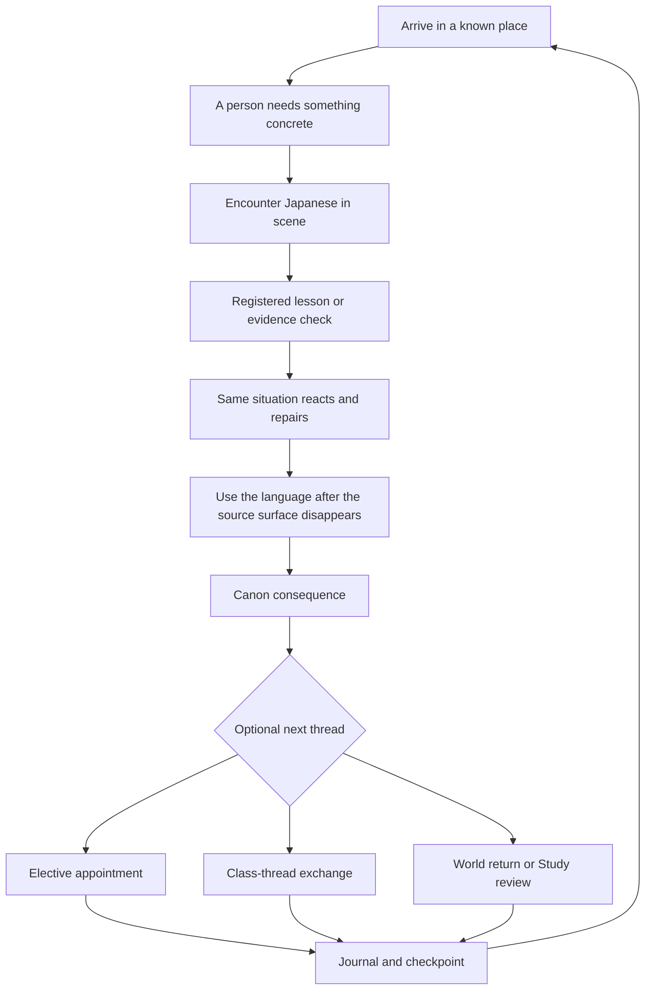

# Narrative stream

## Purpose

This is the end-to-end encounter contract for the Academy story. It joins plot, lessons, locations, class chat, optional relationships, replay, and postgame without letting any one system counterfeit another's progress.

The current runtime has a playable arrival bridge, a structured Chapter 1 package, and a legacy 24-episode source. Everything beyond those facts is target authoring. This document does not claim that Seasons 2-4, class-thread delivery, elective appointments, or graduation migration are implemented.

## Four concurrent streams

| Stream | Promise | Writes | Never writes |
| --- | --- | --- | --- |
| Canon chapter | one finite step toward closing the atlas | canonical cursor, world consequence, continuity beat, callback transition | lesson completion from watching, optional appointment completion |
| Elective appointment | chosen depth with one person through a named activity | appointment cursor, support preference, scoped callback | affection score, exclusive ending, required curriculum access |
| Class thread | short asynchronous coordination between live scenes | local stance, invitation state, fictional thread memory | raw/private-message facts, major off-screen plot resolution |
| Return route | review, location revisit, perspective replay, or postgame practice | learning evidence through its own domain | canon, consent, relationship, provenance, or graduation changes |

Only the canon chapter is mandatory for plot progression. A learner can leave after any checkpoint and return to the same stream position.

## Canon chapter loop

Each chapter contains these authored slots. Several slots can share a scene, but none can be silently omitted.

1. **Re-entry:** a place, object, or unfinished action establishes where the class is now.
2. **Human need:** one lead wants an observable outcome in the next few minutes.
3. **First attempt:** Japanese is encountered before the learner is graded on it.
4. **Evidence turn:** a registered activity or equivalent evidence predicate resolves.
5. **Repair:** success and error both receive an exact in-world response.
6. **Transfer:** the learner uses the function in a changed context with the source hidden.
7. **Consequence:** at least one of plot, relationship, callback, or world state changes.
8. **Breath:** an ordinary action lets emotion land without a summary speech.
9. **Choice of return:** continue, visit a place, open an appointment, read the class thread, review, or stop.

The story may frame the need, but it must not hold an emotional beat hostage to a quiz. A disclosure, refusal, apology, or consent decision completes before any activity boundary.

## Twelve-chapter season cadence

Every season uses the same pressure rhythm without repeating the same events.

| Slot | Structural job | Relationship pressure | Callback budget |
| --- | --- | --- | --- |
| 1 | reopen the term through a concrete problem | establish present distance | one seed or transformed return |
| 2 | reveal a method mismatch | competence is useful but incomplete | up to two echoes |
| 3 | make the mismatch affect a route or plan | ask for help or clarify scope | one seed |
| 4 | widen the sensory or social field | quiet participation matters | one echo |
| 5 | let play or craft expose a blind spot | someone cedes the center | one echo |
| 6 | midpoint reversal | invitation, refusal, or changed condition | one transform |
| 7 | show consequence away from the main room | disagreement remains specific | up to two echoes |
| 8 | make evidence overturn the easy account | confidence is calibrated | one transform |
| 9 | quiet regroup | memory and permission separate | no new seed |
| 10 | attempt the revised plan | changed support becomes visible | one payoff or transform |
| 11 | remove a prepared support | ensemble redistributes work | up to two payoffs |
| 12 | resolve the season question and open the next | behavior, not applause, proves change | plot, relationship, and language payoff |

Season 4 Slot 12 closes the atlas and graduates the learner. No postgame storylet occupies a thirteenth slot or retroactively adds a fifth season.

## Class-thread scenes

The class thread is connective tissue, not a transcript simulator. It carries the humane qualities found in the release-safe class-chat synthesis: quick practical turns, low-stakes teasing, tools shared without ceremony, and a visible way back after absence. It does not reproduce a real exchange, username, timestamp pattern, attachment, or private event.

A normal thread scene has 4-12 messages, 2-4 speakers, one task, and at most one optional fictional prop. Its jobs are limited to:

- clarify a time, place, audience, or role;
- compare two study approaches;
- soften or repair a correction;
- welcome someone back without demanding an explanation;
- pass a bounded clue into the next live scene;
- offer or defer an appointment.

The thread cannot reveal the atlas mystery, settle a serious conflict, publish a person's work, or make a refusal ambiguous through a pile of follow-up messages. One clear no ends the ask. Silence is never interpreted as consent.

Thread rhythm uses complete message actions rather than literary paragraphs: proposal, concrete answer, useful correction, acknowledgment, next action. Consecutive fragments from one speaker are allowed when they feel like real typing, but they compile as one semantic beat so notification count and timing cannot manipulate the learner.

## Elective appointment flow

An appointment offer appears only after the chapter checkpoint. The card states person, activity, place, communication mode, estimated story time, and `Join`, `Later`, and `No thanks` actions. `Later` preserves the offer; `No thanks` clears it without adverse dialogue.

An accepted appointment follows a smaller loop:

1. return to a recurring place;
2. do the named ordinary activity;
3. encounter one difference in preference or method;
4. make a stance/action choice;
5. show one durable relationship change;
6. leave with a concrete future hook.

Appointments use lesson evidence only when the activity naturally needs it. They always have a repair route and can never gate the next canon chapter.

## Location progression

The world grows by repeated use, not by a sequence of decorative backdrops.

- Season 1 establishes campus and the walk home.
- Season 2 extends into commute and ordinary public places needed for the exhibition.
- Season 3 reuses familiar places under public, editorial, and permission pressure; planned civic locations open only when their curriculum hooks are grounded.
- Season 4 returns to early rooms with changed roles, then uses one approved public venue for the event and graduation.

Every main location receives an arrival image, a task affordance, a changed-state revisit, and a final/postgame state. Japan-region places belong to optional learning and future possibilities; travel is never the reward for being the best learner or the proof of a brave ending.

## Placement and return

Placement changes how much earlier context is live, not what happened.

- Foundation/N5 begins at the open door.
- N4 joins the rebuilt-map work through one playable repair.
- N3 arrives with the public invitation and verifies one caption before hearing the dispute.
- N2 enters through two defensible edits and a scope decision.
- N1 enters through the selective reply and the map of claims.

Each bridge introduces no more than three present leads, one current object, the season question, and one action the learner can perform. Earlier canon remains chronological replay. No bridge grants appointments, continuity beats, callbacks, or graduation for scenes not played.

After an ordinary absence, re-entry is shorter: location image, one factual recap, one open next action. Characters do not mention streaks, disappointment, or how long the learner was away.

## Graduation and infinite return

Chapter 48 commits `graduated` once. The postgame home screen then offers:

- chronological canon replay and higher-layer NG+;
- completed elective appointments as memories;
- finite reviewed alumni storylets that acknowledge graduation;
- deterministic review encounters in established places;
- rotating mock tests and Immersion Hall work;
- perspective variants that reveal interpretation, not unauthorized facts.

Replay is read-only for canon and relationships. Alumni stories can add present-day ordinary events, but they cannot reopen the atlas, invent a hidden author, undo a refusal, require everyone to remain together, or make the learner graduate again.

## Stream acceptance test

For any chapter, an editor must be able to trace one uninterrupted sentence:

> Because **person** wants **concrete outcome** at **registered place**, the learner encounters **language function**, proves it through **registered evidence**, uses it again when **context changes**, and therefore **story/relationship/world fact** changes before a clean checkpoint.

If any blank is generic, unregistered, or unrelated to the next blank, the chapter is not ready to script.
