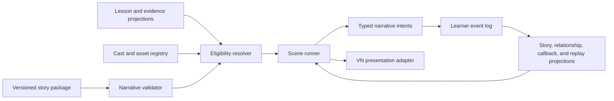

# Script architecture

## Design boundary

The narrative module owns authored sequence, dialogue semantics, local choices, class-continuity beats, elective appointments, fictional class-thread scenes, callbacks, presentation cues, and story commands. It does not grade Japanese, schedule SRS, infer consent, mutate lesson completion, ingest private chats, or render DOM.

The Academy event log remains the single authority. Narrative consumes projections and emits typed intents; domain modules validate and append resulting events.



## Authoring units

| Unit | Owns | Does not own |
| --- | --- | --- |
| Story package | one canonical chapter or postgame storylet | course grading or UI implementation |
| Scene | one place/time/goal and resumable dramatic unit | arbitrary navigation |
| Beat | a semantic action that survives language layers | raw timing or CSS |
| Line | speaker intent, Japanese layers, support, audio binding | relationship mutation |
| Message | one fictional asynchronous action and reply relation | notification manipulation or private-chat reconstruction |
| Choice | learner stance/action and visible local consequence | correct affection answer |
| Activity hook | request for a registered learning interaction | answer key or attempt state |
| Command | whitelisted narrative intent | direct domain writes |
| Callback record | seed/echo/transform/payoff lifecycle | prose search by catchphrase |
| Consent snapshot | reviewed eligibility and asset revision | permission inference |

## Package shape

The target source format is JSON or a typed authoring DSL that compiles to this contract. The runtime consumes compiled immutable JSON.

```ts
interface StoryPackage {
  schema: 'yomu-academy.story-package.v2';
  id: string;
  revision: string;
  canonicality: 'canon' | 'appointment-canon' | 'bridge' | 'alumni' | 'practice-remix';
  season: 1 | 2 | 3 | 4 | 'postgame';
  chapter?: number;
  title: LocalizedText;
  synopsis: string;
  sourceSafety: {
    originalYomu: true;
    externalDialogueUsed: false;
    privateChatUsed: false;
    fictionalComposite: true;
    realEventClaim: false;
  };
  cast: CastUse[];
  entry: StoryEntryRule;
  scenes: Scene[];
  callbacks: CallbackUse[];
  relationship?: RelationshipUse;
  outcomes: StoryOutcome[];
  replay: ReplayContract;
}

interface CastUse {
  castId: AcademyCastMemberId;
  role: 'lead' | 'support' | 'background' | 'offstage';
  portrayal: 'fiction-cleared' | 'lesson-cleared' | 'likeness-cleared' | 'name-only';
  evidenceRefs: string[];
  forbiddenClaims: string[];
  portraitAsset?: { id: string; sha256: string };
}

interface RelationshipUse {
  continuity?: {
    castId: AcademyCastMemberId;
    beat: 'arrival' | 'contribution' | 'limit' | 'return' | 'future';
  };
  appointment?: {
    castId: AcademyCastMemberId;
    routeRevision: string;
    number: 1 | 2 | 3 | 4 | 5 | 6;
  };
}
```

`portraitAsset` is invalid unless the registry returns `likenessRuntime: true` for that use. A package cannot promote `name-only` to a portrait through presentation metadata.

Relationship availability comes from a separate reviewed manifest. `eligibility.story: true` permits a bounded fictional portrayal; it does not promise a deep bond route. A manifest entry can be `continuity-only`, `bond-authored`, or `hold`, and only `bond-authored` may issue an appointment invitation.

## Entry and linkage

Narrative and curriculum cursors remain separate.

```ts
interface StoryEntryRule {
  story: {
    after?: string;
    requiresSeen?: string[];
    forbidsAfterGraduation?: boolean;
  };
  curriculum: {
    anyOfEvidence: EvidencePredicate[];
    recommendedBand: 'foundation' | 'n5' | 'n4' | 'n3' | 'n2' | 'n1';
    missingEvidenceRoute: 'play-bridge' | 'offer-repair' | 'defer-scene';
  };
  relationship?: {
    minimumContinuity?: Partial<Record<AcademyCastMemberId, ContinuityBeat>>;
    minimumAppointments?: Partial<Record<AcademyCastMemberId, 1 | 2 | 3 | 4 | 5 | 6>>;
    fallbackVariant: string;
  };
}
```

A story scene may require evidence that a language function has been encountered or produced. It must not require a hidden exact lesson path when equivalent evidence exists. A learner entering at N3, N2, or N1 plays a band-specific arrival bridge; earlier scenes remain unseen replayable memories, not auto-completed relationships.

An `activity` node names a registered lesson/package/component/exercise or a validated original transfer activity:

```ts
interface ActivityNode {
  kind: 'activity';
  id: string;
  hook: {
    lessonId?: string;
    packageId?: string;
    componentType: 'authentic-input' | 'vocabulary' | 'grammar' | 'listening'
      | 'reading' | 'speaking' | 'writing' | 'kanji' | 'review' | 'transfer';
    exerciseId?: string;
  };
  requiredEvidence: EvidencePredicate;
  onReady: string;
  onRepair: string;
  onDefer: string;
}
```

The scene runner pauses at the node, asks the activity domain to run it, and resumes only from appended evidence. It never fabricates success from a button click or scene completion.

## Scene and beat model

```ts
interface Scene {
  id: string;
  mode: 'live' | 'class-thread' | 'letter' | 'memory';
  locationId: WorldPlaceId;
  timeState: string;
  weatherState?: string;
  goal: string;
  dramaticQuestion: string;
  learnerNeed: string;
  checkpointOnEnter: true;
  nodes: StoryNode[];
  exit: { checkpoint: true; next: string | null };
}

type StoryNode =
  | LineNode
  | MessageNode
  | NarrationNode
  | ChoiceNode
  | ActivityNode
  | CommandNode
  | StageNode
  | CheckpointNode;
```

Every scene follows the semantic rhythm below, though several steps may share a node:

1. concrete arrival image;
2. immediate human want;
3. small obstruction;
4. Japanese-bearing attempt;
5. learner stance or production;
6. exact response/repair;
7. changed action and exit image.

A scene cannot place an activity interruption inside a disclosure, refusal, apology, or sentence. The validator checks that each activity node sits between complete beats and has resumable context on both sides.

`WorldPlaceId` is the target canonical location key. Current v2 story packages use prefixed values such as `location:classroom` while the executable world registry uses `classroom`; migration requires one explicit alias resolver and a validation error for unknown aliases. Authors do not add a second free-string location namespace.

## Class-thread model

Class-thread scenes are wholly fictional asynchronous scenes. They compile from semantic messages, not copied chat text or simulated raw timestamps.

```ts
interface MessageNode {
  kind: 'message';
  id: string;
  beatId: string;
  speakerId: AcademyCastMemberId | 'learner';
  intent: string;
  variants: LineNode['variants'];
  replyTo?: string;
  reaction?: {
    meaning: 'acknowledged' | 'amused' | 'seen';
    by: AcademyCastMemberId[];
  };
  fictionalPropId?: string;
  consentTag?: 'invitation' | 'recording' | 'publication' | 'none';
}
```

A thread scene has 4-12 messages, 2-4 speakers, one task, and no more than one registered fictional prop. Message timing is authored only as `same-moment`, `later-that-evening`, or `next-day`; exact timestamps, typing indicators, read pressure, and notification count are presentation concerns and cannot affect choices.

Reactions acknowledge but never consent. An invitation must contain a visible decline/defer route, and one refusal closes the ask. A thread may pass a clue into a live scene, but cannot resolve a main-plot turn, serious conflict, or consent dispute off-screen.

## Dialogue and language layers

One semantic line can have several Japanese realizations, but they are authored variants, not automated translations.

```ts
interface LineNode {
  kind: 'line';
  id: string;
  beatId: string;
  speakerId: AcademyCastMemberId;
  intent: string;
  attentionTarget: string;
  variants: {
    foundation?: JapaneseLine;
    n5?: JapaneseLine;
    n4?: JapaneseLine;
    n3?: JapaneseLine;
    n2?: JapaneseLine;
    n1?: JapaneseLine;
    ngPlus?: JapaneseLine;
  };
  support: SupportContract;
  audio?: AudioBinding;
}
```

All variants preserve the same action, boundary, fact, and emotional pressure. Higher bands may add ellipsis, register movement, embedded clauses, inference, denser audio, or independent production. They may not reveal facts hidden at lower bands or make a character more consenting, affectionate, or competent.

| Layer | Dialogue target | Learner demand | Support |
| --- | --- | --- | --- |
| Foundation | concrete nouns, greetings, classroom actions, short adjacency pairs | point, repeat, choose an action, produce a memorized repair | furigana and English available after need is established |
| N5 | short present/past turns, particles, time, preferences, invitations | recall and combine familiar forms | per-line gloss and replay; translation after commitment |
| N4 | linked clauses, reasons, conditions, quoted speech, register contrast | construct changed-context responses | selective gloss; grammar note on demand |
| N3 | omitted subjects, reported plans, assumptions, implication, longer audio | infer speaker intent and repair ambiguity | Japanese paraphrase first; English optional |
| N2 | stance, concession, source comparison, formal writing, translation choice | justify, qualify, summarize, negotiate | source and dictionary tools; no default full translation |
| N1 | layered politeness, strategic omission, competing accounts, calibrated certainty | preserve uncertainty and produce audience-aware language | targeted lookup and replay; supports are learner-selected |
| NG+ | same canon with less scaffolding and alternate viewpoint | retell, shadow, mediate, or write at a higher layer | mastery-aware only; no new canonical facts |

Line length is a rhythm tool, not a level metric. Writers prefer one action per box and split only where a natural Japanese pause exists. The research corpus's 27–30-character median is a reference ceiling for ordinary turns, not a quota.

## Choice contract

```ts
interface ChoiceNode {
  kind: 'choice';
  id: string;
  question: string;
  options: Array<{
    id: string;
    action: string;
    japaneseByBand: Record<string, string>;
    records: Array<'stance' | 'boundary-heard' | 'information' | 'support-style'>;
    next: string;
  }>;
  convergence: string;
}
```

Valid choices select an action, emphasis, question, or boundary. They do not ask the learner to guess what a character wants to hear. Every option must be speakable without humiliation, and a decline/defer option must remain available when the activity concerns disclosure, performance, recording, publication, or romance.

Choices may change:

- the next few lines;
- who leads a repair;
- the callback selected later;
- optional perspective and journal wording;
- an appointment's support style.

Choices may not change:

- whether a boundary was respected;
- lesson truth or grading;
- the atlas's provenance;
- graduation;
- private facts;
- character eligibility or likeness.

## Commands and state

The command whitelist is deliberately small:

```ts
type StoryCommand =
  | { type: 'story.seen'; packageId: string; sceneId: string }
  | { type: 'story.completed'; packageId: string }
  | { type: 'relationship.continuityAdvanced'; castId: string; beat: ContinuityBeat }
  | { type: 'relationship.appointmentCompleted'; castId: string; number: 1 | 2 | 3 | 4 | 5 | 6 }
  | { type: 'callback.transitioned'; callbackId: string; to: CallbackState }
  | { type: 'world.locationDiscovered'; locationId: string }
  | { type: 'journal.memoryUnlocked'; memoryId: string }
  | { type: 'presentation.cue'; cueId: string };
```

Commands are intents. Domain handlers reject duplicates, impossible order, unknown cast, ineligible assets, missing evidence, and replay writes.

Story state is projected as:

- canonical cursor and seen scenes;
- five-beat class-continuity cursor per story-eligible person;
- six-appointment cursor only for reviewed `bond-authored` routes;
- at most one pending appointment invitation, with defer/decline state that carries no penalty;
- local choice facts with explicit scope;
- callback ledger;
- discovered memories and perspectives;
- graduation status;
- replay mode, which is never canonical write mode.

No mutable “affection score,” hidden approval value, exclusivity flag, or scene-specific boolean sprawl is introduced.

## Callback ledger

```ts
interface CallbackUse {
  id: string;
  state: 'seed' | 'echo' | 'transform' | 'payoff';
  ownerIds: AcademyCastMemberId[];
  meaningNow: string;
  priorUse?: { packageId: string; sceneId: string; state: 'seed' | 'echo' | 'transform' };
  useNumber: number;
  maximumUses: number;
  optionalFallback?: string;
}
```

The validator rejects a payoff without a prior transform, a second seed for the same ID, unchanged `meaningNow`, and use beyond the declared budget. Comedy callbacks cannot transition during a node tagged `boundary`, `refusal`, `apology`, or `vulnerability`.

The current arrival and Chapter 1 v2 packages still use `maximumFutureUses` and an abbreviated `priorUse`. Those files are current-source evidence, not the final callback contract. Migration preserves callback IDs and derives `useNumber` from history through an explicit adapter; authors do not hand-edit learner history or silently reinterpret the old counter.

## Replay and postgame

```ts
interface ReplayContract {
  chronologicalMemory: boolean;
  canonicalWrites: false;
  allowedLayers: string[];
  perspectiveVariants: string[];
  supportOverrides: string[];
  withdrawnContentFallback?: string;
}
```

Replay can append language evidence and SRS attempts through their own domains, but it cannot append story completion, relationship progress, unlocks, or consent changes. NG+ selects authored variants against the same semantic beats. Alumni packages are new bounded canon after graduation; practice remixes are explicitly non-canonical.

The infinite calendar begins after chapter 48. The existing `calendar:lantern-atlas-review` structure can be retained, but `startsAfterEpisodeId` must migrate from `s1e24-lanterns-return` to `s4e12-next-page` when the four-season runtime ships.

## Validation gates

A package cannot ship unless automation proves:

1. unique package, scene, node, line, choice, callback, and activity IDs;
2. reachable nodes, valid reply targets, and explicit convergence for every choice;
3. resumable checkpoints before and after activities;
4. registered cast IDs and current story/lesson/likeness eligibility;
5. one lead, at most two supports, bounded speaking background roles, and class-thread cast/message caps;
6. original-source safety flags, no reference-corpus path/import, and no raw-chat identifier, timestamp, attachment, or wording;
7. registered lesson/package/component/exercise hooks;
8. no activity completion command in story data;
9. semantic invariants across language layers;
10. every refusal and consent-sensitive action has a non-coercive route;
11. callback lifecycle, changed meaning, prior-use pointer, and use budget are valid;
12. continuity and appointment cursors are monotonic, invitation spacing is valid, and replay writes are disabled;
13. chapter order is complete from 1 through 48;
14. postgame packages require `graduated` and cannot mutate finite-plot facts;
15. portrait assets match approved IDs, revisions, and hashes;
16. every location resolves to the world registry through the declared alias table and carries a grounded/planned state;
17. every speaking role passes a reviewed voice-card revision and adjacent-speaker contrast check.

Human review then checks voice, pacing, Japanese naturalness, learning integrity, private-source boundaries, emotional pressure, and whether a choice feels meaningfully different without becoming a hidden quiz.

## Migration from the current runtime

The current `yomu-academy.season-one-fiction.v1` source is useful but conflates a 24-episode plot with the final infinite calendar.

The migration must:

1. preserve all 24 current episode IDs and learner history;
2. reproject ordinals 1-12 as Season 1 and 13-24 as Season 2;
3. change episode 24 from final graduation to the first exhibition and second-season close;
4. add authored chapters 25-48 only after their lesson dependencies exist;
5. move the infinite calendar gate to chapter 48;
6. map old completed-24 profiles to `seasonTwoCompleted`, not `graduated`;
7. offer those learners chapter 25 without replaying or duplicating relationship progress;
8. preserve the old calendar as a non-canonical review mode during migration;
9. keep this state change in an ADR and event-projection migration, never a silent JSON replacement.
10. treat `s1e13`–`s1e24` as immutable historical IDs whose structured season becomes `2`; do not infer season from their prefix.
11. rename `AcademyClassEvent.season` to `curriculumBand` and add an explicit four-season story reference where needed.
12. introduce class continuity and elective appointments as new relationship projections; do not reinterpret any legacy scene view or lesson event as a completed appointment.
13. compile current v2 packages through compatibility adapters for prefixed location IDs, missing scene `mode`, missing `privateChatUsed`, and the old callback shape until their authored revisions migrate together.
