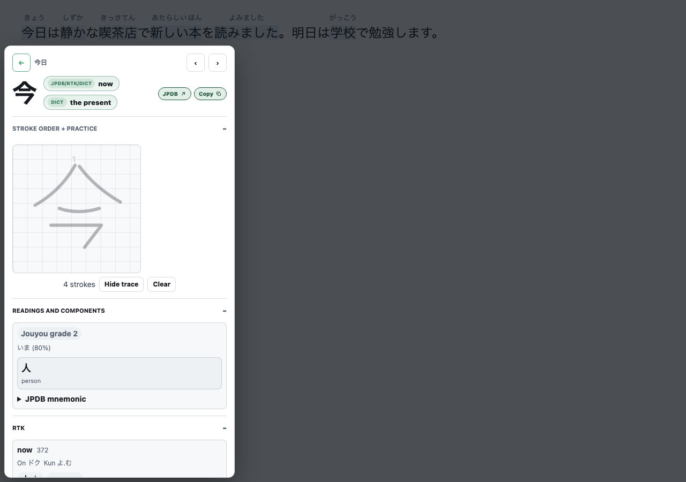
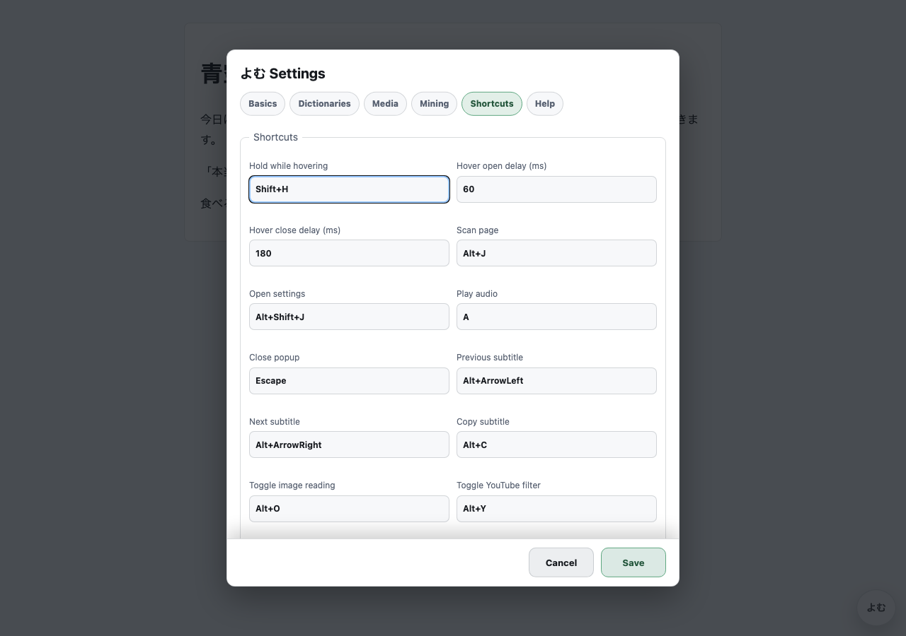
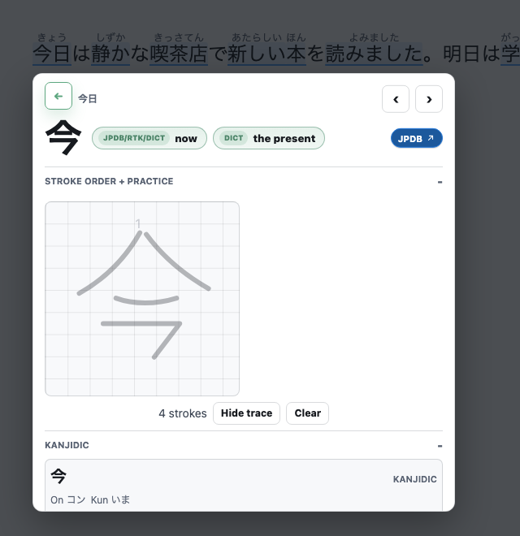
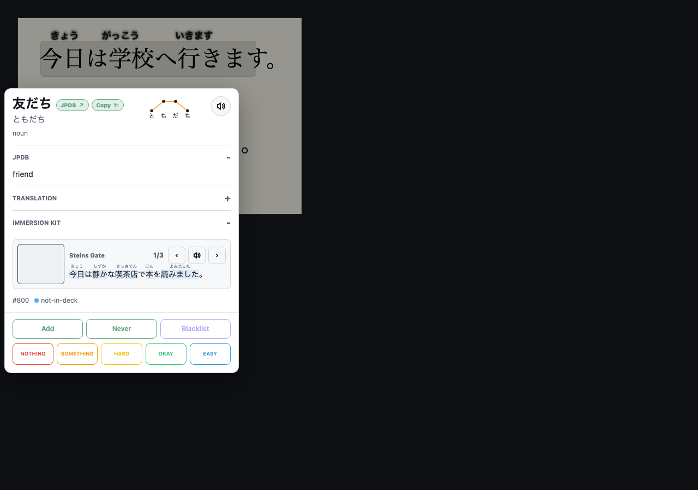
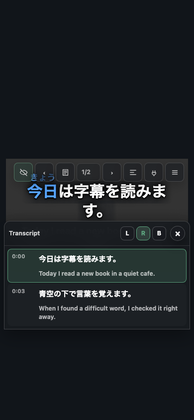
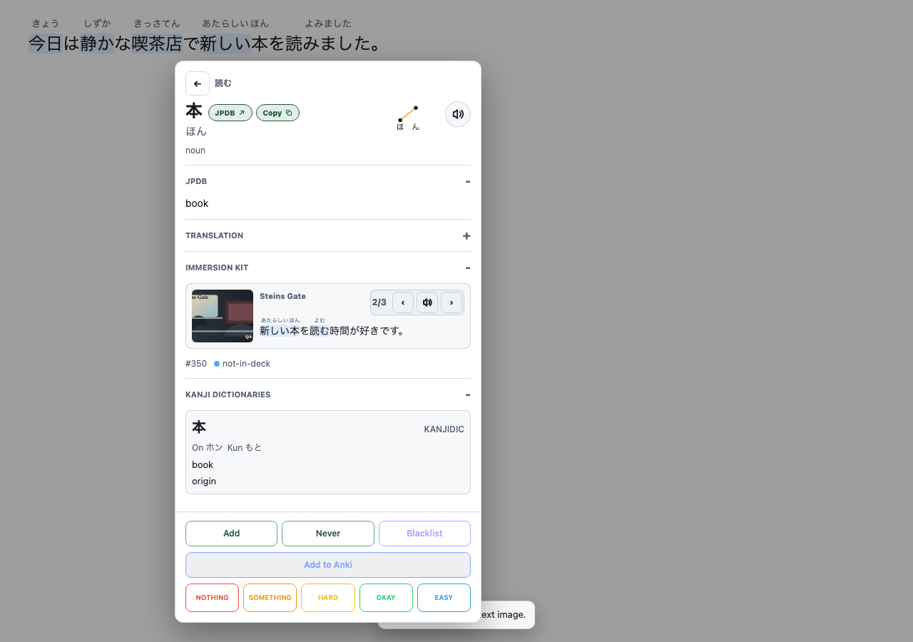
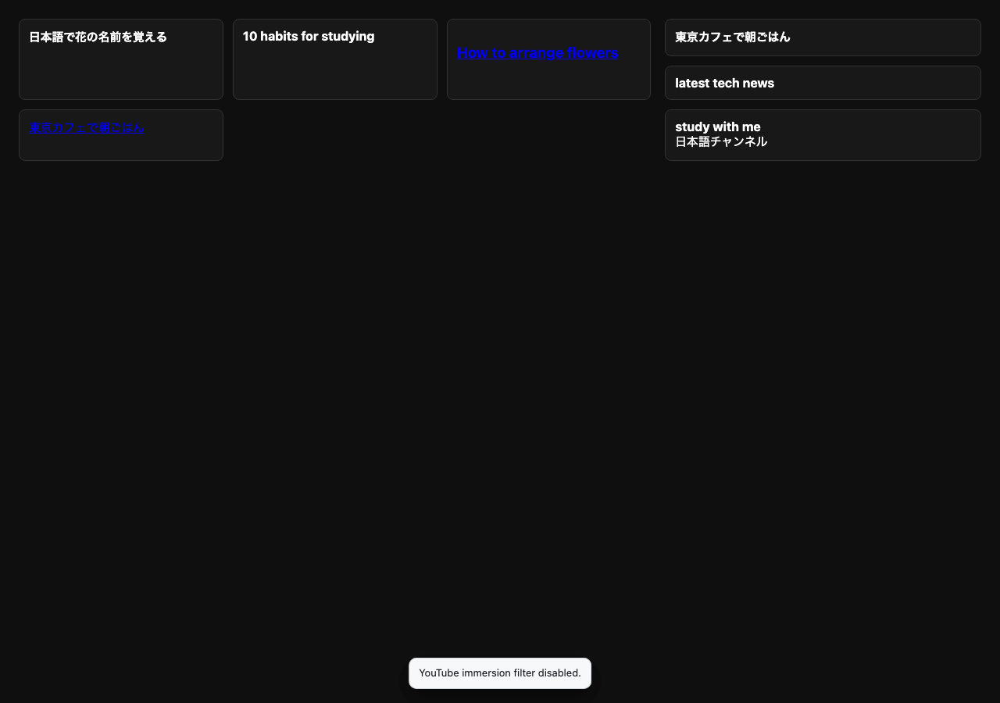
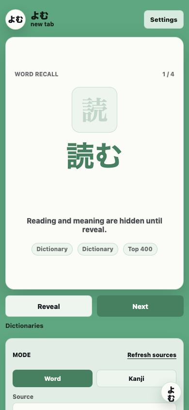
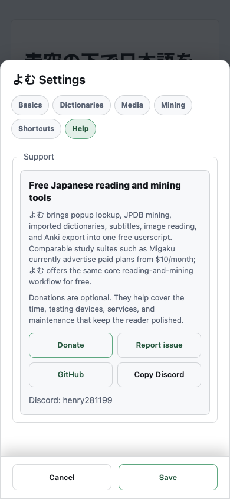

# Features

よむ is designed around one loop: find Japanese in the wild, understand it quickly, and save the useful bits for study.

## Popup Lookup And Mining

Tap, select, or hover Japanese text to open a popup. The popup can show JPDB definitions, imported local dictionary entries, pitch and frequency data, audio, example sentences, kanji details, and optional mining actions.



JPDB mining actions can add a word, mark it Never Forget, blacklist it, or send review grades, and can be turned off while keeping JPDB-powered popup lookup. When Anki is enabled, よむ can create a compact note with the word, reading, meaning, source sentence, JPDB link, local dictionary content, and optional context images.

Furigana and word colors are separate controls. You can keep the automatic behavior, show furigana only for harder kanji, show all parsed readings, hide furigana for known words, color words by JPDB/Anki state, color them by pitch accent, or turn highlight coloring off.

## Yomitan Dictionaries

よむ can import Yomitan dictionary ZIP files, Yomitan settings exports, and dictionary backups. Imported dictionaries stay local in your browser. If you do not have JPDB or Anki connected, よむ can still use local dictionary words for the new-tab study page. It downloads JMdict as a starter dictionary automatically when dictionary study words are needed and no local dictionary is installed yet.



This is useful if you want native-language dictionaries, monolingual Japanese definitions, frequency dictionaries, kanji dictionaries, or pitch dictionaries without depending on a remote service for every lookup.

## Kanji Drilldown

Click a kanji inside the popup headword to open a focused kanji panel. Depending on your settings and imported data, it can show JPDB facts, stroke count, grade, JLPT level, RTK data, related words, component hints, KanjiVG stroke tracing, and a small drawing pad.



Kanji origin sources are modular and license-aware. You can turn off optional public sources independently.

## Image And Manga OCR

OCR lets you tap Japanese text inside images. よむ can use embedded OCR metadata when a site provides it, Google Lens by default, Google Cloud Vision with your own key, or a local OCR app/server for engines such as MangaOCR, PaddleOCR, Apple Vision style results, and YomiNinja-shaped responses.



Recognized text stays lightweight: touch targets sit over the image without covering it until you tap or hover.

## Video Subtitle Mining

よむ can add an ASB-style subtitle overlay for video pages. Japanese subtitles can be parsed into tappable words, native-language subtitle tracks can be shown as a secondary line, and the transcript panel can sit left, right, or below the video with the active line highlighted while you read.

The transcript is meant to work as a reading surface too: visible Japanese lines are hydrated into the same lookup words as the overlay, so you can skim, jump to a line, and open a popup without leaving the video.

Local videos can also flow through an optional MPV bridge compatible with [mpv-subtitleminer](https://github.com/friedrich-de/mpv-subtitleminer), so a running mpv session can stream subtitles into よむ for lookup, mining, and line-audio replay. The MPV bridge is opt-in from the overflow menu or settings, which keeps ordinary website videos uncluttered.



You can use shortcuts for previous subtitle, next subtitle, copy subtitle, and mining. The transcript panel is off by default and can be opened from the subtitle controls or overflow menu. On phones it becomes a bottom panel so the video stays usable.

## Immersion Kit Examples

Immersion Kit examples can appear directly inside word popups. On desktop, the first example can play its audio once when you hover the card; it will not keep replaying unless you press the speaker button. Example sentences are tappable too, so you can jump from one unknown word to the next without leaving the flow.



You can choose example categories, length limits, image visibility, translation visibility, playback speed, and whether that one-time hover audio is enabled. On iPhone and iPad, use the speaker button because touch screens do not have hover and Safari limits autoplay.

## YouTube Immersion Mode

The optional YouTube mode hides non-Japanese-looking recommendation cards, search results, and sidebars. It is off by default and includes reveal controls so you can show hidden videos again or turn the mode off quickly.



## New Tab Study Page

よむ includes an optional new-tab page at:

```text
https://hrussellzfac023.github.io/yomu-reader/newtab/
```

Use that URL as a browser home page, new-tab page, or iPad Home Screen shortcut. It uses your accent color and tries study words from Anki first, then JPDB, then local dictionary words, so a new install can still become useful after JMdict finishes downloading.



On iPhone and iPad, this is often the easiest daily-review surface because it avoids desktop-only bridges. If AnkiConnect or JPDB is not available, JMdict-backed dictionary words keep the page useful.

## Help And Support In Settings

The Help tab includes GitHub issues, Discord, and donation links so users do not need to search the repository when something goes wrong.


